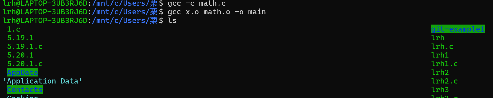
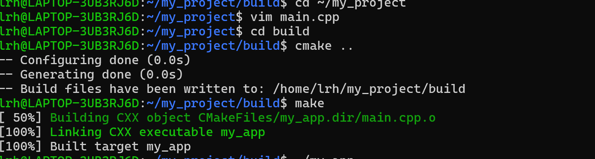

# 编译与链接
## 编译
- 编译的过程其实就是将我们程序的源代码翻译成CPU能直接运行的机器代码
- 在实际开发中，我们通常会将不同功能的代码分散到不同的源文件
- - 一方面方便代码的阅读和维护
- - 同时提升了软件构建的速度
## 链接
其实就是将编译之后的所有目标文件连同用到的一些静态库，运行时库组合拼装成一个独立的可执行文件


# Makefile
## 1.makefile三要素
- 依赖：编译所需要的文件。
- 目标：通过编译后生成的目标文件。
- 命令：对文件进行编译的命令。
## 2.变量
- 我们可以通过设置变量将一些关键字变成较短或自己喜欢的名称。
- > CC：保存编译器名
RM：用于指示删除文件的命令
EXE：存放可执行文件名
OBJS：放置所有的目标文件名
## 3.自动变量与编译
### 自动变量
- $@:用于表示一个规则中的目标。当我们的一个规则中有多个目标时，$@所指的是其中任何命令被运行的目标。
- $^:表示的是规则中所有的先择条件。
- $<:表示的是规则中的第一个先决条件。
### 编译
- 当我们目录下所需要使用的文件很多的时候，那么就需要自动获取这些文件，不然是一个体力活。我们使用wildcard和patsubst。
- >wildcard：通配符函数，通过它可以得到我们所需要的文件。$(wildcard pattern)
patsubst：字符串替换函数。$(patsubst pattern ,replacement ,text)
## 4.依赖第三方库
可以指定存放头文件和库文件的地址，以及链接库。
```
# 定义HEADER_PATH为当前工程中的头文件路径
HEADER_PATH = -I ./include/
   
# 定义LIB_PATH为当前工程中的库文件路径 
LIB_PATH = -L ./lib/   
              
# 制定LIBS链接库的名称 
LIBS=-lpthread                 
# lib中的库文件名称为libpthread.so
```
# cmake
## 编译项目步骤
1. 创建并进入项目目录
mkdir -p ~/my_project/build
cd ~/my_project
2. 编写 CMakeLists.txt
- 在项目根目录（~/my_project）创建 CMakeLists.txt 文件
cmake_minimum_required(VERSION 3.10)
project(MyProject)
add_executable(my_app main.cpp)
- 同时创建一个简单的 main.cpp 文件
#include <iostream>
int main() {
    std::cout << "Hello from WSL!" << std::endl;
    return 0;
}
3. 生成构建系统
进入 build 目录并运行 cmake：
cd build
cmake ..
> 这会生成 Makefile 或其他构建文件（取决于 CMake 配置）。
4. 编译项目
- 用make编译
make
> 生成的可执行文件会出现在build目录中

5. 运行程序



# 运行matmul
- 先找到matmul的路径
- 执行make命令
- 运行可执行文件matmul_main
- 清理文件
- - 若想清理项目构建过程中生成的中间文件和可执行文件，在终端输入make clea。

