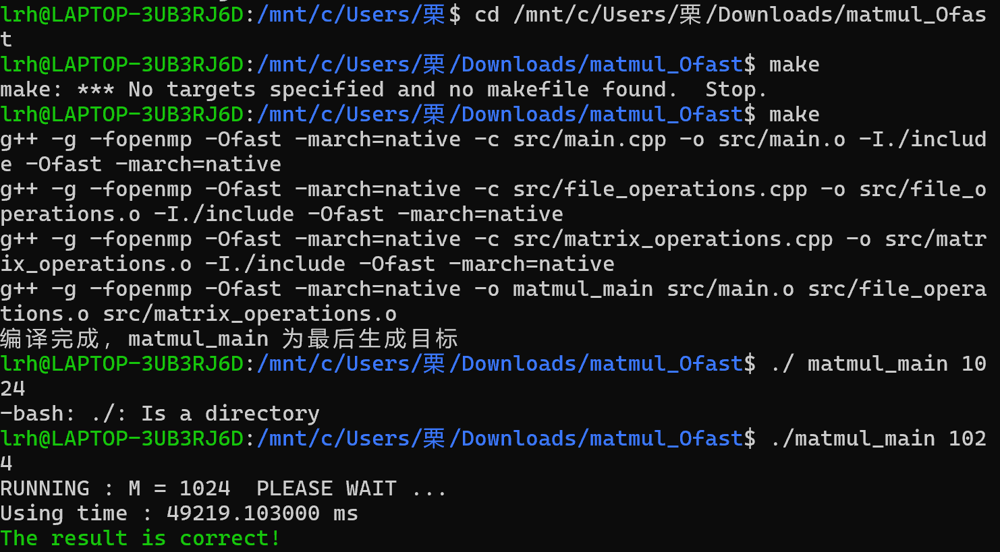

# -Ofast优化
GCC/G++编译器
1. 命令行方式
在编译命令中直接添加-Ofast选项。
例如：编译一个名为 main.cpp 的C++ 源文件，生成可执行文件 main ，命令如下：
g++ -Ofast main.cpp -o main
2. Makefile方式
在Makefile中设置CXXFLAGS变量包含-Ofast选项
CXX = g++
CXXFLAGS = -g -fopenmp -Ofast -march=native
SRC = main.cpp
OBJ = $(SRC:.cpp=.o)
TARGET = main
all: $(TARGET)
$(TARGET): $(OBJ)
    $(CXX) $(CXXFLAGS) -o $@ $^
%.o: %.cpp
    $(CXX) $(CXXFLAGS) -c $< -o $@
# GCC编译器
> 使用gcc指令编译C代码
> 使用g++指令编译C++代码
## 编译过程
1. 预处理-Pre-Processing    //i文件
```
# -E 选项指示编译器仅对输入文件进行预处理
g++ -E test.cpp -o test.i //i文件
```
2. 编译-Compiling   //s文件
```
# -S编译选项告诉g++在为C++代码产生了汇编语言文件后停止编译
# g++产生的汇编语言文件的缺省扩展名是.s
g++ -S tset.i -o test.s
```
3. 汇编-Assembling   //.o文件
```
# -c选项告诉g++仅把源代码编译为机器语言的目标代码
# 缺省时g++建立的目标代码文件有一个.o的扩展名
g++ -c test.s -o tets.o
```
4. 链接-Linking    //bin文件
```
# -o编译选项来为将产生的可执行文件用指定的文件名
g++ test.o -o test
```
### 总体下来效果与g++ test.cpp -o test相同
## g++重要编译参数
### -g端译带调试信息的可执行文件
#-g选项告诉GCC产生能被GNU调试器GDB使用的调试信息，以调试程序。 
#产生带调试信息的可执行文件test 
g++-g test.cpp 
### -0[n] 优化源代码
 所谓优化，例如省略掉代码中从未使用过的变量、直接将常量表达式用结果值代替等等，这些操作会缩减目标文件所包含的代码量，提高最终生成的可执行文件的运行效率。 
- -0选项告诉g++对源代码进行基本优化。这些优化在大多数情况下都会使程序执行的更快。
- -02选项告诉g++产生尽可能小和尽可能快的代码。如-02,-03,-0n(n常为6-3) 
- -0同时减小代码的长度和执行时间，其效果等价于-01 
- -00表示不做优化
- -01为默认优化
- -02除了完成-01的优化之外，还进行一些额外的调整工作，如指令调整等。 
- -03则包括循环展开和其他一些与处理特性相关的优化工作。 
- 选项将使编译的速度比使用-0时慢，但通常产生的代码执行速度会更快。 
-  使用-02优化源代码，并输出可执行文件
-   g++ -02 test.cpp
### -l和-L指定库文件|指定库文件路径
- -1参数(小写)就是用来指定程序要链接的库，-1参数紧接着就是库名
- 在/lib和/usr/lib和/usr/local/lib里的库直接用-1参数就能链接
- 链接glog库
g++ -lglog test.cpp

- 如果库文件没放在上面三个目录里，需要使用-L参数(大写)指定库文件所在目录
- -L参数跟着的是库文件所在的目录名
- 链接mytest库，libmytest.so在/home/bing/mytestlibfolder目录下
-  g++-L/home/bing/mytestlibfolder -lmytest: test.cpp 
### 4.-I指定头文件搜索目录
- -I
- /usr/include目录一般是不用指定的，gcc知道去那里找，但是如果头文件不在/usr/icnclude里我们就要用-I参数指定了，比如头文件放在/myinclude目录里，那编译命令行就要加上-I/myinclude参数了，如果不加你会得到一个"xxxx.h:No such file or directory"的错误。-I参数可以用相对路径，比如头文件在当前目录，可以用-I.来指定。上面我们提到的-cflags参数就是用来生成-I参数的。
- g++ -I/myinclude test.cpp
### Wall 打印警告信息
- 打印出gcc提供的警告信息
- g++ -Wall test.cpp
### W 关闭警告信息
- 关闭所有警告信息
g++ -W test.cpp
### -std=c++11设置编译标准
- 使用c++11标准编译test.cpp 
- g++ -std=c++11 test.cpp 
### -0指定输出文件名

- 指定即将产生的文件名

- 指定输出可执行文件名为test 
- g++ test..cpp -o test 
### 9.-D定义宏
- 在使用gcc/g++编译的时候定义宏

- 常用场景: 
- -DDEBUG定义DEBUG宏，可能文件中有DEBUG宏部分的相关信息，用个DDEBUG来选择开启或关闭DEBUG
# 运行matmul_Ofast的具体步骤
