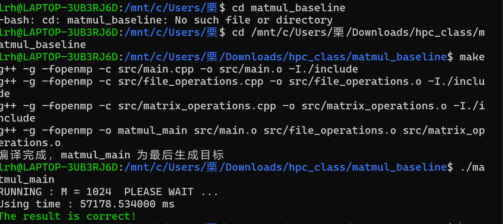
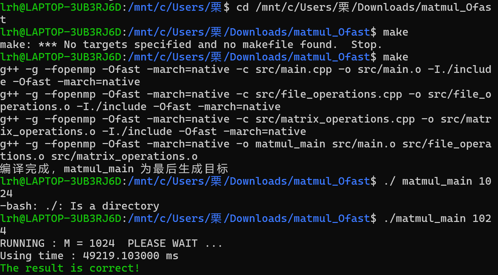
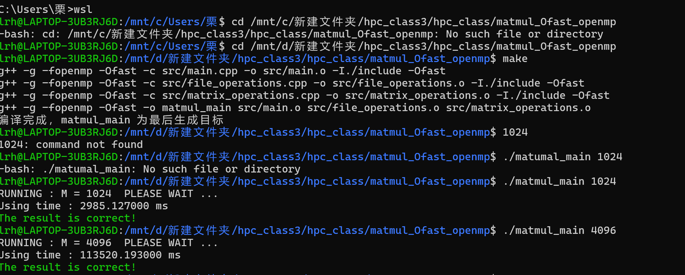
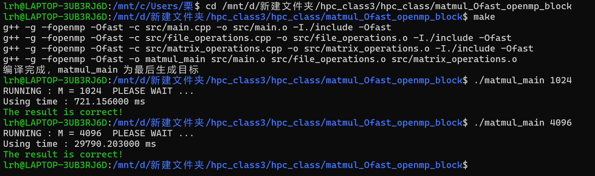
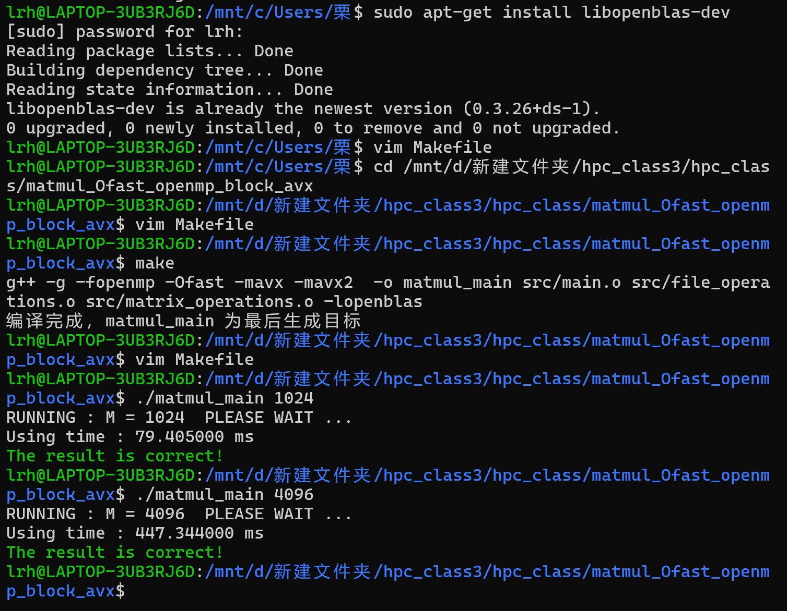

# matmul
- 矩阵乘法（通常缩写为matmul）是线性代数中的基本运算，通过两个矩阵相乘生成一个新的矩阵
## 基本定义
给定两个矩阵：
- 矩阵A：m*n维
- 矩阵B：n*p维
- 它们的乘积矩阵C = AB定义为：
C[i][j] = Σ(A[i][k] × B[k][j])，其中k从1到n
## 运算条件
- 矩阵乘法可行的前提：
第一个矩阵的列数必须等于第二个矩阵的行数
## 主要性质
- 不可交换性：一般情况下AB ≠ BA
- 结合律：A(BC) = (AB)C
- 分配律：A(B+C) = AB + AC
## 主要应用领域
- 计算机图形学（变换操作）
- 机器学习（神经网络）
- 科学计算
- 经济学（投入产出模型）
- 物理学（量子力学）
# matmul_baseline 
matmul_baseline 通常指代 矩阵乘法（matrix multiplication）的基准实现或参考实现
- 在优化矩阵乘法的代码时（如CPU/GPU加速、算法改进）：
- - matmul_baseline 指最朴素的实现（如三重循环），作为性能对比的基准。

# matmul_Ofast
**在编程和性能优化领域，matmul_Ofast 通常指 经过高度优化的矩阵乘法实现，其名称中的 Ofast 暗示它使用了编译器最大优化选项或手动优化技术，以实现比朴素实现更快的计算速度**
## 编译器优化标志（如 -Ofast）
- 在 C/C++ 等语言中，-Ofast 是 GCC/Clang 的最高优化级别之一，比 -O3 更激进，可能放宽 IEEE 浮点精度要求以换取更高性能。
- 这样编译的矩阵乘法可能比 -O0（无优化）或 -O2 快数倍。
## 实现matmul_Ofast
1. 使用优化编译器选项
2. 手动优化（SIMD + 分块）
- 使用 AVX/AVX2 指令集（如 _mm256_fmadd_ps）
- 调整循环顺序以提高缓存命中率
3. 调用优化库
- CPU：OpenBLAS、Intel MKL
- GPU：cuBLAS（NVIDIA）、rocBLAS（AMD）

# matmul_Ofast_openmp
**matmul_Ofast_openmp 通常指结合了编译器最高优化选项(-Ofast) 和 OpenMP 并行化的矩阵乘法实现。**
## 核心优化技术
1. 编译器优化 (-Ofast)
- 启用所有优化选项
- 放宽浮点精度要求以获得更高性能
- 自动向量化 (SIMD)
2. OpenMP 并行化
- 将计算任务分配到多个CPU核心
- 优化内存访问模式
## 编译选项
> gcc -Ofast -march=native -fopenmp matmul.c -o matmul

- -Ofast: 最高级别优化
- march=native: 针对当前CPU架构优化
- fopenmp: 启用OpenMP支持
## 注意事项
1. 线程数设置要合理 (通常等于物理核心数)
2. 注意false sharing问题
3. 大规模计算时注意内存带宽限制
4. 浮点结果可能与串行版本略有不同

# matmul_Ofast_openmp_block
**matmul_Ofast_openmp_block 是一种结合了编译器优化(-Ofast)、OpenMP并行化和分块计算技术的高性能矩阵乘法实现。**
## 核心优化技术
1. 编译器优化 (-Ofast)
- 最高级别编译器优化
自动向量化(SIMD指令)
激进循环优化
2. OpenMP并行化
- 多线程并行计算
动态负载均衡
3. 分块计算(Blocking)
- 提高缓存命中率
减少内存带宽需求
优化数据局部性
## 编译选项
gcc -Ofast -march=native -fopenmp -funroll-loops matmul_block.c -o matmul_block
##  分块优化原理
1. 缓存友好访问模式
- 将大矩阵分解为适合CPU缓存的小块
- 每个块在计算时能完全驻留在缓存中
2. 数据重用
- A的行块和B的列块在内部循环中被重复使用
- 减少线程间通信和同步

# matmul_Ofast_openmp_block_avx
## 优化说明
1. 分块处理(BLOCKING)
- 将矩阵分成BLOCK_SIZE×BLOCK_SIZE的小块
- 提高缓存命中率，减少内存访问延迟
2. OpenMP并行化
- 使用#pragma omp parallel for自动分配工作给多个线程
- collapse(2)将两个外层循环合并并行化
3. AVX向量化
- 使用__m256数据类型处理8个单精度浮点数
- _mm256_fmadd_ps实现融合乘加(FMA)操作
- 一次处理8个元素，提高计算密度
4. 边界处理
- 自动处理矩阵大小不是BLOCK_SIZE整数倍的情况
- 处理剩余不足8个元素的尾部数据

# matmul_Ofast_openmp_block_mkl
## 优化说明
1. Intel MKL优化
- 使用cblas_sgemm函数实现单精度矩阵乘法
- MKL内部已实现多层次优化：AVX/AVX2/AVX-512指令集、循环展开、缓存分块等
- 自动适配不同CPU架构选择最优算法
2. OpenMP并行化
- 通过mkl_set_num_threads设置MKL使用所有可用OpenMP线程
- MKL内部有精细的线程级并行优化
3. 通用矩阵乘法
- 支持任意维度矩阵乘法 (m×k * k×n = m×n)
- 支持alpha和beta系数配置
## 性能优势
1. 极致优化：MKL针对Intel处理器深度优化，比手动优化的AVX代码更快
2. 自动并行：MKL自动管理线程分配，避免手动OpenMP调优的复杂性
3. 功能全面：支持转置操作、多种数据类型、批处理等高级功能
# matmul_Ofast_openmp_block_openblas
## 优化说明
1. OpenBLAS优化

- 使用cblas_sgemm函数实现单精度矩阵乘法
- OpenBLAS实现了类似MKL的多层次优化
- 支持多种CPU架构(Intel/AMD/ARM)的自动优化
2. OpenMP并行化
- 通过openblas_set_num_threads设置OpenBLAS使用所有可用OpenMP线程
- 线程管理由OpenBLAS内部处理
3. 通用矩阵乘法
- 支持任意维度矩阵乘法 (m×k * k×n = m×n)
- 支持alpha和beta系数配置
## 性能特点
- 跨平台性能：在Intel/AMD/ARM等多种CPU上都有良好表现

- 开源免费：相比MKL没有授权限制

- 自动优化：根据CPU特性自动选择最佳算法