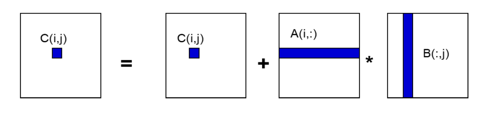
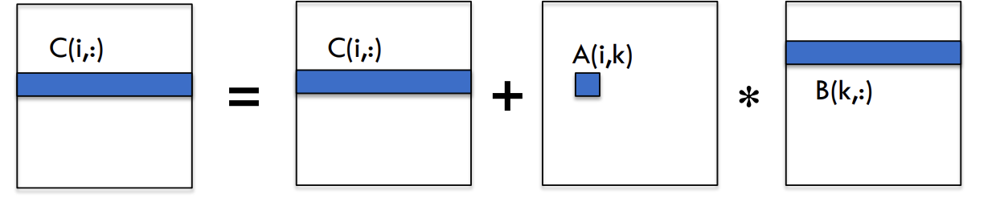
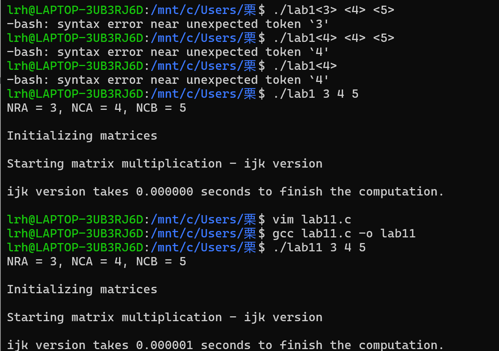
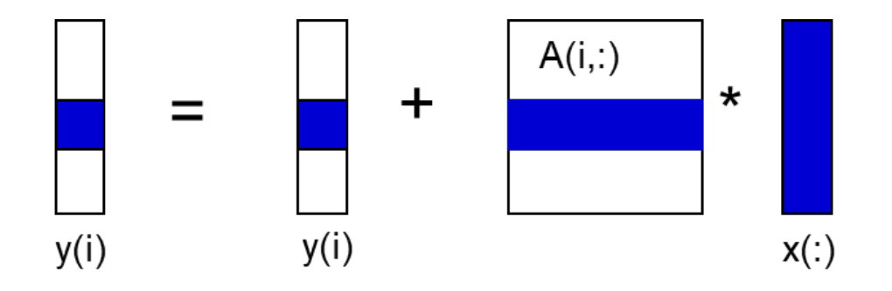
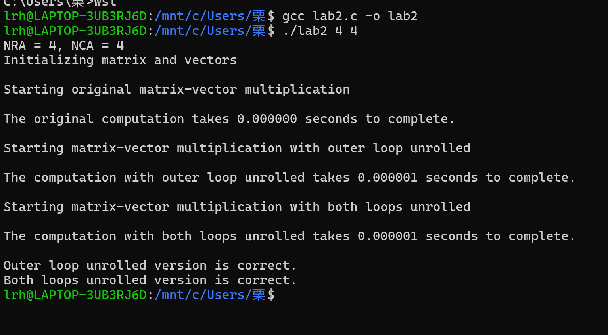
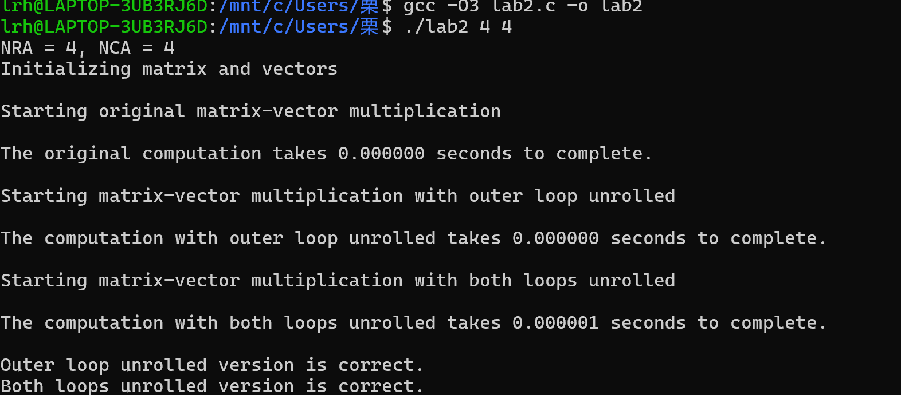

# 计算强度分析
## 基础假设
假设内存层次结构只有两级：快速内存（缓存）和慢速内存（主存），且所有数据初始存放在慢速内存中。定义以下参数：
- m：在快慢内存之间移动的数据量（以字或字节为单位）。
- t（下脚标有个m）：每次慢速内存操作的时间（访存延迟）。
- f：算法所需的算术运算次数（如浮点运算次数）
- t（下脚标有个f）：每次算术运算的时间。
> 通常t（下脚标有个m）>>t（下脚标有个f）
## 时间计算与参数意义
- 最短时间：当所有数据都在快速内存中时，最短可能时间为f*t(f)。
> 这是因为此时没有慢速内存操作的耗时，仅需考虑算术运算时间。
- 实际时间：实际时间计算公式为f*t（f）+m*t（m），进一步变形为f*t（f）*（1+tm/tf*1/q）。这里 q = f / m ，代表每次慢速内存访问的平均浮点运算次数，即计算强度，它是算法效率的关键因素 。q 值越大，意味着每次访问慢速内存能伴随更多的运算，受慢速内存访问耗时的影响就越小，实际时间也就越接近最短时间 f × t_f 。
- 机器平衡：t_m/t_f表示机器平衡，是影响机器效率的关键 。它反映了慢速内存操作时间与算术运算时间的比例关系。并且，要达到至少一半的峰值速度，需要满足q>=t_m/t_f。即只有当计算强度足够高，超过机器平衡对应的比例时，才能在速度上有较好的表现。
## 如何提升单机计算性能
### 单机计算性能优化技巧总结表

| 优化方向         | 具体方法                | 关键手段                                                                 | 适用场景                          | 预期效果                         |
|------------------|-------------------------|--------------------------------------------------------------------------|-----------------------------------|----------------------------------|
| **内存访问优化** | 连续内存访问            | - 按行主序访问<br>- 避免跨步/随机访问                                    | 数组/矩阵遍历                     | 提高缓存命中率，降低Cache Miss   |
|                  | 分块(Blocking/Tiling)   | - 将数据分块匹配缓存大小<br>- 增强数据复用                               | 矩阵乘法/卷积等密集计算           | 减少内存访问次数(m↓)，提高计算强度(q↑) |
| **寄存器优化**   | 循环展开                | - 手动展开循环(如4次)<br>- 减少分支预测失败                              | 小循环密集型计算                  | 提高指令级并行，减少开销         |
|                  | 标量替换                | - 用局部变量替代数组元素<br>- 强制使用寄存器存储                         | 热点代码中的重复访问              | 减少内存加载，加速计算           |
| **并行计算**     | 多线程(OpenMP)          | - `#pragma omp parallel for`<br>- 任务分片                              | 可并行化的循环                    | 利用多核，提升吞吐量             |
|                  | SIMD向量化              | - 编译器指令(`#pragma omp simd`)<br>- 显式使用AVX/NEON指令              | 数据并行计算                      | 单指令多数据，加速计算           |
| **通用策略**     | 提高计算强度(q)         | - 算法重构增加计算密度<br>- 减少不必要的数据移动                         | 所有计算密集型任务                | 使计算成为瓶颈而非内存访问       |
|                  | 平衡机器参数(tₘ/t_f)    | - 确保q ≥ tₘ/t_f<br>- 通过profiling找出瓶颈                              | 硬件适配优化                      | 达到至少50%峰值性能              |

# 矩阵乘法（ijk版本）

C(i, j)  表示结果矩阵  C  中第  i  行第  j  列的元素。它是通过将矩阵  A  的第  i  行（表示为  A(i, :)  ）与矩阵  B  的第  j  列（表示为  B(:, j)  ）对应元素相乘并累加得到的 。先取出  C(i, j)  初始值，然后不断加上  A(i, k)  与  B(k, j)  的乘积，逐步更新  C(i, j)。
**代码**
```
for (i=0; i<n; i++)
 {read row i of A into fast memory}
 for (j=0; j<n; j++)
 {read C(i, j) into fast memory}
 {read column j of B into fast memory}
 for (k=0; k<n; k++)
 C(i, j) = C(i, j) + A(i, k) * B(k, j)
 {write C(i, j) back to slow memory}
 ```

**代码逻辑**
该代码通过嵌套循环实现矩阵乘法。外层循环遍历矩阵  A  的行，将  A  的第  i  行读入快速内存；中间循环遍历矩阵  C  的列，把  C(i, j)  读入快速内存，同时将矩阵  B  的第  j  列读入快速内存；内层循环进行累加计算，更新  C(i, j)  后再写回慢速内存。
**慢速内存引用次数**
-  m  的计算：
- 读取矩阵  B  的每一列  n  次，次数为 n^3  。因为对于每一个  j  （共  n  个 ），内层循环要执行  n  次，每次都需读取  B  的一列，所以是 n×n×n = n^3 。
- 读取矩阵  A  的每一行一次，次数为 n^2  。因为外层循环执行  n  次，每次读取  A  的一行，即 n×n = n^2 。
- 对矩阵  C  的每个元素读和写各一次，次数为 2n^2  。因为矩阵  C  有 n×n 个元素，每个元素读写各一次，所以是 2×n×n = 2n^2 。
- 综上，总的慢速内存引用次数 m = n^3 + n^2 + 2n^2 = n^3 + 3n^2 。
- 计算强度  q  的计算：假设算术运算次数 f = 2n^3 （矩阵乘法的基本运算量 ），由 q = \frac{f}{m} ，可得 q = \frac{2n^3}{n^3 + 3n^2} 。当  n  很大时，n^3 远大于 3n^2 ，q 约等于 2 。
**数据量与理想计算强度**

- 矩阵乘法中数据总量为 3n^2 ，涉及矩阵  A 、 B 、 C  元素。

- 理想的计算强度  q  应达到 2n^3 / 4n^2 数量级，约为 O(n)  。当前计算强度 q \approx 2 （对于大  n  ），远低于理想值，说明有优化空间。

**运算特性与循环顺序**

- 矩阵乘法中乘法可独立进行，加法满足结合律和交换律。这使得循环顺序可调整，不影响最终结果。

- 此前讨论是  ijk  循环顺序，还可考虑其他顺序，如  ikj  版本。不同循环顺序会影响内存访问模式和计算效率，可能通过调整循环顺序优化慢速内存访问次数，提高计算强度，进而提升矩阵乘法运算效率。

# 连续内存访问

**原理阐述**
- 缓存行机制：数据在缓存和主存之间以缓存行（cache line ）为单位传输，一个缓存行包含多个字（words ） 。这意味着当从主存读取数据到缓存时，会一次性读取一个缓存行的数据。
- 重要性：连续内存访问对降低缓存未命中率（cache miss rate ）至关重要。当程序按顺序访问连续内存区域时，更容易利用缓存行机制，使所需数据大概率已在缓存中，减少从主存读取数据的次数，进而提高计算强度。

**矩阵乘法（ikj版本 ）**

- 代码逻辑：这是矩阵乘法的一种实现方式，通过三层嵌套循环进行计算。外层循环遍历矩阵  A  和  C  的行（索引  i  ），中间循环遍历矩阵  A  和  B  的列（索引  k  ） ，内层循环遍历矩阵  C  的列（索引  j  ） 。计算时，对矩阵  C  的每个元素  C(i, j)  ，通过累加  A(i, k)  与  B(k, j)  的乘积来更新 。
- 图示说明：图中展示了该计算过程， C(i, :)  表示矩阵  C  的第  i  行， A(i, k)  是矩阵  A  中第  i  行第  k  列的元素， B(k, :)  是矩阵  B  的第  k  行 。通过这种循环顺序和计算方式，尽量实现连续内存访问，以优化矩阵乘法性能。 这种实现方式有助于提高缓存利用率，减少慢速内存访问，从而提升整体计算效率。
**代码**
```
for (i=0; i<n; i++)
for (k=0; k<n; k++)
 {read A(i, k) into fast memory}
 for (j=0; j<n; j++)
 {read row i of C into fast memory}
 {read row k of B into fast memory}
 C(i, j) = C(i, j) + A(i, k) * B(k, j)
 {write row i of C back to slow memory}
 ```
 - 代码逻辑
- 这是矩阵乘法的一种实现方式，通过三层嵌套循环完成计算。最外层循环遍历矩阵  A  和  C  的行（索引为  i  ），中间循环遍历矩阵  A  和  B  的列（索引为  k  ），内层循环遍历矩阵  C  的列（索引为  j  ） 。

- 在循环体中，先将  A(i, k)  读入快速内存，接着把矩阵  C  的第  i  行、矩阵  B  的第  k  行读入快速内存，执行矩阵乘法累加操作  C(i, j) = C(i, j) + A(i, k) * B(k, j)  ，最后将更新后的矩阵  C  的第  i  行写回慢速内存。
> 注意：
> - 数据以缓存行的形式加载到缓存中。
> - 二维矩阵在C语言中按行优先顺序存储在内存中。
> - 矩阵C和B按行引用
> - - 假设一个缓存行容纳L个字
> - 那么访问每一行只需n/L次慢速内存访问.

**慢速内存引用次数计算**
矩阵A：m = n^{2}/L ，原因是矩阵A的每个元素仅读取一次。对于n\times n的矩阵A，总元素个数为n^{2} ，假设每次非慢速内存操作能处理L个元素，那么对A的慢速内存引用次数就是n^{2}/L 。

- 矩阵B： + n^{3}/L ，这是因为矩阵B的每一行要读取n次。矩阵B每行有n个元素，共n行，读取n次就是n*n*n= n^{3} 个元素，按每次处理L个元素算，慢速内存引用次数为n^{3}/L 。

- 矩阵C： + 2n^{2}/L ，由于矩阵C的每一行要读取和写入各一次。矩阵C每行n个元素，n行元素读写两次，就是2*n*n = 2n^{2} 个元素，所以慢速内存引用次数是2n^{2}/L 。

- 综上，总的慢速内存引用次数m = n^{2}/L + n^{3}/L + 2n^{2}/L

- 计算强度q：已知q = f/m ，这里f = 2n^{3} ，代入m可得q=2n{3}*L/n{3}+3n{2}当n很大时，分母中n^{3}起主导作用，q约等于2L ，说明相比之前有了很大改进，意味着内存访问效率提升。
# Lab exercise 1

# 分块技术
## 分块原理
- 数据划分：将数据划分为若干块，确保每一块都能放入缓存中。这样做是因为缓存容量相对较小，通过合理分块，能让数据在缓存中被高效利用，减少从慢速内存（如主存）读取数据的次数。

- 多次利用：在数据从缓存中被替换出去之前，尽可能多次使用同一块中的数据。这是为了充分发挥缓存的作用，提高数据访问效率，因为缓存的读写速度远快于慢速内存
**代码**
```
for i = 1 to N
 for j = 1 to N
 {read block C(i,j) into fast memory}
 for k = 1 to N
 {read block A(i,k) into fast memory}
 {read block B(k,j) into fast memory}
 //matrix multiply on b-by-b blocks
 Ci,j) = C(i,j) + A(i,k) * B(k,j)
 {write block C(i,j) back to slow memory}
 ```

- 慢速内存引用次数计算
- - 矩阵B：读取矩阵B的每个块N{3}次，因为N{3}*b{2}=N{3}*(n{2}/N{2})=N*n{2}
- - 矩阵A：读取矩阵A的每个块N{3}次，同理可得这部分慢速内存引用次数为N*n{2}
- - 矩阵C：对矩阵C的每个块进行一次读和写操作，所以慢速内存引用次数为2n{2}.
- 综上，总的慢速内存引用次数m=（2N+2）*n{2}
## 计算强度q分析
已知计算强度q=f/m，这里f=2n{3}（矩阵乘法的基本运算量),m=(2N+2)n{2},则q=2n{3}/（2N+2）n{2}
当N合理取值时q约等于n/N,又因为b=n/N，所以q约等于b
## 性能优化
当块大小b远大于2，且3b{2}小于快速内存大小时，性能可以得到提升。
# 循环展开
- 定义与目的：循环展开是一种循环变换技术，旨在优化程序的执行时间。它通过对循环结构进行改造，减少不必要的操作开销，从而提升程序运行效率。

- 减少分支开销：在常规循环中，每次迭代都需要执行诸如指针运算、循环结束条件判断等控制指令，这些指令会带来额外的开销，即分支开销。循环展开通过将循环体中的代码重复编写若干次，减少循环控制指令的执行频率，从而降低分支开销。

- 高效利用寄存器：通过预先将数据项加载到寄存器中，减少对内存带宽的需求。寄存器的访问速度远快于内存，循环展开可以让程序更充分地利用寄存器资源，将数据暂存于寄存器中进行多次操作，避免频繁从内存中读取数据，降低内存访问压力，提高数据处理速度。

- 提高计算强度：将数据项加载到寄存器后，可多次使用这些数据进行计算，增加了数据的复用率，进而提高计算强度。这意味着在相同的内存访问量下，能完成更多的计算操作，提升了程序的整体性能
## 卷积运算
**初始代码**
Initialize s[i] = 0;
for (i = 0; i <= N-L; i++)
 for (j = 0; j < L; j++)
 s[i] += h[j] * a[i+j];
- 首先将数组  s  的所有元素初始化为0。

- 然后通过两层嵌套循环进行卷积计算。外层循环变量  i  从0到  N - L  ，内层循环变量  j  从0到  L  。在循环体中，执行  s[i] += h[j] * a[i + j]  ，即对数组  h  和数组  a  进行对应元素相乘并累加，结果存储在数组  s  中。这里  N  可能是数组  a  的长度， L  是数组  h  的长度 。
**调换i和j后的代码**
Initialize s[i] = 0;
for (j = 0; j < L; j++)
 for (i = 0; i <= N-L; i++)
 s[i] += h[j] * a[i+j];
- 将循环顺序进行了交换，先遍历内层循环变量  j  ，再遍历外层循环变量  i  。这种调整可能是为了更好地利用内存访问模式，使得数据访问更连续，提高缓存命中率。
**循环展开**
```
Initialize s[i] = 0;
for (j = 0; j < L; j+=4){
 float h0 = h[j];
 float h1 = h[j+1];
 float h2 = h[j+2];
 float h3 = h[j+3];
 for (i = 0; i <= N-L; i++)
 s[i] += (h0 * a[i+j]
 + h1 * a[i+j+1]
 + h2 * a[i+j+2]
 + h3 * a[i+j+3]);
 ```
- 展开原理：采用了循环展开技术，展开因子为4。在新的代码中，内层循环  j  的步长变为4，每次迭代时，一次性取出  h[j]  、 h[j + 1]  、 h[j + 2]  、 h[j + 3]  四个元素分别存储在  h0  、 h1  、 h2  、 h3  变量中。然后在内层循环中，对数组  a  对应的四个元素进行乘法累加操作。

- 优势：这样做减少了循环控制指令的执行次数，降低了分支开销。同时，能更高效地利用寄存器资源，预先将多个数据加载到寄存器中，减少对内存带宽的需求，提高计算强度，进而提升卷积运算的执行效率 。 这种优化策略在处理大规模数据的卷积运算时，能有效减少运行时间，提升程序性能。
# 矩阵-向量乘法
- 计算任务：计算y=y+Ax.其中矩阵A的规模为n*n，向量y和x的长度均为n。
- 
- 代码
```
for (i =0; i<n; i++)
 for (k=0; k<n; k++)
 y(i) = y(i) + a(i, k)*x(k)
 ```
- 代码逻辑：
- - 通过两层嵌套循环实现该计算。外层循环变量为i，从0到n-1，遍历向量y的每个元素，内层循环变量为k，从0到n-1.
## 循环展开策略
对矩阵 - 向量乘法中关于  i  的循环进行展开，展开因子为4 。这意味着原本每次循环处理一个元素，现在每次循环处理4个元素。
**代码**
register double y0, y1, y2, y3, x0;
for (i=0; i<n; i+=4){
 y0 = y[i]; y1 = y[i+1]; y2 = y[i+2]; y3 = y[i+3];
 for (k=0; k<n; k++) {
 x0 = x[k];
 y0 += a[i][k] * x0; y1 += a[i+1][k] * x0;
 y2 += a[i+2][k] * x0; y3 += a[i+3][k] * x0;
 }
 y[i] = y0; y[i+1] = y1; y[i+2] = y2; y[i+3] = y3;
}
## lab2

