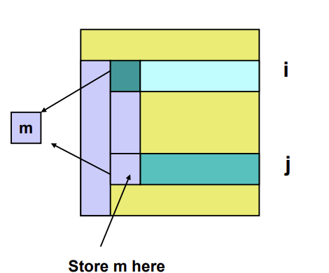

# 加速与效率
## 并行计算的目标
并行计算的核心目标是提高性能，即通过多处理器协作，缩短计算时间，从而比串行算法更快地解决问题。
## 加速比
- 定义：并行计算相对于最优串行算法的性能提升程度
- 公式：
- - 
- 理想情况：如果并行算法完美线性加速，则S=p（即使用p个处理器，速度提升p倍）。
- 现实中：由于通信开销，负载不均衡等因素，通常S< p.
## 效率
- 定义：衡量处理器资源的有效利用率，即每个处理器对加速的实际贡献。
- 公式：

- - 理想情况：E=1（100%利用率，即所有处理器都在有效工作）
- - 实际情况：通常E<1,因为并行计算会引入额外开销（通信，同步）
## 关键影响因素
- 通信开销（Communication Overhead）：处理器间数据交换消耗时间。
- 负载均衡（Load Balancing）：任务分配不均会导致部分处理器空闲。
- 并行算法设计：某些问题天然适合并行（如矩阵运算），而有些则难以并行化（如递归计算）。
- 为了管理计算和增加并行性而引入的额外工作
## 数学关系：开销如何影响效率

# 加速比
## 理想加速比

- 其中Ts是在单处理器上执行任务所需要的时间，Tp实在p个处理器上执行任务所需的时间。
- 原理：理想情况下，当使用p个处理器时，我们期望加速比能提高p倍。这是基于任务可以完全并行化，且处理器之间没有通信开销等问题的假设。
## 实际加速比
- 在实际情况中，由于存在任务不能完全并行化（如部分任务必须串行执行）、处理器间通信开销（传递数据等操作耗时）、负载不均衡（各处理器处理任务量不同）等因素 ，实际加速比通常小于理想加速比。并且随着处理器数量增加，这些影响因素往往更显著，导致实际加速比与理想加速比的差距增大
## 阿姆达尔定律
1. 基本思想
阿姆达尔定律用于预测并行计算的理论加速上限，指出：程序的串行部分会严格限制最大可能的加速比，即使使用无限多的处理器也无法突破这一限制。
2. 数学模型
假设一个问题的总计算可为两部分

3. 加速比公式

## 并行计算中的开销分析与优化策略
1. 效率公式回顾

2. 主要开销来源及优化方向

(1) 通信开销（Communication Overhead）问题：处理器间数据传输（如 MPI 消息传递、共享内存同步）消耗时间。
优化策略：

- 减少通信频率：批量传输数据（如数组而非单变量）。
- 重叠计算与通信：异步通信（如 MPI_Isend/MPI_Irecv）。
优化数据局部性：利用缓存一致性（如 NUMA 架构优化）。

(2) 同步开销（Synchronization Overhead）问题：屏障（Barrier）、锁（Lock）导致处理器等待。
优化策略：
- 减少同步点：使用无锁（Lock-free）数据结构。

- 细粒度同步：替换全局屏障为局部同步（如 OpenMP 的 nowait）。

(3) 负载不均衡（Load Imbalance）问题：某些处理器空闲，其他处理器过载。
优化策略：
- 动态任务调度：如 OpenMP 的 schedule(dynamic)。
- 任务窃取（Work Stealing）：空闲处理器主动获取任务（如 C++ TBB）。
(4) 并行管理开销（Parallel Management）问题：任务分解、结果合并等额外操作。
优化策略：
- 选择高效并行模式：如 MapReduce 适合批处理，Actor 模型适合异步任务。
- 避免过度并行化：线程/进程数并非越多越好
# 并行算法设计
将问题规约转化为具有并发性、可扩展性和局部性的算法，这一过程需要结合创新思维，无法简单套用固定模式。设计优秀的并行算法往往需要突破传统思路，甚至提出前所未有的新方法。
1. 问题分析与分解 
- 理解问题：明确计算目标、数据依赖关系和计算模式（如任务并行/数据并行）。
- 分解策略：
- - 任务分解：将计算拆分为独立或松散耦合的子任务（如MapReduce中的Map阶段）。
- - 数据分解：划分数据块并行处理（如矩阵分块乘法）。
- - 混合分解：结合任务与数据分解（如流体模拟中区域分解+局部计算）。      
2. 并发性设计
- 暴露并行度：通过算法重构减少顺序约束（例如循环展开、递归任务化）。
- 依赖管理：使用同步（屏障、锁）或无锁设计（如原子操作）解决冲突。
3. 可扩展性优化 
- 负载均衡：动态调度（如工作窃取）或静态分配（如均匀分块）。 
-  通信开销：减少进程间通信（如使用局部性优先的数据分布）。    
4. 局部性增强 
- 数据亲和性：使计算尽量访问本地内存（如NUMA架构优化）。
-  计算-通信重叠：异步通信隐藏延迟（如MPI非阻塞操作）。
# 并行计算的一般设计流程
并行算法的设计通常分为两个阶段：与机器无关的阶段 和 与机器相关的阶段。
1. 与机器无关的阶段
**（1）划分**
- 目标：将计算任务分解成多个可并行执行的子任务
- 方法：
- - 任务分解：按计算逻辑拆分
- - 数据分解：按数据划分
**（2）通信与同步**
- 目标：协调并行任务的执行，确保数据一致性和正确性
- 方法：
- - 共享内存模型：使用锁、信号量，屏障等。
- - 分布式内存模型：消息传递
- - 无锁编程：原子操作，事务内存
2. 与机器相关的阶段
**（1）任务分配**
- 目标：将任务映射到处理器（进程/线程），最大化资源利用率
- 方法：
- - 静态分配：提前固定分配（如均匀分块），适用于规则计算。
- - 动态分配：运行时调整（如工作窃取，work-stealing），适用于负载不均场景。
**（2）开销最小化**
- 通信优化：减少进程间数据传输
- 并行粒度调整
- - 粗粒度：减少同步开销，但可能降低并行度
- - 细粒度：提高并行度，但增加调度开销
- 硬核适配
- - CPU多核：利用线程池，SIMD指令
- - GPU：设计wrap-friendly的并行模式
- - 分布式集群：考虑网络延迟，数据分区策略
# 划分
- 目标：揭示并行执行的机会，通过定义大量小任务（每个任务包含计算及其操作的数据）来实现并行化。
## 典型的划分方式
1. 任务划分
- 方法
- - 先将计算逻辑拆分成多个部分
- - 再为每个计算部分分配所需的数据
- 适用场景：计算步骤间独立性高
2. 数据划分
- 方法
- - 先将数据分割成多个块
- - 再将计算操作关联到每个数据块上。
- 适用场景：数据可自然分块且计算模式一致
3. 选择依据
具体采用哪种划分方式，需根据问题的实际特性决定。例如：
- 若计算步骤差异大但数据固定 → 任务划分更优（如多任务流水线）
- 若数据规模大但计算模式统一 → 数据划分更高效（如大规模数值模拟）
# 通信与同步
## 核心概念
1. 任务间的依赖关系
-  划分（Partitioning）生成的子任务虽然可以并发执行，但通常不能完全独立运行。
- 某些任务可能依赖其他任务的计算结果或数据，因此需要进行数据传递或执行顺序协调
2. 通信
- 指任务之间的数据交换
3. 同步
- 指任务执行的协调机制，确保数据一致性和正确执行顺序
## 主要挑战
1. 通信开销
- 数据传递可能带来延迟
- 需优化通信频率和方式
2. 同步瓶颈
- 过度同步会限制并行效率
- 需选择合适的同步机制
3. 死锁与竞态
- 不合理的通信/同步可能导致程序错误
- 需谨慎设计任务间的交互方式
# 示例：矩阵-向量乘法
- 任务划分：
- - 划分向量y，每个任务处理一个元素
- - 计算每个元素c需要用到矩阵A的一行和向量b。
- 观察结论
- - 任务规模均匀
- - 任务之间无依赖关系
- - 属于易并行问题
- 数据划分
- - 我们可以划分矩阵A和向量b，然后将矩阵A中的一组数据与向量b中的一个数据项的乘法运算作为一个任务 。

- - 注意这些小任务的结果只是中间结果，它们会作为新数据用于进一步构建新任务。

- - 这相当于将每个内积进一步划分为n个更小的任务。

- 观察结论：

- - 任务规模均匀。

- - 适合细粒度并行计算。

- - 但在计算两个向量的内积时任务之间存在依赖关系！
# 算法的并行结构
- 为解决给定问题设计并行算法时，通常第一步是检测顺序算法中的并行结构。
- 一旦确定了算法的并行结构，许多后续决策就会变得清晰明了。
- 任务依赖图是识别程序并行结构的有效技术之一。
# 任务依赖图
**在任务依赖图中：**

- 每个节点代表一个任务

- 节点间的箭头表示任务间的依赖关系

**其主要用途是通过图形化展示算法的并行结构，进而呈现算法的多种特性**
- 并行结构模式 - 体现算法的规律性
- 边集特征 - 反映任务间的依赖关系
- 基于输入数据的结构 - 用于工作量预测
- 对于简单算法，通常只需展示一个小型依赖图即可说明问题。
- 然而，针对复杂算法构建这样的依赖图往往具有挑战性。
## 矩阵-向量乘法
- 每个节点表示aij与bj的一次乘法运算
- 箭头表示顺序相加操作（即数据依赖关系）
- 每一条垂直的箭头- 节点线代表点积yi的一个输出。

# 数学结合律与并行算法设计
## 在并行算法设计中
1. 并行结构的重要性与局限性
- 算法并行结构是关键概念，但不应孤立使用
- 单纯依赖任务依赖图可能掩盖更深层的优化机会
2. 数学基础的决定性作用
- 评估算法并行潜力时，其数学原理具有同等重要性
3. 实践价值
- 掌握算法数学基础能显著提升并行度
- 典型应用场景：
✓ 并行归约运算（如MPI_Reduce）
✓ 分布式矩阵计算优化
✓ 流水线任务重组
## 考虑n个整数的求和：

- 对于典型的顺序程序：

- 初始化s = 0 ；

- 通过循环 for (i = 0; i < n; i++)  ，每次将a[i]累加到s ，即 s = s + a[i];  。

- 该算法的结构：呈现完全顺序执行的特性（图中用节点依次连接表示顺序关系）。 
- 本质上是完全顺序执行的！
## 基于结合律的并行求和算法
1. 数学基础
加法运算满足结合律特性
（a+b）+c=a+(b+c)
这使得我们可以重组求和顺序
\sum_{i=0}^{2n-1} a_i = \sum_{i=0}^{n-1} a_i + \sum_{i=n}^{2n-1} a_i
2. 并行算法实现
采用递归二分策略
- 1. 数据划分：将数组均分为两部分
- 2. 并行计算：
- - 左右子数组各自独立求和
- - 递归执行直到子数组规模为1
- 3. 结果合并：逐层合并部分和
3. 并行结构分析
任务依赖图：形成完全二叉树结构
      [0:7]
     /     \
  [0:3]   [4:7]
  /   \    /   \
## 分治技术在并行规约中的应用
1. 技术原理
- 分解阶段
- - 将输入数据划分为n个单元素组
- 征服阶段
- - 递归执行两两合并操作
2. 适用条件
- 运算符要求：
- - 必须满足结合律：(a⊕b)⊕c = a⊕(b⊕c)
- - 常见适用运算：
- - ✓ 加法/乘法
✓ 逻辑与/或
✓ 最大值/最小值
✓ 字符串连接
# Lab

# 高斯消元法
## 对于给定的N\times N矩阵A ，通过将每行的倍数加到后续行，使矩阵A化为上三角矩阵：
 
- 外层循环 for i = 1 to n - 1  ：针对每一列，要将对角线下方元素消为0 ，通过把第i行的倍数加到后续行来实现。

- 中层循环 for j = i + 1 to n  ：对于第i行之后的每一行j 。

- 内层循环 for k = i to n  ：计算并更新矩阵元素，先取出A(j, i)赋值给 tmp  ，然后对第j行从第i列到第n列的元素A(j, k) ，按 A(j,k) = A(j,k) - (tmp / A(i,i)) * A(i,k) 的规则更新 。
 
下方图示展示了不同阶段i取值时，矩阵对角线下方元素逐步被消为0的过程，从i = 1到i = n - 1 ，最终将矩阵化为上三角矩阵

## 乘数存储：将乘数m存储在对角线下方已消为零的元素位置，以备后续使用。

- 外层循环 for i = 1 to n - 1  ：遍历矩阵的行。

- 中层循环 for j = i + 1 to n  ：针对第i行之后的行j 。先计算A(j, i)=A(j, i)/A(i, i)得到乘数 。

- 内层循环 for k = i + 1 to n  ：根据公式A(j, k)=A(j, k)-A(j, i)*A(i, k)更新矩阵元素 。

- 矩阵定义：

- 把严格下三角的乘数矩阵称为M ，令L = I + M（I为单位矩阵） 。

- 把最终矩阵的上三角部分称为U 。

- 引理（LU分解）：如果上述算法能够正常结束（即没有出现除数为零的情况），那么矩阵A可分解为A = L*U 。 这就是高斯消元法实现矩阵LU分解的原理，通过对矩阵的逐步变换，将原矩阵分解为下三角矩阵L和上三角矩阵U的乘积形式。
- 
# 带部分主元选择的高斯消元法
1. 基本问题
对于矩阵

传统高斯消元法会失败，因为A(1,1)=0导致无法进行除法运算。而实际上该方程组应容易求解
2.  数值稳定性问题 
当对角元素A(i,i)非常小（不一定是零）时：
 •  算法可能得出完全错误的解
   •  主要原因：舍入误差放大导致的数值不稳定
3. 解决方案
通过行交换（pivoting）确保主元足够大
- 主元选择策略
- - 在第i列中，选取绝对值最大的元素作为主元
- - 交换当前行与该主元所在行
- 部分主元选取：通过交换行，使A(i, i)成为第i列中绝对值最大的元素 。

- 外层循环 for i = 1 to n - 1  ：遍历矩阵的行。

- 首先找到并记录k ，使得\vert A(k, i)\vert=\max_{i\leq j\leq n}\vert A(j, i)\vert ，即找到第i列剩余部分中绝对值最大的元素所在行k 。

- 若\vert A(k, i)\vert = 0 ，则退出并给出警告，提示矩阵A奇异或接近奇异 。

- 若k\neq i ，则交换矩阵A的第i行和第k行 。

- 消元计算：

- 计算A(i + 1:n, i)=A(i + 1:n, i)/A(i, i) ，确保每个商的绝对值\leq1 。

- 根据公式A(i + 1:n, i + 1:n)=A(i + 1:n, i + 1:n)-A(i + 1:n, i)*A(i, i + 1:n)更新矩阵元素 。