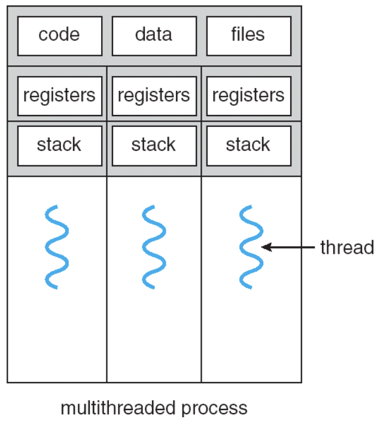
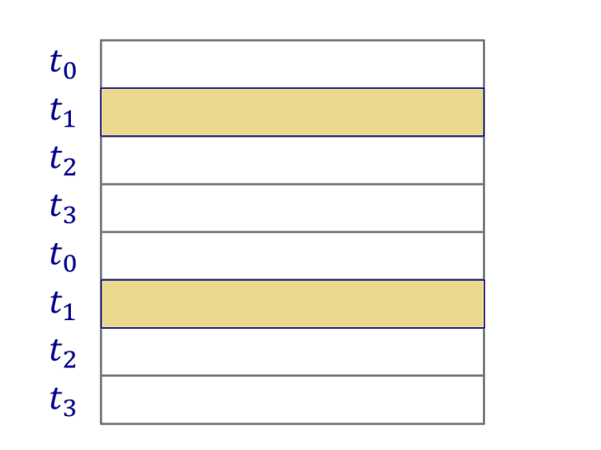
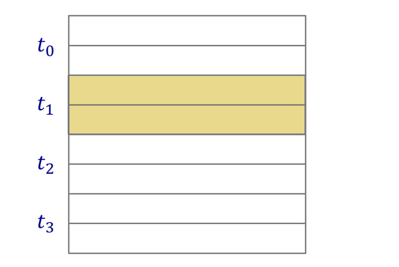
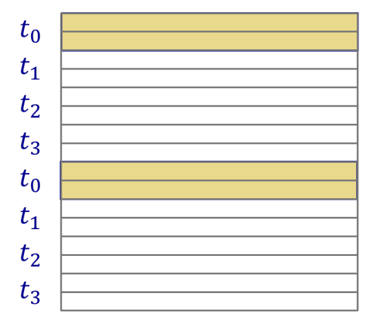
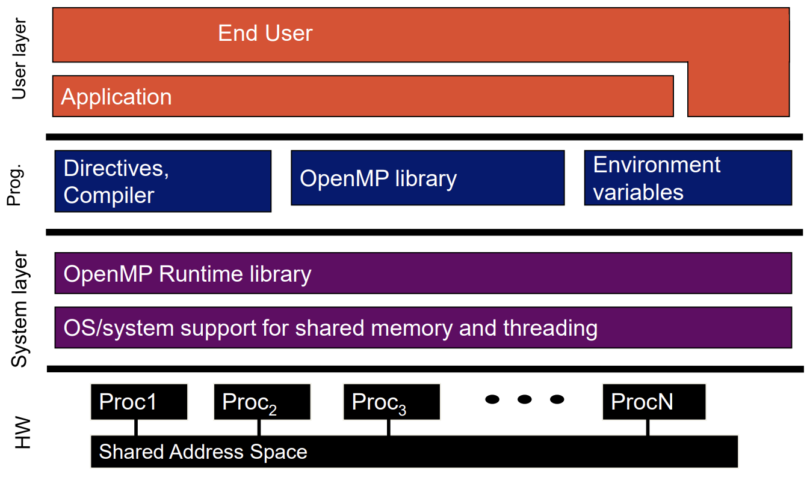
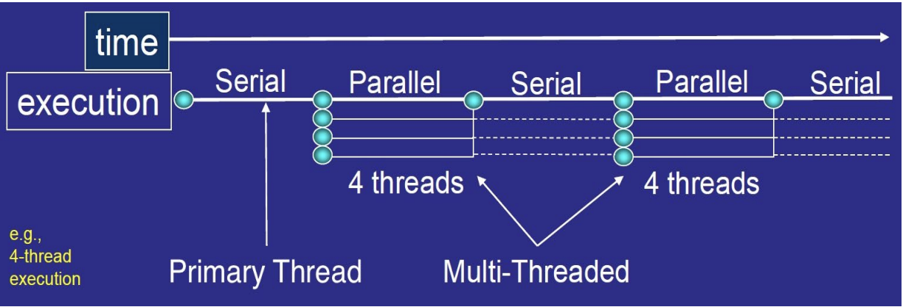
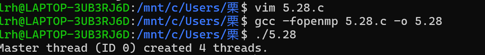
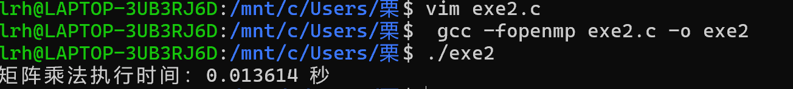

# 共享内存平台概述
- 共享内存平台 是一种并行计算模型，多个线程在同一个进程内并发执行，并共享同一块内存空间。
## 主要特点：
1.  线程执行与内存模型
- 多线程并发：多个线程同时运行。
- 共享全局变量：所有线程可读写同一块内存（全局变量）。
- 私有局部变量：每个线程拥有独立的栈空间存储局部变量。
- 隐式通信：线程通过读写共享变量进行数据交换。
- 显式同步：必须使用锁（mutex）、信号量（semaphore）、屏障（barrier）等机制协调线程执行顺序，避免竞态条件（race conditions）。
2. 硬件与适用场景
- 小规模并行
- 粗粒度并行
3. 共享内存编程技术
- Pthread（POSIX线程）
- - 显式创建和管理线程（pthread_create()、pthread_join()）。
- OpenMP
# 线程基础
- 单进程多线程：一个进程内可运行多个线程
- 共享地址空间与进程状态：同一进程的所有线程共享内存空间和进程资源，大幅降低上下文切换开销
- 并发执行与隐式交互：线程并发运行，通过读写共享内存中的同一位置进行通信
- 执行顺序不确定性：
- - 线程执行顺序无法预设
- - 必须通过同步机制（如锁/屏障）明确控制顺序
- 典型问题
- - 死锁
- - 线程饥饿
- - 性能优化挑战
- 跨平台支持：所有现代通用操作系统均原生支持线程
- 
- 展示了多线程进程的内存结构
1. 共享内存区域
- 代码段（Code）：存储程序指令
- 数据段（Date）：全局变量，静态变量
- 文件（Files）：打开的文件描述符，内存映射文件
2. 线程私有内存区域
- 寄存器（Registers）：存储线程当前的执行上下文
- - 线程切换时：寄存器状态由操作系统保存/恢复。
- 栈（Stack）：存储局部变量、函数调用栈帧
- - 线程安全：栈空间私有，无需同步
# 程序共享内存平台
1. 全局变量被所有线程共享
- 算法设计似乎更容易，因为数据不需要频繁移动
2. 数据分区和数据局部性
- 很重要，但数据到线程的分配通常是隐式的
- - 因为我们必须认真考虑指令级并行性、内存层次结构和缓存效应
3. 显示同步
- 在共享内存机器中，全局数据被多个线程共享
- 同步必须用于
- - 保护对共享数据的访问，从而防止竞争条件
- - 施加顺序约束
- 需要防止应用同步时可能出现的死锁
# 竞态条件
1. 定义
竞态条件指多个线程并发访问共享数据时，由于执行顺序的不确定性，导致程序最终结果不可预测的情况。
2. 发生条件
- 共享数据：多个线程访问同一变量或资源（如全局变量、文件、内存等）。
- 非原子操作：至少有一个线程在修改数据
3. 举例
假设初始值 count = 5，两个线程并发执行：

线程A：执行 count++（预期结果：6）

线程B：执行 count--（预期结果：4）

可能的执行顺序（无同步时）：

线程A读取 count=5 → 线程B读取 count=5 → A写入 6 → B写入 4 → 最终结果：4（错误）

线程A完整执行 count++ → 线程B执行 count-- → 最终结果：5（错误）

线程B完整执行 count-- → 线程A执行 count++ → 最终结果：5（错误）

其他交错执行可能导致结果为 6 或 4。
- 根本原因
count++ 和 count-- 并非原子操作，实际分为三步
- - LOAD count到寄存器  
- - 修改寄存器值  
- - STORE寄存器值到count
- 
**解决方法**
为了防止竞态，需要保证递增（排序）操作在其他操作之前完成——互斥
- 通过互斥锁确保同一时间只有一个线程能执行临界区代码
- 作用：
- - 线程A执行count++时，线程B的count--必须等待锁释放
- - 保证count++和count--的指令不会交错，结果始终正确。
# 示例：矩阵乘法
-  我们可以为矩阵乘法绘制一个任务依赖图。
- 从图中我们可以很容易地看到，所有输出元素  c_{ij}  都可以并行计算。

- 然而，这是一种细粒度并行性。

- 对于共享内存机器，我们需要更粗粒度的并行性
- 对于粗粒度并行，划分输出矩阵  C 。
- 不存在数据依赖，因此无需同步
- 属于易于并行（指任务可轻易并行处理，相互几乎无依赖 ）。
- 注意规则的数据结构和已知的工作量。
- - 静态划分相对容易
##  划分矩阵  C  与分配任务的不同方式
### 一维循环划分
- 在一维循环划分中，按循环方式逐行将行分配给线程，直到所有行都分配完毕。

### 一维分块划分
- 在一维分块划分中，首先将行分组为块，然后为每个块分配一个线程。
- 
### 一维分块循环划分
- 首先将行分组为块。
- 块的数量远多于线程数量。
- 按循环方式逐块将块分配给线程。
- 
## SM机上的矩阵乘法
- 没有数据依赖-令人尴尬的并行
- 线性加速是可以实现的
- 重点应该放在每个核心上的顺序计算上，以实现高效率•
- 例如，缓存效果，内存层次结构，循环展开和ILP
## 问题
已知矩阵 A(n*k)、B(k*m) 和 C(n*m) ，n 或 m 远小于核心数量，k 很大 。目标是设计并行算法，需利用共享内存特性，考虑缓存、内存层次等因素来提升效率1. 基于分块的并行策略

1. 将矩阵 A 按行分块，矩阵 B 按列分块。由于 k 很大，可沿 k 维度进行划分。例如把 A 划分为大小为 n_{sub}\times k 的子矩阵 A_{i} （n_{sub} 为合适的子矩阵行数 ） ，把 B 划分为大小为 k\times m_{sub} 的子矩阵 B_{j} （m_{sub} 为合适的子矩阵列数 ）。每个子矩阵乘法 A_{i}\times B_{j} 分配给一个线程或处理器核心计算，最后合并结果得到矩阵 C 。这样能减少数据传输，充分利用缓存局部性原理，降低内存访问开销。

2.  利用OpenMP实现并行

- 利用OpenMP进行并行编程。OpenMP是共享内存并行编程模型，通过在代码中添加编译指导语句实现并行化。例如，使用  #pragma omp parallel for  指令对矩阵乘法循环进行并行化。以计算矩阵 C 元素 c_{ij} 的循环为例，可将外层循环并行化，让不同线程计算不同行的 c_{ij} 元素。

3.  缓存优化

- 考虑缓存效应，合理安排数据访问顺序。按分块方式加载数据到缓存，确保在计算过程中尽量从缓存读取数据。例如，先将一个子矩阵块的数据一次性加载到缓存，在该块计算完成前尽量避免缓存替换，减少缓存缺失次数。

4.  循环展开

- 对矩阵乘法计算中的内层循环（涉及 k 维度 ）进行展开。循环展开可减少循环控制开销，提高指令级并行（ILP） ，使处理器能同时执行更多指令，提升计算效率。
# OpenMP 共享内存并行编程
## 课程材料来源
- https://hpc-tutorials.llnl.gov/openmp/  
- https://cvw.cac.cornell.edu/OpenMP/ 
-  https://sites.google.com/lbl.gov/cs267-spr2018/  
- https://www.openmp.org/wp-content/uploads/omp-hands-on-SC08.pdf
## OpenMP相关说明
- OpenMP是"Open Multi-Processing"（开放式多处理）的缩写
- openmp.org - 提供演讲、示例、论坛等资源
## OpenMP技术特点
- 一种基于指令的应用程序编程接口（API），用于开发共享内存架构上的并行程序 
-  用于C/C++和Fortran编程的高级API 
- 预处理器（编译器）指令
- - 编译器指令使用以pragma开头的命令（内置于注释中）指定应生成哪种类型的代码
- - #pragma omp construct [clause [clause...]]    
- 库调用  
- - #include <omp.h>    
- 环境变量
## OpenMP 设计动机
- 线程库（例如Pthread）难以使用
- - Pthread线程包含许多初始化、同步、线程创建、条件变量等库调用
- - 线程之间的同步引入了程序正确性的新维度
- 这时通过OpenMP指令进行显式并行化就派上用场了
- - 通过相对较少的注释来并行化顺序程序，指定并行性和独立性
- - 只需一个小的API，用更简单的指令隐藏繁琐的线程调用
## OpenMP的各层内容介绍
### HW（硬件层）
- Proc1 - ProcN（处理器）：代表多个处理器核心，是进行实际计算的硬件单元。它们通过共享地址空间（Shared Address Space） 来访问共享内存，实现数据交互和共享，为并行计算提供物理基础。
- Shared Address Space（共享地址空间）：允许多个处理器访问同一块内存区域，方便处理器间共享数据，是共享内存并行计算的关键硬件支持，不同处理器能读写同一块内存中的数据，促进并行任务协作。
### System layer（系统层）
- OS/system support for shared memory and threading（操作系统对共享内存和线程的支持）：操作系统提供底层机制，管理共享内存资源分配、回收，以及线程的创建、调度和同步等操作，保障共享内存并行程序正常运行。
- OpenMP Runtime library（OpenMP运行时库）：运行时库在程序运行阶段起作用，提供一系列函数和服务，比如线程管理（创建、销毁线程 ）、数据共享管理（处理变量在不同线程间的共享和私有属性 ）、同步机制（如锁、障碍等 ），支持OpenMP程序运行。
###  Prog.（编程层）
- Directives, Compiler（指令、编译器）：OpenMP使用编译指令（如  #pragma omp parallel  等 ）来指示编译器将特定代码段并行化。编译器负责解析这些指令，将其转换为底层机器可执行的并行代码，实现并行计算逻辑。
- OpenMP library（OpenMP库）：提供了一系列函数接口，供程序员在代码中调用，实现更灵活的并行控制和功能扩展，比如设置线程数量、获取线程相关信息等。
- Environment variables（环境变量）：通过设置环境变量（如  OMP_NUM_THREADS  等 ），可在程序运行前或运行时配置OpenMP程序的运行参数，如指定使用的线程数量、设置并行任务调度策略等，灵活调整程序并行执行方式。
###  User layer（用户层）
- Application（应用程序）：程序员基于OpenMP编写的具体应用，利用OpenMP相关机制实现并行计算功能，提升程序性能。
- End User（终端用户）：最终使用应用程序的用户，通过应用程序的功能满足自身需求，无需了解OpenMP底层实现细节

## 程序员的OpenMP视角
- OpenMP是一种可移植的、基于线程的共享内存编程规范，具有"轻量级"语法
- - 需要编译器支持(C、C++或Fortran)
### OpenMP可以
允许程序员将程序分为串行区域和并行区域,而不是显式创建并发执行的线程  
隐藏栈管理  
提供一些同步构造

### OpenMP不会：
自动并行化 
保证加速 
完全避免数据竞争
## OpenMP执行模式
### 分叉-加入并行模式
- 主线程根据需要创建一组线程
- 逐步增加并行度，直到达到性能目标，即顺序程序演化为并行程序
- 
-  横轴与纵轴含义：横轴表示时间（time），纵轴表示执行（execution）。展示了程序执行过程中顺序执行和并行执行的时间分布情况 。

- 执行阶段

- Serial（顺序执行）：程序开始由主线程（Primary Thread ）执行顺序代码，此时只有一个主线程在工作，如初始化变量、执行一些不适合并行的操作等。

- Parallel（并行执行）：当遇到并行代码段时，主线程分叉出多个子线程（图中为4 threads ），进入多线程（Multi - Threaded ）并行执行阶段。这些子线程共同处理并行任务，提升执行效率。并行任务结束后，子线程合并回主线程，继续顺序执行后续代码。

- 执行模式：体现了Fork - Join Parallelism（分叉 - 合并并行）模式。主线程按需创建子线程组，并行部分执行完毕后子线程回归主线程，程序在顺序和并行执行间交替，逐步将顺序程序转变为并行程序以满足性能需求。
## C/C++ 中 OpenMP 的通用代码结构
1. 基本结构概览
```
#include <omp.h>       // 引入OpenMP头文件
int main() {
    int var1, var2, var3; // 变量声明

    /*---------- 串行代码段 ----------*/
    // 此处是串行执行的代码
    // ...

    /*---------- 并行区域开始 ----------*/
    #pragma omp parallel private(var1, var2) shared(var3)
    {
        /* 
         * 此代码块会被所有线程并行执行
         * var1 和 var2 是线程私有变量
         * var3 是共享变量
         */
        // 可以调用OpenMP运行时库函数（如omp_get_thread_num()）
        // 其他OpenMP指令（如#pragma omp for）
    } 
    /*---------- 并行区域结束 ----------*/

    /*---------- 恢复串行代码 ----------*/
    // 此处代码由主线程单独执行
    // ...
    return 0;
}
```
|OpenMP pragma、函数或子句|概念|
|---|---|
|#pragma omp parallel|并行区域、线程组、结构化块、线程间的交错执行|
|int omp_get_thread_num()  int omp_get_num_threads()|在并行区域中创建线程，并根据线程数量和线程ID分配工作|
|double omp_get_wtime()|加速比和阿姆达尔定律。 伪共享及其他性能问题|
|setenv OMP_NUM_THREADS N|内部控制变量。使用环境变量设置默认线程数|
|#pragma omp barrier  #pragma omp critical|同步和竞争条件。回顾交错执行|
|#pragma omp for  #pragma omp parallel for|工作共享、并行循环、循环携带依赖|
|reduction(op:list)|跨线程组的值归约|
|schedule(dynamic [,chunk])  schedule(static [,chunk])|循环调度、循环开销和负载均衡|
|private(list), firstprivate(list), shared(list)|数据环境|
|nowait|禁用工作共享构造上的隐式屏障、屏障的高成本以及刷新概念（但不是刷新指令 ）|
|#pragma omp single|单线程工作共享|
|#pragma omp task  #pragma omp taskwait|任务，包括任务的数据环境|

# 并行区域构造
#pragma omp parallel [子句...] 换行符
- 当线程到达并行指令时，它会创建一个线程团队，并成为该团队的主线程
- 主线程是该团队的一员，在该团队中拥有线程号（或ID）0
- 从并行区域的开始处，所有线程都将执行该区域内的相同代码
- 在并行区域的末尾有一个隐式的屏障
- 只有主线程会继续执行越过这个点
## 创建了多少个线程
- 实现默认值通常是节点上的 CPU 数量或核心数
- 使用库函数omp_set_num_threads() 设置
- 使用 num_threads 子句设置线程数
- - 例如：#pragma omp parallel num_threads(3)
- 要获取节点上可用的核心数
- - 使用函数 omp_get_num_procs()
- 要检查创建了多少个线程
- - 使用函数 omp_get_num_threads()
- 创建的线程从 0（主线程）编号到 nthreads-1
- 要获取每个线程的 ID
- - 使用函数 omp_get_thread_num()
## 共享变量和私有变量？
- 在并行区域外声明的变量都是共享的
- - 变量只有一个副本，所有线程都引用同一个变量
- - 当引用这类变量时需要小心
- 在并行区域内声明的变量都是私有的
- - 每个线程都有自己的变量副本，使用安全
- 共享和私有子句
- - private(list) 子句将列表中的变量声明为每个线程私有
- - 对于团队中的每个线程，都会声明一个相同类型的新对象
- - shared(list) 子句将列表中的变量声明为团队中所有线程共享
# Lab1

# 工作共享机制：针对指令
## #pragma omp for[子句...]换行
- for 指令指定，其后面紧接着的循环迭代必须由线程组并行执行。
-  for 指令必须位于并行区域内。
- 例如
   #pragma omp parallel 
 { 
 #pragma omp for 
 for (i = 0; i < N; i++)- （循环控制索引i默认对每个线程是“私有的”。） { 
     c(i); 
 } - （线程在此等待，直到所有线程完成并行for循环，然后才能继续执行循环结束后的代码。） 
 } 
## OpenMP快捷方式：将“parallel”和工作共享指令放在同一行。
- 指令基础： #pragma omp for 指定后续循环由线程组并行执行，且须置于并行区域（ #pragma omp parallel  ）内 ，循环控制索引默认对各线程私有 。

- 语法简化：存在快捷写法， #pragma omp parallel 与 #pragma omp for 可合并为 #pragma omp parallel for  ，效果等同。

- 任务分配：介绍工作划分与共享方式，如通过获取线程编号、总数计算各线程负责的循环区间（块划分） ， #pragma omp parallel for 默认采用块划分 。

- 并行要点：循环并行化时，需找出计算密集型循环，消除循环携带依赖，使迭代相互独立，再添加对应OpenMP指令并测试。
## 处理循环
- 找到计算密集型循环
- 使循环迭代相互独立....这样它们可以按任意顺序安全执行，而不存在循环携带依赖。
- 放置合适的OpenMP指令并测试。
# Lab2
```
#include<stdio.h>
#include<omp.h>
#define M 100
#define N 100
#define P 100
int main(){
        double A[M][N],B[N][P],C[M][P];
        for (int i=0;i<M;i++){
                for(int j=0;j<N;j++)
                {
                        A[i][j]=(double)(i+j);
                }
        }
        for(int i=0;i<N;i++){
                for(int j=0;j<P;j++)
                {
                        B[i][j]=(double)(i-j);
                }
        }
        double start_time,end_time;
        start_time=omp_get_wtime();
#pragma omp parallel for collapse(2)
        for(int i=0;i<M;i++){
                for(int j=0;j<P;j++)
                {
                        C[i][j]=0.0;
                        for(int k=0;k<N;k++){
                                C[i][j]+=A[i][k]*B[k][j];
                        }
                   }
        }
        end_time=omp_get_wtime();
        double elapsed_time=end_time-start_time;
        printf("矩阵乘法执行时间：%f 秒\n",elapsed_time);
        return 0;
}
```     

