# 同步
- 在共享内存机器中，全局数据由多个线程共享
- 必须使用同步来
- - 保护对共享数据的访问，从而防止竞争情况
- - 施加顺序约束
- OpenMP支持的同步结构
- - 批判的，原子和障碍
- - 完整的OpenMP规范还有更多
# 同步构造
## OpenMP critical 指令
- /#pragma omp critical
- - **互斥执行**： 同一时刻只有一个线程可以执行临界区内的代码。当一个线程进入临界区时，其他线程必须等待，直到该线程退出临界区。
- - **作用域限制**：critical 指令必须出现在并行区域（#pragma omp parallel）内部，否则会导致编译错误。
- - **性能影响**：过度使用临界区会导致线程间频繁等待，降低并行效率。因此，应尽量减少临界区的代码量。
- 例如，线程增加计数
- /#pragma omp parallel shared(count)
- {
- ...
- /#pragma omp citical
- count++;
- ...
- }
## OpenMP atomic 指令
- /#pragma omp atomic
- - 也提供互斥功能，但仅适⽤于⼀个内存位置的更新
- - atmoic指令仅适用于紧随其后的语句
- 例如：累积多个线程完成的部分结果 
- double sum = 0.0;
- #pragma omp parallel shared(sum)
{
 double lsum;
 ⋯
 #pragma omp atomic
 sum += lsum
 ⋯
}
## OpenMP barrier 指令
- #pragma omp barrier
- - barrier是程序中所有线程在被允许继续执⾏之前必须到达的点
- 在 OpenMP 中，⼤多数构造在构造末尾都有⼀个隐含的屏障
- - 要消除这个障碍，使用nowait子句。
- #pragma omp parallel shared(sum)
{
 //all threads do something
 #pragma omp barrier //Threads wait until all threads hit the barrier
 //all threads do some other thing
}
# 指令级数据依赖
## 三个种类
### 1. 流依赖（Flow dependency，Read After Write，RAW）
- 定义：指一条指令需要读取另一条指令写入的数据，即写后读 。
- 示例：先执行 a = b + c  ，将 b + c 的结果写入 a ；后续 d = a * e 需要读取 a 的值来计算并赋值给 d 。如果这两条指令乱序执行， d 就会读取到错误的 a 值。
### 2. 反依赖（Anti - dependency，Write After Read，WAR）
- 定义：一条指令写入的目的寄存器是另一条指令要读取的源寄存器，即读后写 。
- 示例：先执行 b = a + c  ，读取 a 的值来计算并赋值给 b ；然后执行 a = d * e  ，向 a 写入新值。若顺序错误， b 读取的 a 值就不正确。
### 3. 输出依赖（Output dependency，Write After Write，WAW）
- 定义：两条指令对同一寄存器进行写入操作，即写后写 。
- 示例：先执行 a = b + c  ，再执行 a = d * e  。如果顺序不当，可能导致最终 a 的值不是期望的结果。
##  指令级数据依赖性——指令序列中的依赖性
- 流依赖是真正的依赖
- 反依赖和输出依赖不是真正的（所谓的⼈为）依赖，可以消除
# 循环携带数据依赖
> 例1
for(i=0; i<n; i++)
{
tmp = a[i];
a[i] = b[i];
b[i] = tmp;
}

- 三条指令存在数据依赖关系
- 然⽽，没有数据依赖关系可以执⾏到下⼀次迭代
- 因此，循环可以安全地并⾏化
> 例2
for（i=0;i<n;i++）
{
    a[i]=b[i]+e[i];
    d[i]=e*a[i+1];
}

> 线程0：
a[0] = d[0]+e[0]
d[0] = e * a[1]
a[1] = d[1]+e[1]
d[1] = e * a[2]

>线程1:
a[2] = d[2]+e[2]
d[2] = 3 * a[3]
a[3] = d[3]+e[3]
d[3] = e * a[4]

> 线程2：
a[4] = d[0]+e[0]
d[0] = e * a[5]
a[5] = d[1]+e[1]
d[1] = e * a[6]
- 确实存在循环携带的数据依赖关系
- 还有潜在的数据竞争
- - ⼀个线程写⼊，另⼀个线程读取同⼀数据
## 调整指令顺序
- 消除数据依赖限制：在同一迭代中，若两条指令不存在数据依赖，调整顺序不会影响结果。像图中示例，调整后可使指令执行顺序更符合处理器执行特性或优化策略，为后续优化（如并行执行相关优化 ）创造条件。
> for (i=0; i<n; i++)
 {
 d[i] = e * a[i+1];
 a[i] = b[i] +e[i];
 }
## 拆分循环
- 降低数据依赖复杂度：将存在复杂数据依赖的循环拆分开，可使每个新循环内的数据依赖关系更简单清晰。比如图中循环，拆分后可分别分析和处理每个循环的数据依赖，避免相互干扰，为并行化或其他优化手段的应用奠定基础
> for (i=0; i<n; i++)
 d[i] = e * a[i+1];
for (i=0; i<n; i++)
 a[i] = b[i] +e[i];

## 现在逐个并⾏化两个 for 循环
> #pragma omp parallel for
 for (i=0; i<n; i++)
 d[i] = e * a[i+1];
 **此处隐含障碍**
 #pragma omp parallel for
 for (i=0; i<n; i++)
 a[i] = b[i] +e[i]

> Thread 0:
d[0] = e * a[1]
d[1] = e * a[2]
a[0] = b[0]+e[0]
a[1] = b[1]+e[1]

> Thread 1:
d[2] = 3 * a[3]
d[3] = e * a[4]
a[2] = b[2]+e[2]
a[3] = b[3]+e[3]

> Thread 3:
d[4] = e * a[5]
d[5] = e * a[6]
a[4] = b[0]+e[0]
a[5] = b[1]+e[1]

## A simple problem
> for (i=0; i<n; i++)
 {
 a[i+1] = b[i] +e[i];
 d[i] = e * a[i];
 }

> #pragma omp parallel for
for(i=0;i<n;i++)
a[i+1]=b[i]+e[i];
 #pragma omp parallel for
for(i=0;i<n;i++)
d[i]=e*a[i];

## 注意
- ⼀般来说，我们需要注意以下循环携带的数据依赖性：
- - 数组数据的索引不等于当前循环索引
- - 变量的值随着迭代⽽变化
**例子**
>int i, j, A[MAX];
 j = 5;
for (i=0;i< MAX; i++){
 j +=2;
 A[i] = big(j);
 }

 这里存在循环携带数据依赖。每次循环中  j  的值都依赖于上一次循环  j  的值（ j += 2  ）。这意味着循环迭代不能随意并行执行，因为如果并行， j  的更新顺序就会混乱，导致计算结果错误。
>  int i, A[MAX];
 #pragma omp parallel for
for (i=0;i< MAX; i++) {
 int j = 5 + 2*(i+1);
 A[i] = big(j);
 }

通过将  j  的计算方式修改为仅依赖于循环索引  i  ，消除了循环携带数据依赖。 #pragma omp parallel for  是OpenMP指令，用于指示编译器将  for  循环并行化。这里  j  的值在每次迭代中都可以独立计算，不依赖于前一次迭代的结果，所以可以安全地进行并行计算
# 规约计算
## 给定结合运算符⊕
- 示例
- - 添加 (+)
- - 乘法 (*)
- - 和、或（&&、||）
- - max，min
- 以及元素数组 [𝑎0, 𝑎1, 𝑎2, …, 𝑎𝑛−1] 
- 计算
- S = 𝑎0 ⊕ 𝑎1 ⊕ 𝑎2 ⊕ … ⊕ 𝑎𝑛−1
## 求和示例
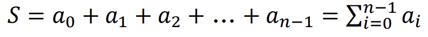
**然而**
1. 加法是结合律和交换律
我们可以按任意顺序添加数字
例如：
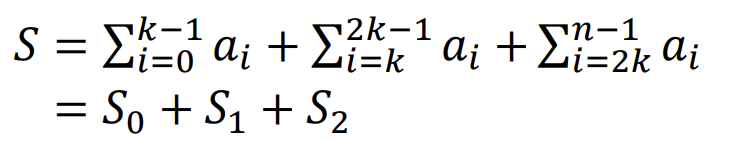
2. 利用OpenMP指令可以将循环并行化。让每个线程分别计算一部分和（partial sum，即上述的S_0、S_1、S_2 等），然后再将这些部分和累加起来得到最终结果。这样利用多线程并行计算，能提高计算效率，尤其当数据量n很大时，相比串行计算能大幅减少计算时间。 例如在多核CPU上，不同核心的线程可以同时计算不同组的和，最后再汇总。
3. 代码
>#pragma omp parallel shared(a,S) private(i)
 {
 double lsum = 0.0; //each thread has a local lsum variable
 #pragma omp for nowait
 for (i=0; i<n; i++) //the number of iterations distributed
 lsum += a[i]; //each thread calculate a partial sum
 ⋯ //accumulate partial sums
 }

4. 怎样去累积部分和
- 1.临界区
- 可以使用  #pragma omp critical  指令。在所有线程计算完部分和后，通过临界区来保证同一时刻只有一个线程能执行累加操作。示例代码如下
- > #pragma omp parallel shared(a,S) private(i)
{
    double lsum = 0.0;
    #pragma omp for nowait
    for (i = 0; i < n; i++)
        lsum += a[i];
    #pragma omp critical
    {
        S += lsum; // 将局部部分和累加到共享变量S中
    }
}
# OpenMP规约子句
1.  语法
 reduction (op : list)  ：这是OpenMP归约子句的语法形式。其中  op  表示归约操作符，如  + （加法）、 * （乘法）等 ； list  是参与归约操作的变量列表。
2.  示例代码解析
-  double S = 0;  ：声明一个双精度类型的变量  S  并初始化为0，用于存储最终的求和结果。
-  #pragma omp parallel for shared(S, a), reduction(+:S)  ：这是OpenMP指令。 #pragma omp parallel for  表示将紧随其后的  for  循环并行化； shared(S, a)  表示变量  S  和数组  a  在并行区域内是共享的； reduction(+:S)  表示对变量  S  进行加法归约操作。
-  for (int i = 0; i < n; ++i) S += a[i];  ：并行化的  for  循环，在每次迭代中，将数组  a  的元素累加到变量  S  上。
3.  归约子句工作原理
- 局部变量创建与初始化：当使用归约子句时，OpenMP会为每个线程创建一个局部的  S  副本，并根据归约操作符进行初始化。对于加法操作符  +  ，初始值为0。例如，假设有4个线程，每个线程都会有自己独立的  S  副本，且都初始化为0。
- 局部更新：在并行循环执行过程中，每个线程对自己的局部  S  副本进行更新。比如在上述求和例子中，每个线程在自己负责的循环迭代里，将数组  a  的对应元素累加到自己的局部  S  上。
- 最终归约：循环结束后，各个线程的局部  S  副本会被归约成一个最终值。OpenMP会自动处理这个合并过程，将所有局部结果合并起来得到最终的全局结果，存储在原始的共享变量  S  中。
- 变量共享要求：归约子句中  list  里的变量（这里是  S  ）必须在包含它的并行区域内是共享变量。这是因为最终结果需要在所有线程间进行汇总和共享。
4. 可以使⽤许多不同的关联操作数
初始值是数学上有意义的值
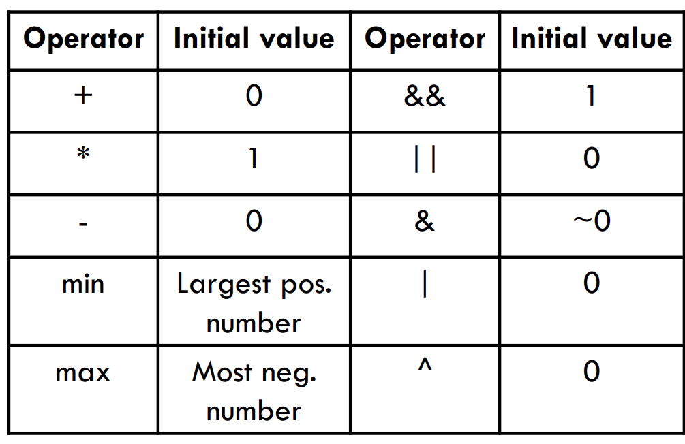
## Lab
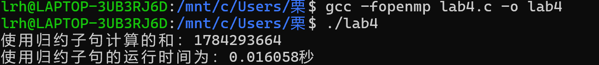
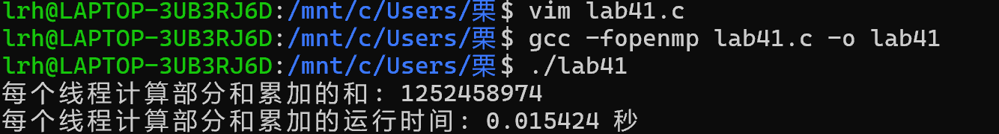
# 扫描操作
 扫描操作（Scan Operation）讲解
 
1. 定义
扫描操作（也称为前缀操作）作用于一个数组A = [a_0, a_1, a_2, ... a_{n - 1}] ，其中⊕是一个满足结合律的操作符（如加法、乘法等 ）。它生成一个新数组C ，C 的元素计算方式为：C = [a_0, (a_0⊕a_1), (a_0 ⊕ a_1 ⊕ a_2), ... (a_0⊕a_1 ⊕ a_2 ⊕... ⊕ a_{n - 1})] 。
2. 示例
当数组A = [1, 2, 3, 4, 5, 6] ，使用加法作为⊕操作符时，扫描操作后得到C = [1, 3, 6, 10, 15, 21] 。具体计算过程为：
- (C[0]=1]=) ；
- (C[1]=1 + 2 = 3]=) ；
- (C[2]=1 + 2 + 3 = 6]=) ；
- (C[3]=1 + 2 + 3 + 4 = 10]=) ；
- (C[4]=1 + 2 + 3 + 4 + 5 = 15]=) ；
- (C[5]=1 + 2 + 3 + 4 + 5 + 6 = 21]=) 。
3. 减少冗余计算
在计算]=(C]=) 数组元素时，存在很多冗余计算。例如计算]=(C[3]) 时，]=(1 + 2 + 3 + 4]=) 中]=(1 + 2 + 3]=) 的计算在计算]=(C[2]) 时已经做过了。可以使用递归等方法来消除这些冗余操作 。
4. 顺序计算代码及操作次数
 
- 代码：
 
c[0] = a[0];
for (i = 1; i < n; i++)
    c[i] = c[i - 1] ⊕ a[i];
 
 
这里先将C 数组的第一个元素赋值为A 数组的第一个元素，然后通过循环，利用前一个已计算出的C 数组元素和当前A 数组元素，计算当前C 数组元素。
 
- 操作次数：总共只需要n - 1 次⊕操作。因为从第二个元素开始计算，一共n - 1 个元素需要通过⊕操作来计算。
# 扫描操作的并行算法
- 顺序例程⾮常简单，但本质上是严格顺序的
- 需要设计新的并⾏算法
- 许多⽤于扫描操作的并⾏算法已经基于以下事实⽽开发出来：
- - ⊕是结合运算符
- 关键是尽量减少操作量
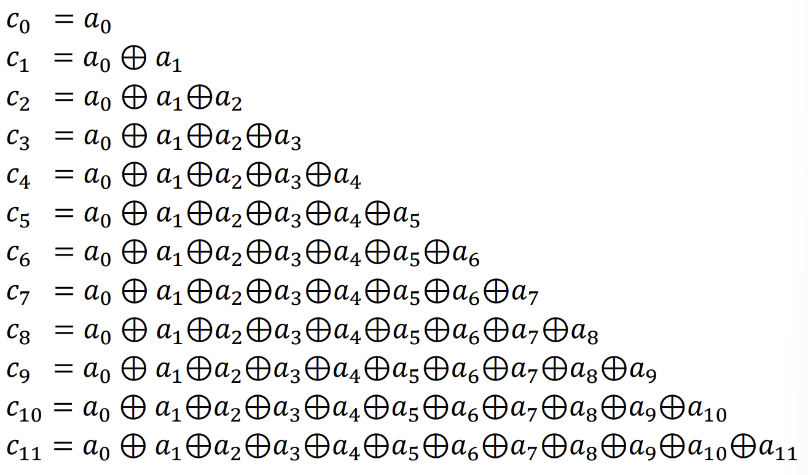
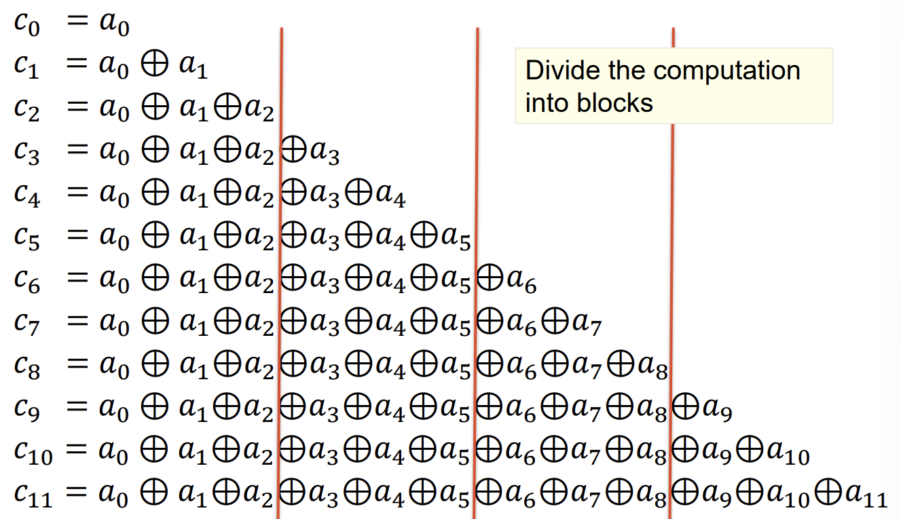
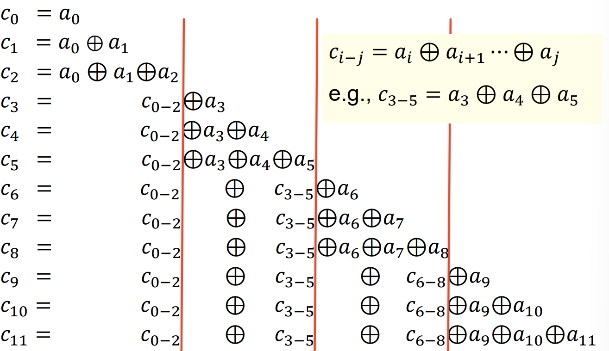
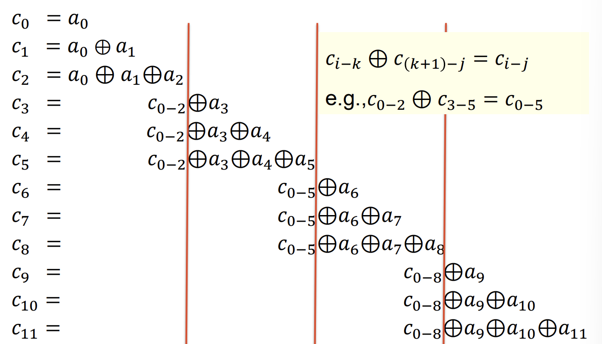
 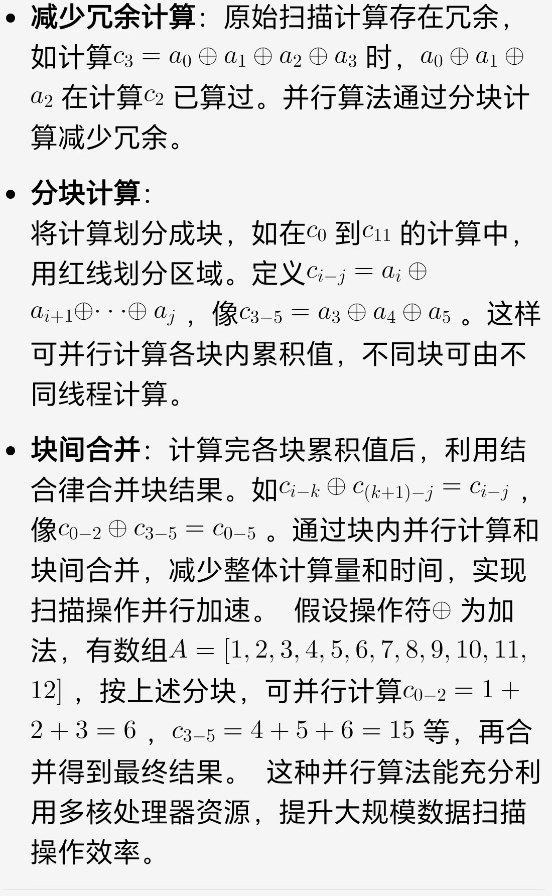

## 扫描操作并行算法步骤

并行算法步骤
 
- 阶段1：每个线程获取 n/t 个元素的子集（块划分） ，对分配到的元素执行本地扫描操作。除了最后一个线程外，线程 i 将其最后一个本地 c 元素存储到工作数组 w[i + 1] 中。例如将元素分组为 [a_0,a_1,a_2]、[a_3,a_4,a_5] 等形式进行本地扫描计算 ，并涉及到如 c_0 = a_0，c_{0 - 1}=c_0⊕ a_1 等计算（⊕ 代表某种运算）。并且在阶段之间必须进行同步（隐式或显式）。
- 阶段2：单个线程对工作数组 W 执行扫描操作 。
- 阶段3：每个线程将 w[i] 与每个部分扫描元素进行 ⊕运算 。
 
算法特点
 
- 该并行算法由三个并行阶段组成，阶段之间需要同步 。在第二阶段只有一个线程处于活动状态，虽然是纯顺序执行，但由于SM机器通常规模较小，开销并不高 。
 
操作数量分析
 
- 阶段1：每个线程对 n/t 个元素执行本地扫描，操作数量为 (n/t - 1)*t=n - t 。
- 阶段2：单个线程对 W（大小为 t ）执行扫描，操作数量为 t - 1 。
- 阶段3：每个线程将 w_i 添加到部分扫描元素，操作数量为 n/t*t = n 。
- 总操作数量为 n - t + t - 1 + n=2n - 1 ，而顺序计算的总操作数量是 n - 1 ，并行算法使操作数量增加了一倍 。但并行时间为 2n/t + t + 通信与同步时间，当线程数量大于2时，完成计算所需时间更少。
 
这种并行扫描算法常用于高性能计算、并行计算架构（如GPU计算）等场景中，通过多线程并行处理提高计算效率，减少大规模数据扫描操作的整体执行时间 。
# homework
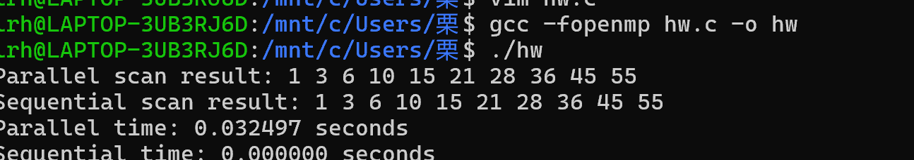