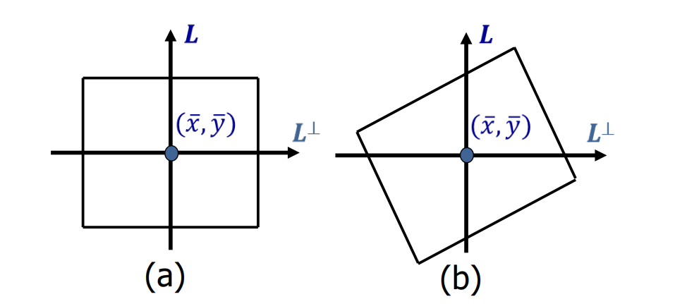
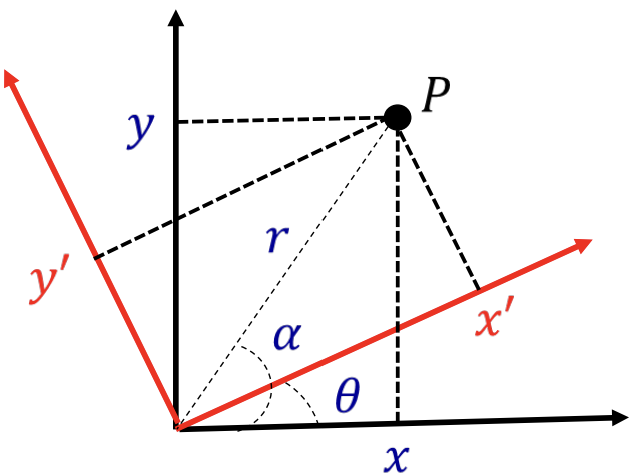
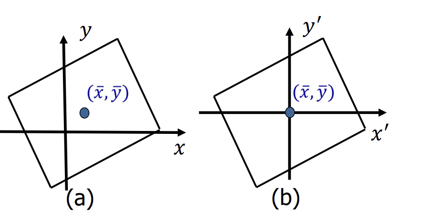
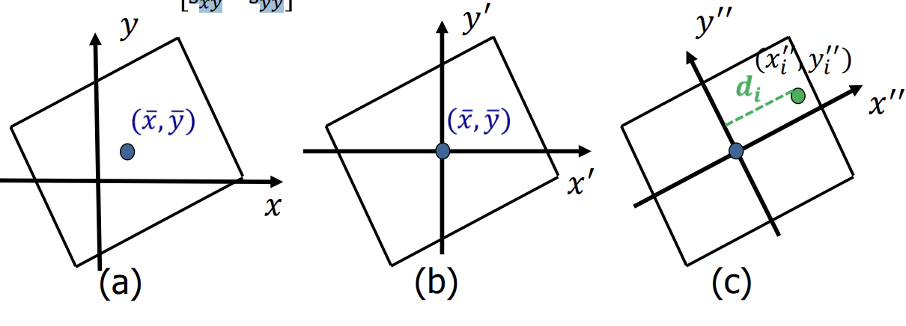
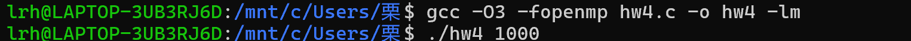

# 理想加速比与实际加速比
## 基本概念
1. 加速比的基本定义
加速比（  ）是并行计算中的关键指标，其定义为：S=Ts/Tp
- Ts：问题的串行（单处理器）版本的执行时间。
- Tp:使用p个处理器并行版本的执行时间
2.  理想加速比（线性加速）
- 理想预期：当使用p个处理器时，理想加速比假定为 完美的线性关系，即：S（理想）=p  
这意味着并行版本的运行速度恰好是串行版本的p 倍。
- - 假设条件：问题完全可并行化，且不存在任何开销（如处理器间的通信、同步或负载不均衡）。
3. 实际加速比
- 实际表现：在现实中，实际加速比（S实际）始终小于理想加速比，并且随着处理器数量（ p ）的增加，其性能通常会进一步下降：S实际<S理想=p
## 效率低下的原因
1. 单处理器性能不佳
- 通常出现在内存系统中（如内存带宽不足、缓存命中率低等）。
2. 并行化开销过大
- 包括同步开销（如等待所有处理器完成任务）、通信开销（处理器间数据传输）、冗余计算（重复执行相同操作）。
3.  负载不均衡
- 处理器之间的工作量分配不均（如部分处理器繁忙，部分空闲）
- 计算与通信的不匹配（如计算快但数据传输慢）。
- 计算资源速度差异（如 CPU 与 GPU 混合架构中设备性能不一致）。
4. 设计高效并行算法的关键：必须尽可能减少所有不必要的开销。
# 任务分配
- 阿姆达尔定律：少量的负载不均衡就可能显著限制最大加速比。
- 我们需要良好的任务分配策略来平衡进程 / 线程之间的工作负载。
- 这些策略可分为两类：
- - 静态任务分配
- - 动态任务分配（动态作业调度或动态负载均衡）
##  静态任务分配
在静态分配中，任务到进程/线程的分配是**预先确定的**。  
- **优点**：实现简单，运行时无额外开销。  
- **适用场景**：任务量可预测（如已知输入规模和计算模式）。  
- **关键依赖**：任务分配的质量直接取决于**任务划分的合理性**。  
  - **简单场景**：  
    例如密集矩阵计算、规则网格等问题，可轻松分解为**等规模任务**，且数据依赖模式规则，任务分配相对容易。  
  - **复杂场景**：  
    例如稀疏矩阵、非结构化网格、图计算等问题，需考虑：  
    - 如何平衡工作负载（避免部分处理器过载、部分空闲）；  
    - 最小化通信开销（减少处理器间数据传输）；  
    - 避免冗余计算（重复处理相同数据）。
# 图划分
**定义**  
将一个图分解为若干个子图的过程。
**应用领域**  
- 科学计算  
- VLSI电路设计  
- 计算机图形学  
- 网页图分析  
**并行计算中的作用**  
- 大规模图计算/分析的**关键预处理步骤**  
- 优化并行处理效率的核心技术
## 图划分在求解偏微分方程中的应用
许多求解偏微分方程（PDE）的方法基于网格模型
- 二维空间离散化
- - 将二维空间划分为若干三角形单元。
- 依赖图表示
- - 每个三角形单元对应依赖图（或网格）中的一个顶点，顶点携带单元状态。
- - 相邻三角形单元通过网格中顶点间的边表示连接关系。
- - 关键特性：顶点的状态更新需依赖其相邻顶点的状态（通过边传递信息）。 
## 图划分的定义
**形式化定义**  
给定一个图 \( G = (N, E, W_N, W_E) \)，其中：  
- \( N \): 顶点集合  
- \( W_N \): 顶点权重（如计算开销）  
- \( E \): 边集合  
- \( W_E \): 边权重（如通信开销）  

**示例解释**  
- \( N = \{\text{任务}\} \)  
- \( W_N = \{\text{任务计算成本}\} \)  
- 边 \( (j, k) \in E \) 表示任务 \( j \) 向任务 \( k \) 发送 \( W_E(j, k) \) 单位的数据  

**目标**  
将图划分为 \( p \) 个子图 \( N = N_1 \cup N_2 \cup \dots \cup N_p \)，满足：  
1. **负载均衡**：各子图顶点权重之和近似相等  
   \[
   \sum_{v \in N_i} W_N(v) \approx \text{常数}, \quad \forall i \in [1, p]
   \]  
2. **最小化通信开销**：连接不同子图的边权重之和最小  
   \[
   \min \sum_{(u,v) \in E, \ u \in N_i, \ v \in N_j, \ i \neq j} W_E(u, v)
   \]  

**核心权衡**  
- 平衡计算负载（顶点权重）  
- 减少跨分区通信（边割集最小化）
## 图二分法
**应用场景**  
- 实际中常处理 \( N = 2^k \) 的图，通过递归二分 \( k \) 次实现划分

**划分可能性计算**  
对 \( N \) 个顶点的图进行二分（分为两个大小为 \( N/2 \) 的子集），可能的划分数为：  
\[
\binom{N}{N/2} = \frac{N!}{\left(\frac{N}{2}!\right)^2} \approx \frac{2^N}{\sqrt{\pi N}}
\]  
（近似公式基于斯特林公式 \( n! \approx \sqrt{2\pi n}(n/e)^n \)）

**计算复杂度**  
- 图二分法通常属于 **NP 难问题**  
  （解的验证可在多项式时间内完成，但求最优解需指数级时间）

**解决方案**  
- 需依赖启发式算法（Heuristics）近似求解，而非穷举所有可能
## 基于几何信息的图划分
- 图划分有许多技术
- 如果有额外信息可用，可能有助于解决问题
- 例如，图源自二维或三维空间中的某种结构（如在偏微分方程求解中），顶点可附加几何坐标，因此图的几何布局是已知的
## 坐标二分法
- 坐标二分法是最简单的基于坐标的划分方法
- 我们可以简单地绘制一个与某一坐标轴（如 x 轴）正交的超平面，将顶点分成相等的两部分
- 对于递归二分，我们交替对 x、y、z 坐标进行二分
- 这会产生更优的纵横比，并有望减少割边数量
### 操作

在二维空间中，选择一条与 x 轴垂直的直线 \( L \)，其质心 \((\bar{x}, \bar{y})\) 位于该直线上，其中：  
\[  
\bar{x} = \frac{1}{N} \sum_{i=1}^{N} x_i, \quad \bar{y} = \frac{1}{N} \sum_{i=1}^{N} y_i  
\]  
– 然后将直线左侧的所有网格点划入子集 \( N_1 \)，右侧的划入子集 \( N_2 \)。
### 缺点

### 缺点——依赖坐标  
- **同一结构在不同坐标系下可能产生差异极大的划分**  
  例如，在下图简单示例中：  
  - 划分方式（b）的割边集未达最小，划分质量较差。  
  - 这表明坐标二分法的效果高度依赖坐标系选择，缺乏对图结构本身（如边连接关系）的感知。  

## 惯性二分法  
- 惯性二分法的基本思想是选择一个超平面，使得顶点到该超平面距离的平方和最小  
- 通过坐标旋转，使网格点到直线 \( L \) 的距离平方和最小化  
  • 我们需要通过求解最小化问题来找到直线 \( L \)  
  \[  
  \min \sum_{i=1}^{N} d_i^2  
  \]  
  其中 \( d_i \) 为网格点 \( (x_i, y_i) \) 到直线 \( L \) 的距离
### 坐标旋转
- 在 \((x, y)\) 坐标系中，设点 \(P\) 的极坐标为 \((r, \alpha)\)，则在 \((x', y')\) 坐标系中其极坐标为 \((r, \alpha - \theta)\)。  
- 坐标变换关系：  
  \[  
  \begin{cases}  
  x = r \cos \alpha, \quad y = r \sin \alpha \\  
  x' = r \cos (\alpha - \theta) = r \cos \alpha \cos \theta + r \sin \alpha \sin \theta = x \cos \theta + y \sin \theta \\  
  y' = r \sin (\alpha - \theta) = r \sin \alpha \cos \theta - r \cos \alpha \sin \theta = -x \sin \theta + y \cos \theta  
  \end{cases}  
  \]  
  其中 \(\theta\) 为坐标系旋转角度。
  
### 步骤

1. 将坐标原点平移至质心 \((\bar{x}, \bar{y})\)  
- \((x_i, y_i)\) 变换为 \(x_i - \bar{x}, \, y_i - \bar{y} = (x'_i, y'_i)\)
- 
2. 接下来将坐标 \((x', y')\) 旋转 \(\theta\) 度：  
\[
\begin{cases}
x'' = x' \cos\theta + y' \sin\theta \\
y'' = -x' \sin\theta + y' \cos\theta
\end{cases}
\]  
– 根据步骤 (c)，点到分割线的距离为 \(d_i = x''_i\)  
– 令 \(\cos\theta = v\) 和 \(\sin\theta = w\)，通过简单的数学推导可得：  
\[
\sum d_i^2 = v^2 \sum (x_i - \bar{x})^2 + 2vw \sum (x_i - \bar{x})(y_i - \bar{y}) + w^2 \sum (y_i - \bar{y})^2
\]
3. – 设 𝑢ᵀ = [𝑣, 𝑤]，其中 𝑠ₓₓ = ∑(𝑥ᵢ - 𝑥̅)²，𝑠ₓᵧ = ∑(𝑥ᵢ - 𝑥̅)(𝑦ᵢ - 𝑦̅)，𝑠ᵧᵧ = ∑(𝑦ᵢ - 𝑦̅)²。  
– 我们有  
  \[
  \sum d_i^2 = v^2 s_{xx} + 2vw s_{xy} + w^2 s_{yy} = u^T \begin{bmatrix} s_{xx} & s_{xy} \\ s_{xy} & s_{yy} \end{bmatrix} u
  \]  
– 由于我们希望最小化 ∑𝑑ᵢ²，因此应选择 𝑢 作为矩阵  
  \[
  \begin{bmatrix} s_{xx} & s_{xy} \\ s_{xy} & s_{yy} \end{bmatrix}
  \]  
  的最小特征值对应的特征向量。


## 无几何信息的划分 
- 基于坐标的方法（如惯性二等分法）需要关于网格点的几何信息。  
- 然而，在许多实际问题中，图的顶点并不具备几何信息。  
- 例如，万维网模型中，顶点是网页。  
- 我们需要不同的算法。  
- 也有许多方法可以处理该问题。

# 时间与质量  
- 在执行时间和解决方案质量之间通常存在权衡。  
- 某些算法运行速度极快，但只能找到中等质量的解决方案。  
- 另一些算法耗时较长，但能提供优异的解决方案。  
- 甚至还有一些算法可在两个极端之间进行调优。  
- 时间与质量的权衡选择取决于预期应用场景：  
  - 对于超大规模集成电路（VLSI）设计，我们更优先考虑质量，因为即使是稍优的解决方案也能节省实际成本。  
  - 对于稀疏矩阵计算，我们只关注总时间——图划分的执行时间必须小于并行矩阵计算所节省的时间。  
- 因此，不存在适用于所有情况的单一最佳解决方案。
# 并行for指令的调度子句
- 循环迭代的默认分区方式是块分区。
- 迭代被分成若干组，每组包含一组连续的、大小相等的迭代。例如，当N=30且线程数为4时，分组为(0..7)、(8..15)、(16..22)、(23..29)。
- 在许多情况下，需要使用不同的块大小来划分迭代，甚至以循环方式（即循环分区）来划分迭代。
- 解决方案：使用schedule子句。

### 调度子句描述循环的迭代如何在线程组中的线程之间划分。  
- **schedule(static[, chunk])**  
  - 将大小为“chunk”的迭代块分配给每个线程  
  - 静态调度在编译时完成  
  - 块大小由程序员预先确定和预测——运行时工作量最小  
  - 例如：  
    • `schedule(static)` - 块分区  
    • `schedule(static, 1)` - 循环分区  
- **schedule(dynamic[, chunk])**  
  - 每个线程从队列中抓取“chunk”个迭代，直到处理完所有迭代  
  - 动态调度在运行时使用复杂的调度逻辑  
  - 不可预测，每次迭代的工作量高度可变——运行时工作量最大
# Lab
```
#include <stdio.h>
#include <stdlib.h>
#include <omp.h>

int main() {
    int n = 1000, m = 500;  // 矩阵大小
    double **A = (double **)malloc(n * sizeof(double *));
    double **C = (double **)malloc(n * sizeof(double *));
    
    // 初始化矩阵A
    for (int i = 0; i < n; i++) {
        A[i] = (double *)malloc(m * sizeof(double));
        C[i] = (double *)malloc(n * sizeof(double));
        for (int j = 0; j < m; j++) {
            A[i][j] = (double)rand() / RAND_MAX;
        }
    }
    
    // 并行计算C = A * A^T
    double start_time = omp_get_wtime();
    matrix_multiply_parallel_block(n, m, A, C);
    double end_time = omp_get_wtime();
    
    printf("并行计算耗时: %.6f 秒\n", end_time - start_time);
    
    // 释放内存
    for (int i = 0; i < n; i++) {
        free(A[i]);
        free(C[i]);
    }
    free(A);
    free(C);
    
    return 0;
}
```
# Homework 4
