# 工作共享结构：sections指令
- 到目前为止，我们已经学习了用于并行化for循环的OpenMP指令。
- 若要并行化for循环之外的代码，可使用sections指令：
```c
#pragma omp sections [子句 ...] 换行
{
 #pragma omp section
 结构化代码块;
 #pragma omp section
 结构化代码块;
 #pragma omp section
 结构化代码块；
}
```
- 在sections结构里，每个section会由一个线程来执行。
- 默认情况下，omp sections结束处存在一个屏障。
- 可以使用nowait子句来关闭这个屏障。
- - 作用：取消 sections 结构末尾的隐式屏障，允许线程在完成自身 section 后立即继续执行后续代码，无需等待其他线程。
- - 适用场景：当 sections 中的任务与后续代码无数据依赖时使用。
- sections指令必须处于并行区域之内。
## 例子
```
– E.g., a sequential code:
v = alpha();
w = beta();
x = gamma(v, w);
y = delta();
z = zita(x, y);
– The OpenMP code with sections directive:
#pragma omp parallel
{
 #pragma omp sections
 {
 #pragma omp section
 v = alpha();
 #pragma omp section
 w = beta();
 }
 #pragma omp sections
 {
 #pragma omp section
 x = gamma(v, w);
 #pragma omp section
 y = delta();
 }
}
z = zita(x, y);
```
### 顺序代码的依赖关系
1. v = alpha() 和 w = beta() 可以并行执行，因为它们相互独立
2. x = gamma(v, w) 依赖于 v 和 w 的计算结果
3. y = delta() 可以与 x = gamma(v, w) 并行执行，因为它们相互独立
4. z = zita(x, y) 依赖于 x 和 y 的计算结果
### 并行化原理
1.  第一组 sections： 
- 并行执行 alpha() 和 beta() 
- 默认的隐式屏障确保所有线程在此同步，保证 v 和 w 都已计算完成   
2.   第二组 sections： 
- 并行执行 gamma(v, w) 和 delta() 
- 同样有隐式屏障确保 x 和 y 都已计算完成   
3.  最终计算： 
- z = zita(x, y) 在所有并行计算完成后执行
# 循环之外的结构 
- 考虑一个简单的链表遍历：  
```c
node *p = head;
while (p)
{
    process(p);
    p = p->next;
}
```  
- 注意：OpenMP的循环工作共享结构仅适用于**循环迭代次数可在编译时通过封闭形式表达式表示**的循环。  
- **while循环不受支持**。  
- 然而在实际场景中，有时需要并行化while循环（及其他通用数据结构）。  
- 如何实现？
- 一种解决方案是统计链表中的节点数，将每个节点的指针复制到数组中，然后使用OpenMP的for结构  
```c
p = head; count = 0;
while (p) {
    parr[count] = p;
    p = p->next;
    count++;
}
#pragma omp parallel
{
    #pragma omp for schedule(static, 1)
    for (int i = 0; i < count; i++)
        process(parr[i]);
}
```  
- 需要对数据进行多次遍历  
- 我们能否做得更简洁？  
- 使用OpenMP的任务（task）构造  

# OpenMP firstprivate 子句  
在讨论 OpenMP 任务构造之前，我们先介绍另一个 OpenMP 数据环境子句：**firstprivate**。  

当使用 `private(list)` 子句时，每个线程会创建该子句中列表的本地副本，但**不会对其值进行初始化**。  
例如：  
```c
int tmp = 0;
#pragma omp parallel for private(tmp)
for (int i=0; i<n; i++)
    tmp += i;
printf("%d\n", tmp);  // tmp 未被初始化，此处输出 0
```  
- `tmp` 的值未被初始化（线程的私有副本初始值不确定）。  
- 主线程中的 `tmp` 仍为 0，不受并行区域内操作的影响。 
- 私有副本将从共享变量初始化。  
例如：  
```c
int tmp = 0;
#pragma omp parallel for firstprivate(tmp)
for (int i=0; i<n; i++)
    tmp += i;
printf("%d\n", tmp);  // 输出0（主线程中的tmp未被修改）
```  
- 每个线程获取`tmp`的独立副本，其**初始值为0**（继承自主线程中共享变量的初始值）。  
- 并行区域内各线程对`tmp`的修改仅作用于自身副本，**不会影响主线程中的原始变量**。  

**核心要点**：  
- `firstprivate` = `private`（创建私有副本） + **初始化**（以共享变量的初始值赋值）。  
- 确保线程安全：避免多线程访问共享变量导致的数据竞争。  
- 无回写机制：并行区域执行完毕后，共享变量`tmp`仍保持初始值（0）。
# OpenMP任务构造 
- `#pragma omp task`  
- **任务是独立的工作单元**  
- 任务由以下部分组成：  
  - 待执行的代码  
  - 数据环境  
  - 内部控制变量 (ICV)  
- 线程负责执行每个任务的工作  
- 运行时系统决定任务的执行时机  
- 基本思想是设置一个任务队列  
- 当线程遇到 `task` 指令时，会打包一个新的任务实例，然后继续执行后续代码  
- 某个线程会在之后的某个时刻执行该任务

## 使用OpenMP任务构造解决链表遍历问题：  
```c
#pragma omp parallel
{
    #pragma omp single
    {
        p = head;
        while (p) {
            #pragma omp task firstprivate(p)
            process(p);
            p = p->next;
        }
    }
}
```  

1. **创建线程组**  
2. **单一线程执行`single`构造**，其他线程在`single`构造末尾的隐式屏障处等待  
3. **单一线程每次使用不同的`p`值创建任务**  
4. **在屏障处等待的线程开始执行任务**，所有任务完成后，执行流程越过屏障继续运行
## 任务构造的实现
```
#pragma omp parallel
{
    #paragma omp single
    { //block1
       node*p=head;
       while(p){
        //block2
        #pragma omp task process(p);
        p=p->next;//block3
       }
    }
}
```
- 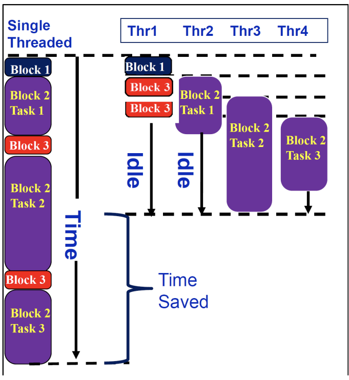
**代码解释**
 
1.  #pragma omp parallel ：这是OpenMP的并行区域指令，它会创建一个并行区域，使得在这个区域内的代码可以由多个线程并行执行。
2.  #pragma omp single ：此指令表示该块内的代码只会由一个线程执行。在并行区域内，只有一个线程会执行 block 1 中的代码。
3.  #pragma omp task ： task 指令用于创建一个新的任务。在这里， process(p) 会被作为一个任务分配给可用的线程去执行，而不会阻塞当前线程，使得循环可以继续创建新的任务。
 
**图示解释**
 
- 左侧代码部分中， Block 1 只会由一个线程执行。 Block 2 中的 #pragma omp task 创建了多个任务，这些任务可以被不同的线程（如 Thr1  -  Thr4  ）执行。 Block 3 是任务创建完后继续执行的代码部分。
- 右侧图示展示了任务在不同线程上的执行情况。最初只有一个线程执行 Block 1  ，随后创建的任务（ Task 1 、 Task 2 、 Task 3  ）被分配到不同的线程上执行，在任务执行过程中，部分线程存在空闲（ Idle  ）阶段，通过这种方式实现并行计算，最终达到节省时间（ Time Saved  ）的目的。

# 总结  
## 在共享内存机器中：  
- **全局数据可被所有线程共享**  
  - 不同线程使用数据时无需移动数据  
  - 任务划分与分配相比分布式内存机器更简单  

- **线程间协调必须通过共享变量的显式同步实现**  
  - 需合理应用同步机制  
  - 最小化同步开销至关重要  

- **局部性非常关键**  
  - 优化单处理器或核心上的性能  
  - 提高计算强度（内存层级优化）
## OpenMP
- 一种基于指令的**应用程序编程接口（API）**，用于在共享内存架构上开发并行程序  
- 仅通过轻量级指令隐藏繁琐的线程调用细节，属于小型API  
- 允许程序员将程序划分为**串行区域**和**并行区域**，而非显式创建并发执行的线程  
- 提供若干同步构造机制
### OpenMP 指令、子句和函数：  
- **用于创建线程组**  
  • `#pragma omp parallel`  

- **用于在线程间共享工作**  
  • `#pragma omp for`  
  • `#pragma omp single`  
  • `#pragma omp sections`  
  • `#pragma omp task`  

- **用于避免冲突（防止数据竞争）**  
  • `#pragma omp critical`  
  • `#pragma omp atomic`  
  • `#pragma omp barrier`  

- **数据环境子句**  
  • `private(list)`  
  • `firstprivate(list)`  
  • `shared(list)`  
  • `reduction(op:list)`

- **循环调度子句**  
- `schedule(static, chunk)`  
- `schedule(dynamic, chunk)`  
- `collapse(n)`  

-  **禁用隐式屏障**  
- `nowait`  

- **设置/获取环境变量函数**  
- `omp_set_num_threads()`：设置线程数  
- `omp_get_num_threads()`：获取当前并行区域的线程数  
- `omp_get_thread_num()`：获取当前线程的编号  
- `omp_get_procs()`：获取可用处理器的数量  

-  **获取时钟时间函数**  
- `omp_get_wtime()`：返回当前时间（以秒为单位）  

### 需注意  
OpenMP **不会**：  
- 自动并行化代码  
- 保证加速效果  
- 自动避免数据竞争  

### 编写OpenMP程序的一般步骤：  
1. **并行算法设计**  
2. 编写对应的串行程序  
3. 优化串行程序性能  
4. 添加必要的OpenMP指令、子句和函数  
5. 测试并调优性能  
6. 上述步骤可能需要重复进行  
7. 尝试其他可行的算法

# 分布式内存平台  
- 分布式内存平台由一组处理单元（或计算节点）组成  
- 每个处理单元拥有独立的内存，其他处理单元无法访问（进程间无共享变量）  
- 处理单元通过显式的发送和接收原语进行通信  
- 流行的库（如MPI和VPM）提供此类进程通信原语
- 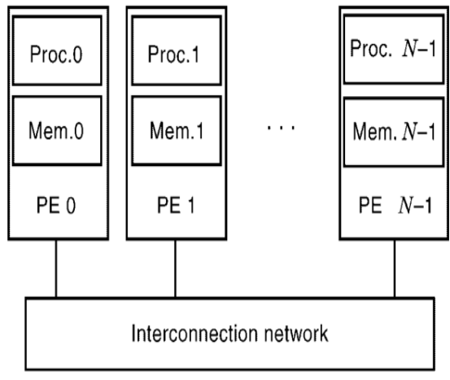
## 共享内存机器与分布式内存平台的对比
#### 共享内存机器特性
- **任务分配简单**：  
  由于全局数据不专属于任何线程，任务分配具有很高的灵活性。

#### 分布式内存平台特性
- **数据显式管理**：  
  数据必须显式地进行分区、分发并保持在每个进程的本地。  
- **数据分解影响任务分配**：  
  数据的分解方式直接影响工作负载的分配策略。  
- **隐式同步机制**：  
  阻塞式发送/接收操作（进程在接收到数据前被阻塞）本身构成同步点，因此同步是隐式的。  
- **编程难度**：  
  初学者可能认为分布式内存平台的并行编程比共享内存平台更具挑战性。

#### 现代混合架构编程策略
- **集群节点内并行**：  
  在集群的多核节点内部使用共享内存编程（如OpenMP）。  
- **节点间通信**：  
  在节点之间使用消息传递（如MPI）进行通信。

### 由于数据需要分布在多个处理器上，因此在算法设计和实现中我们需要认真考虑：  
- 如何对数据进行分区和分发  
- 如何分配任务（或工作），这也与数据分区相关  
- 如何最小化通信开销  
- 数据局部性（以减少通信开销）  
- 当然，如何平衡工作负载
# 矩阵乘法  
- **任务依赖图**：  
- 计算每个独立元素 \(c_{ij}\) 的数据依赖关系  
- 所有输出元素 \(c_{ij}\) 可**无依赖地并行计算**

# 分区与分配  
- 在共享内存平台的算法设计中，我们讨论了如何对矩阵 \( C \) 进行分区，然后将输入数据与计算关联起来。  
- 输入矩阵是共享的，无需在主内存中移动。  
- 分区技术包括一维循环分区（1D cyclic）、一维分块分区（1D blocking）或一维块循环分区（1D block cyclic）等。  

- 然而，对于分布式内存机器，输入数据矩阵 \( A \) 和 \( B \) 也需要进行分区并分发到不同进程。  
- **关键问题**：如何对任务和数据进行分区，如何将它们分配给进程，更重要的是  
- 如何在进程之间移动数据以确保  
  - 正确的数据在正确的时间到达正确的进程  
  - 同时最小化通信开销
# 任务与数据关联
## 1D分块（1D blocking）解释
 
在矩阵乘法（假设是C = A\times B ）的1D分块策略中：
 
- 任务与数据关联：C矩阵的一个块行（block row，这就是一个任务），关联A矩阵的一个块行以及B矩阵的整个矩阵。
- 原理：计算C矩阵某一块行元素时，根据矩阵乘法规则C_{ij}=\sum_{k}A_{ik}B_{kj} ，对于C的某一行元素，需要A的对应行元素与B的所有列元素参与运算。所以将A按行分块，B整体参与，来计算C的行分块元素 ，这样便于并行计算，不同的C块行计算任务可分配给不同处理器或线程。
 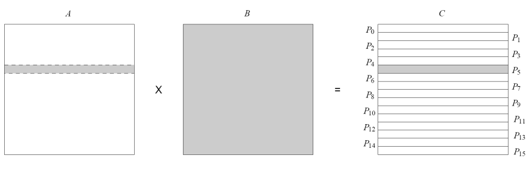
## 2D分块（2D blocking）解释
 
在矩阵乘法的2D分块策略中：
 
- 任务与数据关联：C矩阵的一个块（block ，作为一个任务），关联A矩阵的一个块行和B矩阵的一个块列。
- 原理：2D分块进一步细分数据关联。计算C矩阵某个子块元素时，仅需A矩阵对应块行和B矩阵对应块列参与运算。这种方式在内存访问和并行计算上更灵活高效，能更好地利用缓存，减少数据传输开销，不同的C块计算任务可并行执行 。
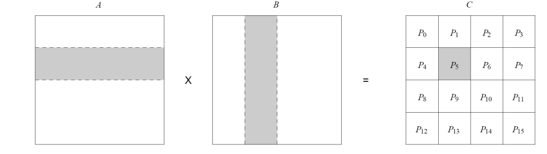

# 一维数组/环结构上的并行矩阵乘法  
- 首先考虑如何在一维数组/环结构上设计并行算法  
- 处理单元按线性数组/环结构组织  
- **分块矩阵乘法回顾**：  
  - 将矩阵 \( C \) 和 \( A \) 划分为 \( p \times 1 \) 分块矩阵，每个块包含 \( n/p \) 行  
  - 用 \( C(i) \) 和 \( A(i) \) 表示每个块（称为块行），大小为 \( n/p \times n \)  
  - 计算公式为：\( C(i) = C(i) + A(i) \times B \)
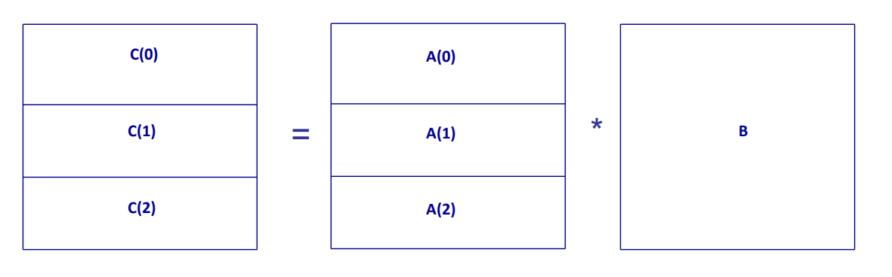

## 进一步划分矩阵𝐴(𝑖)  
- **𝐴(𝑖,𝑗)** 是𝐴(𝑖)的一个 \(n/p \times n/p\) 子块  
  - 对应列范围为 \(j \times n/p\) 到 \((j+1) \times n/p - 1\)  
- **矩阵𝐵的划分**：将𝐵划分为 \(p \times 1\) 分块矩阵  
  - 要求𝐴(𝑖,𝑗)的列数等于𝐵(𝑗)的行数  

### 计算逻辑  
\[
C(i) = C(i) + A(i) \times B = C(i) + \sum_j A(i,j) \times B(j)
\]  
- **示例**：  
  \[
  C(0) = C(0) + A(0,0) \times B(0) + A(0,1) \times B(1) + A(0,2) \times B(2)
  \]
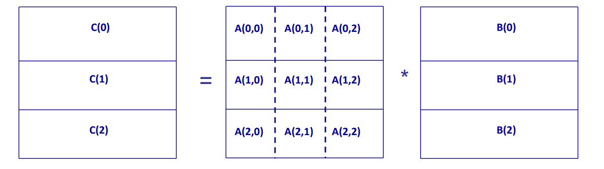

### 假设我们有p个处理器，按一维数组/环结构组织  
- 我们将每个矩阵（𝐴、𝐵和𝐶）划分为行分块矩阵，并将每个块行（𝐴(𝑖)、𝐵(𝑖)和𝐶(𝑖)）分配给一个处理器  
- 要计算每个𝐶(𝑖)，我们需要𝐴(𝑖)和整个𝐵矩阵  
  - 即：\( C(i) = C(i) + A(i) \times B = C(i) + \sum_j A(i,j) \times B(j) \)  
- 然而，𝐵(𝑖)分布在不同的处理器上  
- 因此需要显式通信——如何实现？
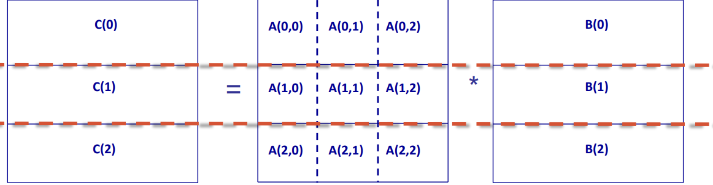
## 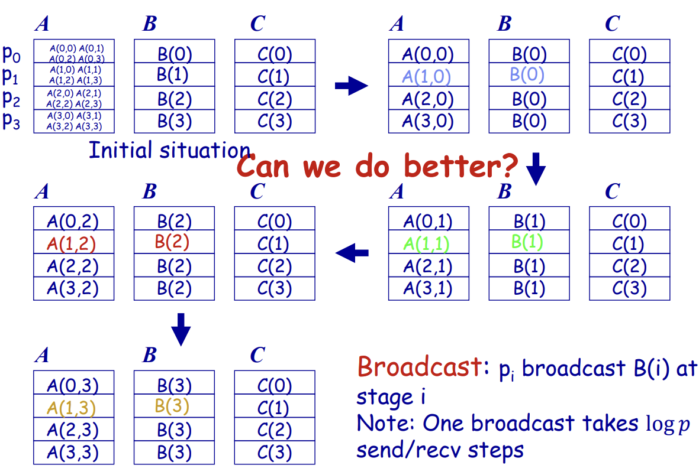


- 初始情况（Initial situation）：矩阵A被划分给P_0 - P_3 四个处理器，矩阵B和C也对应分配。这里是矩阵乘法并行计算的起始数据分布状态。
- “Can we do better?”及后续：提出能否优化的问题，后续展示了数据的重新分布过程。
- 广播（Broadcast）：p_i 在第i 阶段广播B(i) ，且注明一次广播需要\log p 次发送/接收步骤（p 通常指处理器数量） 。这是一种数据通信策略，目的是让各处理器获取计算所需的B矩阵数据，以更好地并行计算矩阵乘法。
 
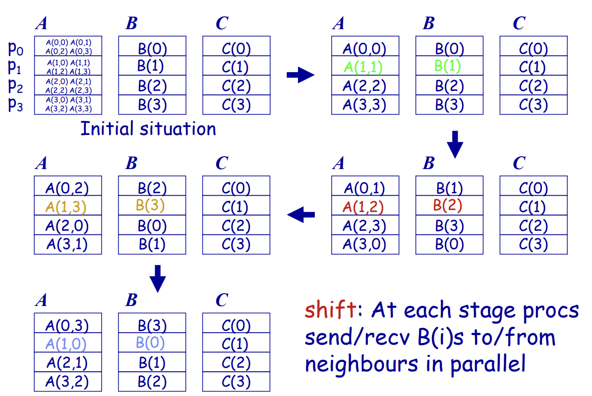
- 初始情况（Initial situation）：与上页初始数据分布类似，是并行计算开始前的矩阵划分状态。
- 移位（shift）：在每个阶段，处理器并行地向邻居发送/接收B(i) 。这是一种数据交换策略，通过处理器间的数据移位，使各处理器能获取不同部分的B矩阵数据，配合自身持有的A矩阵部分来计算C矩阵，以此提高并行计算效率，减少数据传输和计算的冗余。
# 二维分区与通信策略  
假设使用二维分区且 \( p = \sqrt{p} \times \sqrt{p} \)，即 \( p \) 个进程组织为二维网格/环面结构：  
- **矩阵分块**：  
  - \( C(i,j) \) 表示大小为 \( n/\sqrt{p} \times n/\sqrt{p} \) 的子矩阵，\( A(i,j) \) 和 \( B(i,j) \) 同理。  
- **数据依赖**：  
  - 每个 \( C(i,j) \) 需要来自不同进程的 **一行 \( A(i,j) \) 块** 和 **一列 \( B(i,j) \) 块**。  
- **通信方式**：  
  - **水平移动 \( A(i,j) \)**：将 \( A \) 的块沿水平方向传输至目标进程。  
  - **垂直移动 \( B(i,j) \)**：将 \( B \) 的块沿垂直方向传输至目标进程。
## 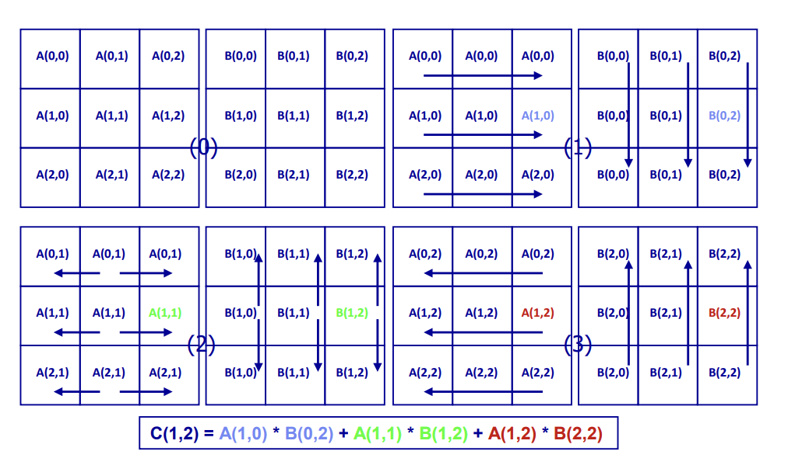

- 原理：该算法基于广播机制进行二维矩阵乘法并行计算。将矩阵A和B划分为多个子矩阵块，通过在处理器间广播子矩阵块数据来实现并行计算。如箭头所示，在不同步骤中，A矩阵块横向广播，B矩阵块纵向广播 。
- 示例计算：以C(1,2) 的计算为例，根据矩阵乘法规则C(i,j)=\sum_{k}A(i,k) \times B(k,j) ，它通过A(1,0) * B(0,2) + A(1,1) * B(1,2) + A(1,2) * B(2,2) 得出，在广播过程中各处理器获取所需A、B子矩阵块数据进行对应计算。
 
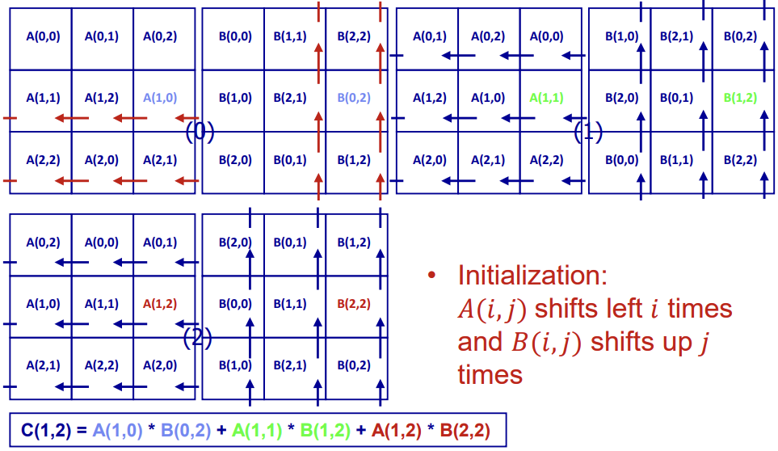
- 原理：此算法采用移位策略。初始化时，A(i,j) 向左移位i 次，B(i,j) 向上移位j 次 。在后续计算过程中，通过处理器间子矩阵块的移位操作，使各处理器能获取计算C矩阵元素所需的不同A、B子矩阵块组合。
- 示例计算：同样以C(1,2) 计算为例，移位操作后各处理器利用移位得到的A、B子矩阵块数据，依据矩阵乘法公式进行计算，逐步得出C矩阵元素值 。

# 矩阵乘法并行算法  
- 我们讨论了分布式内存机器上的一维和二维并行算法  
- **问题**：哪一种性能**更好？  
- **一维算法**：  
  - 矩阵划分为块行（\(n/p \times n\)）  
  - 在一个并行步骤（或阶段）中，每个进程：  
    • 发送一个块行（\(B(j)\)）并接收一个块行（~\(n^2/p\)）  
    • 计算 \(A(i,j)\)（\(n/p \times n/p\)）与 \(B(j)\)（\(n/p \times n\)）的乘法  
  - 操作次数：~\(n^3/p^2\)  
    • 计算强度：~\(n/p\)  
  - 并行步骤数：\(p\)

- **二维算法：**  
- 矩阵划分：划分为多个子矩阵（\(n/\sqrt{p} \times n/\sqrt{p}\)）  
- 单步并行操作：每个进程  
  • 水平发送/接收一个子矩阵 \(A(i,j)\)（数据量~\(n^2/p\)）  
  • 垂直发送/接收一个子矩阵 \(B(i,j)\)（数据量~\(n^2/p\)）  
  • 计算 \(A(i,k)\) 与 \(B(k,j)\) 的乘法  
- 操作次数：~\(n^3/(p\sqrt{p})\)  
  • 计算强度：~\(n/\sqrt{p}\)（高于一维算法）  
- 并行步骤数：\(\sqrt{p}\)（远少于一维算法的 \(p\) 步）

### 二维算法的性能优势分析  
尽管二维算法在单个并行步骤中需要传输两倍的数据量（同时移动 \(A(i,j)\) 和 \(B(i,j)\)），但其操作次数随 \(\sqrt{p}\) 因子增加：  
- **计算强度提升**：计算强度（运算量/通信量）相比一维算法提升 \(\sqrt{p}\) 倍。  
  - 一维算法：\(\sim n/p\)  
  - 二维算法：\(\sim n/\sqrt{p}\)（更高的计算密集度）  
- **并行步骤优化**：  
  - 一维算法需 \(p\) 步完成通信，二维算法仅需 \(\sqrt{p}\) 步，通信次数显著减少。  
- **通信开销降低**：  
  - 总通信量虽因双向传输略有增加，但步骤数的锐减使整体开销大幅下降。  
- **结论**：二维并行算法通过平衡计算与通信，在矩阵乘法中表现更优。