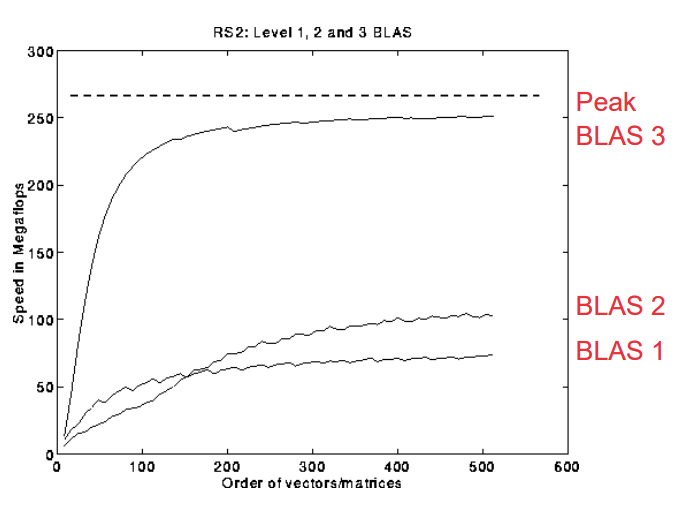
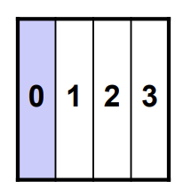
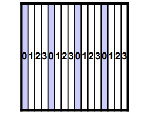
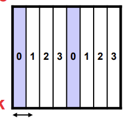
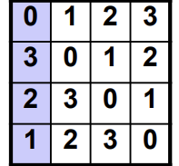
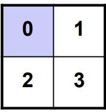
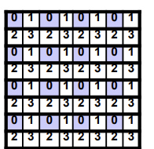
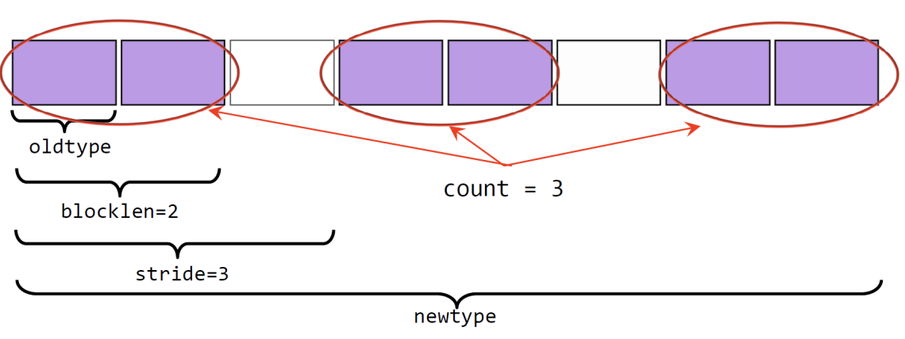

# 带部分主元的高斯消元法  
**部分主元选择**：对于 \( i = 1 \) 到 \( n-1 \)，交换行使得 \( A(i,i) \) 为第 \( i \) 列的最大值  
1. 找到并记录 \( k \)，使得 \( |A(k,i)| = \max\{ |A(j,i)| \mid i \leq j \leq n \} \)  
   即第 \( i \) 列剩余部分的最大元素  
2. 若 \( |A(k,i)| = 0 \)  
   - 输出警告：矩阵 \( A \) 奇异或接近奇异，退出算法  
3. 否则，若 \( k \neq i \)  
   - 交换矩阵 \( A \) 的第 \( i \) 行和第 \( k \) 行  
4. 计算 \( A(i+1:n,i) = A(i+1:n,i) / A(i,i) \)  
   （每个商的绝对值 \( \leq 1 \)）  
5. 计算 \( A(i+1:n,i+1:n) = A(i+1:n,i+1:n) - A(i+1:n,i) \times A(i,i+1:n) \)  

**引理**：该算法可将矩阵 \( A \) 分解为 \( A = P \times L \times U \)，其中 \( P \) 为置换矩阵。  

**算法特性**：  
- **数值稳定性**：在实际应用中具有较好的数值稳定性  
- **应用地位**：为标准算法，但需考虑通信开销？
# 基础高斯消元法的问题  
**计算效率瓶颈**：  
- 当前算法的计算主要依赖 **BLAS 1**（向量运算）或 **BLAS 2**（矩阵-向量运算）  
- 但我们知道 **BLAS 3**（矩阵-矩阵运算）的计算效率最高（参考之前的课程...）  
### 高斯消元法中的BLAS操作分解  
在高斯消元法的第 \( i \) 步迭代中，关键计算步骤可分解为：  

```
for i = 1 to n-1
    // 步骤1: 列归一化（BLAS 1操作）
    A(i+1:n,i) = A(i+1:n,i) / A(i,i)  // 缩放向量操作
    
    // 步骤2: 消元更新（BLAS 2操作）
    A(i+1:n,i+1:n) = A(i+1:n,i+1:n) - A(i+1:n,i) * A(i,i+1:n)  
    // 矩阵更新可表示为: A := A - u·v^T （秩1更新）
```

**BLAS操作映射**：  
1. **向量缩放（BLAS 1）**  
   - 操作：`x := α·x`  
   - 对应代码：`A(i+1:n,i) := (1/A(i,i))·A(i+1:n,i)`  

2. **秩1矩阵更新（BLAS 2）**  
   - 操作：`A := A - α·u·v^T`  
   - 对应代码：  
     - 向量 `u = A(i+1:n,i)`（列向量）  
     - 向量 `v = A(i,i+1:n)`（行向量转置）  
     - 矩阵 `A = A(i+1:n,i+1:n)`（子矩阵）  

**性能分析**：  
- **BLAS 1** 操作时间复杂度：\( O(n) \)  
- **BLAS 2** 操作时间复杂度：\( O(n^2) \)  
- 总步骤复杂度：\( O(n^2) \)（每步迭代）  
- 整体复杂度：\( O(n^3) \)（所有迭代）  


### 将BLAS2操作转换为BLAS3  
- **分块技术**  
  - 用于优化矩阵乘法  
  - 在高斯消元法（GEPP）中更具挑战性，因为存在数据依赖关系  

- **核心思想：延迟更新**  
  - 保存连续多个BLAS2（秩1）更新对“尾部矩阵”的修改  
  - 通过一次BLAS3（矩阵乘法）操作批量应用这些更新  

- **普适性**  
  - 同一思路可应用于大部分稠密线性代数运算  

- **分块大小b的选择**  
  - **约束条件**：  
    - \( b \) 应足够小，确保由 \( b \) 列构成的活动子矩阵能存入缓存  
    - \( b \) 应足够大，使BLAS3（矩阵乘法）运算高效执行
```for ib = 1 to n-1 step b  // 按块处理矩阵，每块b列
    end = ib + b-1        // 标记当前块的结束列索引
    
    // 1. 对当前块执行BLAS2版高斯消元
    // 得到A(ib:n, ib:end) = P' * L' * U' 分解
    apply BLAS2 version of GEPP to A(ib:n, ib:end)
    
    // 2. 提取L矩阵的严格下三角部分并添加单位对角
    // LL = [I; L']，其中L'是当前块的下三角因子
    let LL denote the strict lower triangular part of A(ib:end, ib:end) + I
    
    // 3. 更新U矩阵的下b行（前向替换）
    A(ib:end, end+1:n) = LL^(-1) * A(ib:end, end+1:n)
    
    // 4. 批量应用延迟更新（BLAS3操作）
    A(end+1:n, end+1:n) = A(end+1:n, end+1:n) - 
                         A(end+1:n, ib:end) * A(ib:end, end+1:n)
    // 用一次矩阵乘法替代b次秩1更新
```

# 任务/数据划分与分配  
- **共享内存机器**  
  - 任务分配相对简单，因为全局数据并非由任何线程专属持有  
  - 为任务分配提供了极大的灵活性  

- **分布式内存机器**  
  - 数据必须分布在各个进程中  
  - 任务分配的灵活性较低  
  - 通过消息传递交换数据  
  - 必须考虑如何最小化通信开销

# 并行高斯消元法的不同数据布局  
**1. 一维列分块布局（1D Column Blocked Layout）**  
- **负载均衡问题**：进程P0在完成前n/4步后闲置  
- **特点**：数据按列连续分块到进程，负载不均衡  

**2. 一维列循环布局（1D Column Cyclic Layout）**  
- **负载均衡性**：列按循环方式分配给进程，负载均衡  
- **局限性**：难以直接利用BLAS3矩阵运算  

**3. 一维列块循环布局（1D Column Block Cyclic Layout）**  
- **权衡策略**：通过选择块大小b平衡负载均衡与BLAS3性能  
- **瓶颈**：块列的分解操作可能成为性能瓶颈  

**4. 块斜布局（Block Skewed Layout）**  
- **寻址复杂度**：数据寻址复杂，可能无需完全并行  

**5. 二维行列分块布局（2D Row and Column Blocked Layout）**  
- **负载均衡问题**：进程P0在完成前n/2步后闲置  
- **结构**：数据按行和列分块到二维进程网格  

**6. 二维行列块循环布局（2D Row and Column Block Cyclic Layout）**  
- **最优选择**：  
  - 行和列均采用块循环分配（如示例中进程0-3循环分配行列块）  
  - **优势**：兼顾负载均衡与BLAS3性能，支持高效矩阵运算和通信优化  
  - **适用场景**：大规模分布式内存并行计算  


**总结对比**：  
| 布局类型                | 负载均衡 | BLAS3支持 | 通信开销 | 复杂度       |
|-------------------------|----------|-----------|----------|--------------|
| 一维列分块              | 差       | 高        | 低       | 简单         |
| 一维列循环              | 优       | 低        | 高       | 中等         |
| 一维列块循环            | 中       | 中        | 中       | 中等（需调b）|
| 二维行列块循环（推荐）  | 优       | 高        | 可优化   | 复杂（需网格）|  

二维行列块循环布局通过分块循环策略，在并行高斯消元中实现了负载均衡与计算效率的最佳平衡，是分布式内存场景下的主流选择。
# 在分布式内存机器上进行LU分解
```

for ib = 1 to n-1 step b
    end = min(ib + b - 1, n)
    for i = ib to end
        (1) find pivot row k, column broadcast
        (2) swap rows k and i in block column, broadcast row k
        (3) A(i+1:n, i) = A(i+1:n, i) / A(i, i)
        (4) A(i+1:n, i+1:end) -= A(i+1:n, i) * A(i, i+1:end)
    end for
    (5) broadcast all swap information right and left
    (6) apply all rows swaps to other columns
    (7) Broadcast LL right
(8) A(ib:end, end+1:n)=LL \ A(ib:end, end+1:n)
(9) Broadcast A(ib:end, end+1:n) down
(10) Broadcast A(end+1:n, ib:end) right
(11) Eliminate A(end+1:n, end+1:n)
```
外层循环控制
 
 for ib = 1 to n-1 step b  ： ib  是块行索引， n  是矩阵维度，该循环以步长  b  遍历矩阵的块行，从第 1 块行到第  n - 1  块行 。
 
 end = min(ib + b - 1, n)  ：确定当前迭代处理的块行范围上限，防止索引越界。
 
内层循环及各步骤
 
- 步骤(1)
 find pivot row k, column broadcast  ：寻找主元行  k  ，并将主元行信息按列广播。这一步是为了找到合适的主元，以便后续进行消元操作 ，通常选择绝对值最大的元素所在行作为主元行，以减少计算过程中的舍入误差。

- 步骤(2)
 swap rows k and i in block column, broadcast row k  ：在块列中交换主元行  k  和当前行  i  ，然后广播行  k  。交换行是为了将主元移到合适位置，方便后续消元，广播是为了让其他处理单元获取交换后的行信息 。

- 步骤(3)
 A(i+1:n, i) = A(i+1:n, i) / A(i, i)  ：计算消元因子，对矩阵  A  的第  i  列（从第  i + 1  行到第  n  行）的元素，除以主元元素  A(i, i)  ，得到用于消元的系数 。

- 步骤(4)
 A(i+1:n, i+1:end) -= A(i+1:n, i) * A(i, i+1:end)  ：执行消元操作，对矩阵  A  的右下角子矩阵（从第  i + 1  行到第  n  行，从第  i + 1  列到  end  列 ）进行更新，减去消元因子与主元行相应元素的乘积 。

- 步骤(5)
 broadcast all swap information right and left  ：将所有行交换信息向左右广播，确保其他处理单元获取到行交换情况，以便后续对整个矩阵进行一致操作 。

- 步骤(6)
 apply all rows swaps to other columns  ：将行交换操作应用到其他列上，保证矩阵的一致性，完成 LU 分解过程中的行交换相关处理 。
- 步骤(7)
 
- 代码： Broadcast LL right 

- 解读：将与 LU 分解相关的子矩阵  LL  向右广播 。在 LU 分解过程中，矩阵会被分解为下三角矩阵  L  和上三角矩阵  U  ，这里的  LL  可能是已经计算得到的部分下三角矩阵相关数据，向右广播是为了让其他处理单元获取该数据，以便后续计算 。
 
- 步骤(8)
 
- 代码： A(ib:end, end+1:n)=LL \ A(ib:end, end+1:n) 

- 解读：这里的符号  \  通常在矩阵运算中表示左除（在 MATLAB 等环境中有类似用法 ）。该操作是利用已有的  LL  矩阵，对矩阵  A  的指定子矩阵（从第  ib  行到  end  行，从  end + 1  列到  n  列 ）进行计算，可能是求解线性方程组形式的操作，以更新矩阵  A  的这部分元素 。
 
- 步骤(9)
 
- 代码： Broadcast A(ib:end, end+1:n) down 

- 解读：将步骤(8)中更新后的矩阵  A  的子矩阵（从第  ib  行到  end  行，从  end + 1  列到  n  列 ）向下广播，目的是将这部分更新后的数据传递给其他需要该数据的处理单元，保证各处理单元数据一致性，为后续计算做准备 。
 
- 步骤(10)
 
- 代码： Broadcast A(end+1:n, ib:end) right 

- 解读：将矩阵  A  的另一子矩阵（从第  end + 1  行到  n  行，从  ib  列到  end  列 ）向右广播。这一步也是为了在分布式内存机器的各处理单元间同步数据，使其他处理单元获取到这部分矩阵数据，用于后续的计算步骤 。
 
- 步骤(11)
 
- 代码： Eliminate A(end+1:n, end+1:n) 

- 解读：对矩阵  A  的右下角子矩阵（从第  end + 1  行到  n  行，从  end + 1  列到  n  列 ）进行消元操作。在 LU 分解中，通过消元逐步将矩阵转化为上三角矩阵和下三角矩阵的乘积形式，这一步就是对矩阵剩余部分进行消元处理，以完成整个 LU 分解过程 。

# MPI派生数据类型  
- **MPI预定义数据类型**：  
  MPI为通信预定义了基础数据类型，例如：  
  - `MPI_CHAR`、`MPI_INT`、`MPI_FLOAT`、`MPI_DOUBLE`  

- **用户自定义派生数据类型**：  
  MPI允许用户基于预定义基础类型构造自定义数据类型。  

- **核心优势**：  
  1. **支持非连续数据通信**：  
     可通过单个MPI调用传输非连续存储的数据（如矩阵的间隔行/列）或混合数据类型。  
  2. **代码简洁性与可维护性**：  
     将复杂数据布局抽象为自定义类型，减少重复代码，提升可读性。  
  3. **潜在性能优化**：  
     部分实现可针对派生类型优化通信效率（如批量处理非连续数据）。  

- **应用场景**：  
  派生数据类型可用于：  
  - **点对点通信**（`MPI_Send`/`MPI_Recv`）  
  - **集合通信**（`MPI_Bcast`/`MPI_Allreduce`等）  

**典型用例**：  
传输二维矩阵的非连续行（如每隔一行取数据）时，可通过`MPI_Type_vector`或`MPI_Type_indexed`定义数据类型，避免多次拆分发送。

### C编程语言中矩阵的存储与通信问题  
在C语言中，矩阵以**行优先顺序**存储：  
- **发送行数据**：行元素在内存中连续存储，仅需一次消息发送即可完成通信。  
- **发送/接收列数据**：列元素在内存中**非连续存储**，面临以下挑战：  

#### 低效的传统方法  
1. **逐元素发送**  
   - 多次发送单个元素（如`for`循环调用`MPI_Send`）  
   - **缺点**：产生大量消息启动开销（`O(n)`次），通信效率极低。  

2. **临时缓冲区复制**  
   - 先将非连续的列元素复制到连续的临时数组，再发送整个数组  
   - **流程**：  
     `非连续内存数据 → 临时缓冲区 → 网络通信缓冲区`  
   - **缺点**：需两次内存复制，增加额外开销（内存复制代价不可忽视）。  

#### 核心问题与优化目标  
- **能否通过单次消息完成非连续数据的通信，避免额外复制？**  
  - 即：  
    - 直接将非连续内存数据复制到网络通信缓冲区（发送端）  
    - 或直接将连续的网络数据复制到非连续的用户内存（接收端）  

### 定义新数据类型的步骤  
1. **声明新数据类型**  
   - 声明一个`MPI_Datatype`类型的变量（名称自定义）  
   - 示例：`MPI_Datatype new_type;`  

2. **构造数据类型**  
   - 使用MPI提供的构造函数定义数据类型结构  
   - 示例：  
     ```c
     MPI_Type_vector(nblk, len, stride, type, &new_type);
     ```  
     - `nblk`：数据块数量  
     - `len`：每个块内的元素数量  
     - `stride`：块之间的字节跨度  
     - `type`：基础数据类型（如`MPI_INT`、`MPI_DOUBLE`）  

3. **提交数据类型**  
   - 使构造的类型生效（必须调用，否则无法用于通信）  
   - 示例：`MPI_Type_commit(&new_type);`  

**后续使用与清理**：  
- **通信使用**：提交后可在`MPI_Send`/`MPI_Recv`等函数中使用该类型  
- **资源释放**：不再使用时需释放类型占用的资源  
  - 示例：`MPI_Type_free(&new_type);`

### MPI为用户提供了多个数据类型构造函数用于构造新数据类型：  
- `MPI_Type_contiguous()`  
- `MPI_Type_vector()`  
- `MPI_Type_indexed()`  
- `MPI_Type_create_subarray()`  
- `MPI_Type_struct()`

### MPI_Type_contiguous函数  
```c
MPI_Type_contiguous(int count, MPI_Datatype oldtype, MPI_Datatype *newtype)
```  
**功能**：  
该构造函数用于派生一个新数据类型，其结构由`count`个连续的`oldtype`（基础类型）数据元素组成。  

**示例**：  
#### 场景：发送矩阵`a`中第1行的前`n`个元素  
##### 传统方法  
```c
// 直接发送n个双精度浮点型元素
MPI_Send(&a[1][0], n, MPI_DOUBLE, 1, des, MPI_COMM_WORLD);
```  

##### 使用连续数据类型方法  
```c
// 1. 声明新数据类型
MPI_Datatype row_t;

// 2. 构造连续数据类型（包含n个MPI_DOUBLE元素）
MPI_Type_contiguous(n, MPI_DOUBLE, &row_t);

// 3. 提交数据类型（使其生效）
MPI_Type_commit(&row_t);

// 4. 使用新数据类型发送（仅需指定1个新类型元素）
MPI_Send(&a[1][0], 1, row_t, 1, des, MPI_COMM_WORLD);
```

### MPI_Type_vector函数  
```c
MPI_Type_vector(int count, int blocklen, int stride, MPI_Datatype oldtype, MPI_Datatype *newtype)
```  
- **参数说明**：  
  - `count`：数据块的数量  
  - `blocklen`：每个数据块中的元素数量  
  - `stride`：相邻两个数据块起始位置之间的元素间隔数  
  - `oldtype`：基础数据类型  
  - `newtype`：新创建的派生数据类型  

- **功能**：  
  该构造函数用于创建一个派生数据类型`newtype`，它由`count`个数据块组成，每个数据块包含`blocklen`个`oldtype`类型的元素，且相邻数据块的起始位置之间间隔`stride`个元素。

## 
- oldtype：基础数据类型，是构建派生数据类型的基本单元 。
- blocklen：表示每个数据块中基础数据类型的数量，图中  blocklen = 2  ，即每个数据块包含 2 个  oldtype  类型的数据 。
- count：指定派生数据类型中数据块的数量，这里  count = 3  ，意味着有 3 个这样的 数据块 。
- stride：指从一个数据块的起始位置到下一个数据块起始位置的间隔（以基础数据类型的数量为单位 ），图中  stride = 3  ，表示相邻数据块起始位置间隔 3 个  oldtype  类型数据的位置 。
- newtype：通过上述参数组合构建出的 MPI 派生数据类型 。 这种派生数据类型定义方式，在并行计算中传递非连续或特定结构的数据时非常有用，可灵活适应各种复杂数据布局的通信需求。
## 举例
```c
int main(int argc, char ** argv)
{
    double **a; // 用于存储一个大小为m×n的二维矩阵
    int m, n;   // 矩阵尺寸
    int myid, nprcs;
    ...
    MPI_Datatype row_t, col_t; // 声明新的数据类型
    
    // 创建行数据类型：包含n个连续的双精度浮点型元素
    MPI_Type_contiguous(n, MPI_DOUBLE, &row_t);
    
    // 创建列数据类型：包含m个块，每个块1个元素，块间间隔为n个元素
    MPI_Type_vector(m, 1, n, MPI_DOUBLE, &col_t);
    
    // 提交行和列数据类型，使其生效
    MPI_Type_commit(&row_t);
    MPI_Type_commit(&col_t);
```
// 计算左右邻居进程ID（循环拓扑）
l_nbr = (myid-1+nprcs)%nprcs;  // 左邻居ID = (当前ID-1+总进程数) % 总进程数
r_nbr = (myid+1)%nprcs;        // 右邻居ID = (当前ID+1) % 总进程数

// 1. 发送矩阵第2行至左邻居（连续内存→非连续接收）
MPI_Send(&a[2][0], 1, row_t, l_nbr, 100, MPI_COMM_WORLD);

// 2. 发送矩阵第1列至右邻居（非连续内存→连续/非连续接收）
MPI_Send(&a[0][1], 1, col_t, r_nbr, 200, MPI_COMM_WORLD);

// 3. 从左邻居接收列数据到连续工作缓冲区w_bf（大小为m）
//    （非连续→连续：自动重组数据）
MPI_Recv(w_bf, m, MPI_DOUBLE, l_nbr, 200, MPI_COMM_WORLD, &status);

// 4. 从左邻居接收列数据到矩阵第1列（非连续→非连续：直接映射）
MPI_Recv(&a[0][1], 1, col_t, l_nbr, 200, MPI_COMM_WORLD, &status);

### MPI_Type_indexed函数  
```c
MPI_Type_indexed(int count, int blocklens[], int displs[], MPI_Datatype old_type, MPI_Datatype *newtype)
```  
- **参数说明**：  
  - `count`：数据块数量（同时也是`displs`和`blocklens`数组的元素个数）  
  - `blocklens[]`：每个数据块的元素数量（整数数组）  
  - `displs[]`：每个数据块相对于起始地址的位移量（整数数组，单位为`old_type`类型的元素个数）  
  - `old_type`：基础数据类型  
  - `newtype`：新创建的派生数据类型  

- **功能**：  
  该构造函数用于创建一个派生数据类型`newtype`，它由`count`个数据块组成，每个数据块的长度和位移量可以不同。  

- **示例（上三角矩阵）**：  
  ```c  
  double a[100][100];          // 100×100的二维数组（行优先存储）  
  int disps[100], blocklens[100];  
  int i;  
  MPI_Datatype upper;  

  // 计算每行起始位置和元素数量（上三角部分）  
  for (i = 0; i < 100; i++) {  
      disps[i] = 100 * i + i;   // 第i行起始位移：i*(行宽) + i = i*100 + i  
      blocklens[i] = 100 - i;   // 第i行上三角元素数量：100 - i  
  }  

  // 创建上三角矩阵数据类型  
  MPI_Type_indexed(100, blocklens, disps, MPI_DOUBLE, &upper);  
  MPI_Type_commit(&upper);  

  // 发送整个上三角部分（仅需1个派生类型元素）  
  MPI_Send(a, 1, upper, dest, tag, MPI_COMM_WORLD);  
  ```  


### 其他常用数据类型构造函数  
#### 1. `MPI_Type_create_subarray`  
```c  
MPI_Type_create_subarray(int ndims, int array_of_sizes[], int array_of_subsizes[],  
                         int array_of_starts[], int order, MPI_Datatype oldtype,  
                         MPI_Datatype *newtype)  
```  
- **功能**：  
  用于构造矩阵的子矩阵数据类型（适用于发送矩阵的某块子区域）。  
- **参数**：  
  - `ndims`：数组维度（如2表示二维矩阵）  
  - `array_of_sizes`：原数组各维度大小（如`[100, 100]`表示100×100矩阵）  
  - `array_of_subsizes`：子数组各维度大小（如`[50, 50]`表示50×50子矩阵）  
  - `array_of_starts`：子数组在原数组中的起始索引（如`[25, 25]`表示从(25,25)开始）  
  - `order`：存储顺序（`MPI_ORDER_C`表示行优先，`MPI_ORDER_FORTRAN`表示列优先）  

#### 2. `MPI_Type_struct`  
```c  
MPI_Type_struct(int count, int blocklens[], int displs[],  
                MPI_Datatype old_types[], MPI_Datatype *newtype)  
```  
- **功能**：  
  用于构造包含**不同数据类型**或**非均匀布局**的数据类型（比`MPI_Type_indexed`更灵活）。  
- **应用场景**：  
  - 混合数据类型（如包含`int`和`double`的结构体）  
  - 非对齐内存布局（如结构体中各字段偏移量不规则）  

**总结**：  
- `MPI_Type_vector`：等长块、等间距的规则布局（如矩阵列）。  
- `MPI_Type_indexed`：块长和间距可不同的规则布局（如上三角矩阵）。  
- `MPI_Type_create_subarray`：子矩阵的规则区域提取。  
- `MPI_Type_struct`：任意数据类型和布局的灵活组合。

### MPI笛卡尔拓扑例程  
- **功能**：  
  MPI允许程序员将进程组织成逻辑上的k维网格（如二维平面、三维立方体等）。  

- **核心机制**：  
  - 可将`MPI_COMM_WORLD`中的进程ID通过多种方式映射到其他通信器（对应更高维的网格结构）。  
  - 映射的优劣取决于底层程序的交互模式与机器的拓扑结构匹配度。  

- **应用场景**：  
  - 适用于需要规则通信模式的并行算法（如有限元计算、图像处理等）。  
  - 通过拓扑结构优化通信路径，减少消息传递延迟（如邻近进程直接通信）。  

**关键作用**：  
将物理进程的无序集合抽象为逻辑上的结构化网格，便于利用规则通信模式提升并行程序的可扩展性和性能。

### 笛卡尔拓扑  
- **创建笛卡尔拓扑的函数**：  
  ```c  
  int MPI_Cart_create(MPI_Comm comm_old, int ndims, int *dims, int *periods, int reorder, MPI_Comm *comm_cart)  
  ```  
  - **功能**：根据原通信器中的进程创建一个`ndims`维的新通信器（笛卡尔拓扑）。  
  - **参数**：  
    - `comm_old`：原通信器（如`MPI_COMM_WORLD`）。  
    - `ndims`：拓扑维度（如二维填`2`）。  
    - `dims[]`：各维度的进程数（如`[4,3]`表示4×3的二维网格）。  
    - `periods[]`：是否为周期性边界（`1`表示周期，`0`表示非周期，如`[1,0]`表示行周期、列非周期）。  
    - `reorder`：是否允许重新排列进程ID（`1`允许，`0`保持原顺序）。  
    - `comm_cart`：输出的新笛卡尔通信器。  

- **其他关键函数**：  
  1. **根据进程号获取坐标**：  
     ```c  
     int MPI_Cart_coord(MPI_Comm comm_cart, int rank, int maxdims, int *coords)  
     ```  
     - 输入进程号`rank`，输出其在笛卡尔拓扑中的坐标`coords[]`（如二维坐标`[x,y]`）。  

  2. **根据坐标获取进程号**：  
     ```c  
     int MPI_Cart_rank(MPI_Comm comm_cart, int *coords, int *rank)  
     ```  
     - 输入坐标`coords[]`，输出对应的进程号`rank`。  

  3. **获取邻接进程号**：  
     ```c  
     int MPI_Cart_shift(MPI_Comm comm, int direction, int displ, int *source, int *dest)  
     ```  
     - 在指定维度`direction`上，根据偏移量`displ`计算邻居进程号：  
       - `source`：当前进程在该方向的“上游”邻居（如左邻居）。  
       - `dest`：当前进程在该方向的“下游”邻居（如右邻居）。  

  4. **划分笛卡尔子拓扑**：  
     ```c  
     int MPI_Cart_sub(MPI_Comm comm, const int remain_dims[], MPI_Comm* new_comm)  
     ```  
     - 将当前笛卡尔拓扑划分为子网格（集体操作，所有进程需共同调用）。  
     - `remain_dims[]`：布尔数组，`1`表示保留该维度，`0`表示在该维度上压缩（如`[1,0]`保留行、压缩列）。  

**核心作用**：  
通过笛卡尔拓扑，将进程组织为结构化的多维网格，便于实现规则通信模式（如邻域通信），并利用拓扑感知优化通信效率（如邻近进程优先通信）。