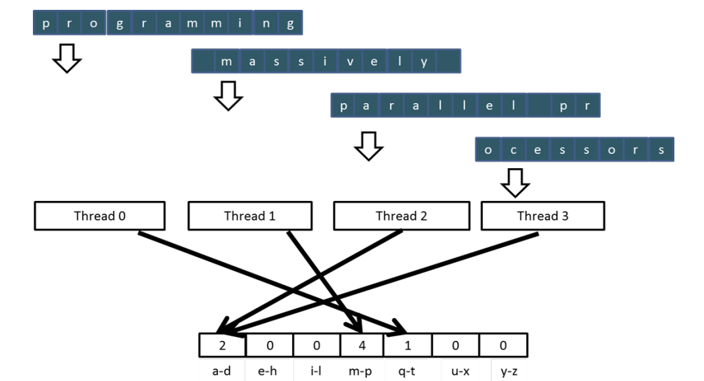

# Reduction Operation（归约操作）  
**定义**：归约操作是将一组输入值通过特定运算聚合为单一结果的过程。其核心是通过**关联且交换的运算**，结合**明确的单位元**，实现从多到一的映射。  

## 常见归约操作类型  
1. **最大值（Max）**  
   - 功能：返回输入集合中的最大元素。  
   - 单位元：对于数值类型，通常为负无穷（如在整数/浮点数中）。  

2. **最小值（Min）**  
   - 功能：返回输入集合中的最小元素。  
   - 单位元：对于数值类型，通常为正无穷。  

3. **求和（Sum）**  
   - 功能：累加所有输入值。  
   - 单位元：0（任何数加0不变）。  

4. **乘积（Product）**  
   - 功能：将所有输入值相乘。  
   - 单位元：1（任何数乘1不变）。  


## 用户自定义归约操作的要求  
当需要自定义归约函数时，必须满足以下条件：  
1. **运算的结合律（Associative）**  
   - 定义：\( (a \oplus b) \oplus c = a \oplus (b \oplus c) \)，其中 \(\oplus\) 为自定义运算。  
   - 作用：确保运算顺序不影响最终结果，允许并行计算（如分治策略）。  

2. **运算的交换律（Commutative）**  
   - 定义：\( a \oplus b = b \oplus a \)。  
   - 作用：确保输入顺序不影响结果，符合归约操作“聚合”的本质。  

3. **明确的单位元（Identity Value）**  
   - 定义：存在元素 \( e \)，使得对于任意输入值 \( a \)，有 \( a \oplus e = e \oplus a = a \)。  
   - 作用：单位元是运算的“起点”，例如求和中的0、乘积中的1。  


## 自定义归约操作示例：3D坐标数据的最大距离  
**场景**：计算3D坐标数据集中距离原点最远的点。  
**自定义函数逻辑**：  
1. 对每个坐标元组 \((x, y, z)\)，计算其到原点的距离：\( \text{distance} = \sqrt{x^2 + y^2 + z^2} \)。  
2. 对所有距离值执行“最大值”归约操作。  
**满足条件**：  
- **结合律与交换律**：最大值运算天然满足（与顺序无关）。  
- **单位元**：负无穷（确保第一个元素参与运算时结果正确）。  


## 应用场景  
- **数据聚合**：统计分析（如求平均值需先求和）、传感器数据汇总。  
- **并行计算**：结合律允许将数据分块计算后合并（如MapReduce中的Combine阶段）。  
- **算法优化**：简化递归或迭代过程（如动态规划中的状态转移）。  

# 分区与汇总  
– 处理大规模输入数据集的常用策略  
– 数据集内元素无需按特定顺序处理（需满足结合律和交换律）  
– 将数据集划分为更小的数据块  
– 由每个线程处理一个数据块  
– 使用归约树将每个数据块的结果汇总为最终答案

这是**并行归约树算法（parallel reduction tree algorithm）**的示意图，实体信息如下：
 
- 算法功能：通过树状结构并行执行操作（这里是取最大值“max”操作 ），将N个元素归约，需执行N - 1次操作，时间复杂度为\log(N)（基于并行计算的时间度量 ）。
- 示例数据：初始元素是3、1、7、0、4、1、6、3 ，经多轮“max”并行运算，最终得到最大值7 。

### 并行求和归约  
-  并行实现方式  
- -  递归地将线程数减半，每一步中每个线程对两个值求和  
- -  对于n个元素，需执行log(n)步，需要n/2个线程  
-  假设使用共享内存进行原地归约  
-  - 原始向量存储在设备全局内存中  
-  - 共享内存用于保存部分和向量  
-  - 每一步使部分和向量更接近最终总和  
-  - 最终总和将存储在部分和向量的第0个元素中  
-  - 由于部分和值的存在，减少了全局内存访问量

# 一种简单的线程到数据映射方法  
- 每个线程负责部分和向量的偶索引位置（责任位置） 
- 每步操作后，半数线程不再需要参与计算  
- 其中一个输入始终来自责任位置  
- 在每一步中，另一个输入来自距离逐步增加的位置
## 并行求和归约
这是并行求和归约（Parallel Sum Reduction）示例，实体信息：
 
- 线程（THREAD）：共4个线程（THREAD 0 - THREAD 3 ），分别用橙色、紫色、黄色、深紫色标识。
- 数据（DATA）：初始数据为3、1、7、0、4、1、6、3 ，经3步（STEPS 0 - 3 ）并行求和，逐步归约，最终THREAD 0 得到总和25 ，体现并行计算中通过多线程协作快速求和的过程。
- 
# 简单线程块设计  
- **每个线程块处理 2×BlockDim.x 个输入元素**  
- **每个线程将 2 个元素加载到共享内存中**  
  ```cuda
  __shared__ float partialSum[2*blockDim.x];
  unsigned int t = threadIdx.x;
  unsigned int start = 2*blockDim.x*blockIdx.x;
  unsigned int j = 2*t;
  partialSum[j] = input[start + j];
  partialSum[j+1] = input[start + j+1];
  ```  
- **注意**：该实现的**全局内存访问未合并**（non-coalesced）  
  - 线程访问的全局内存地址间隔较大，可能导致内存事务效率降低
# 归约步骤优化  
**优化内存合并的实现方法**：  
```cuda
// 线程块内每个线程加载2个元素到共享内存（合并访问）
partialSum[t] = input[start + t];
partialSum[blockDim.x + t] = input[start + blockDim.x + t];

// 并行归约：通过递增步长合并部分和
for (unsigned int stride = 1; stride <= blockDim.x; stride *= 2)
{
    __syncthreads();  // 同步屏障：确保当前步所有部分和已生成
    if (t % stride == 0)
        partialSum[2*t] += partialSum[2*t + stride];
}
```  

**关键点**：  
1. **内存合并访问**  
   - 每个线程连续加载两个输入元素（`input[start+t]` 和 `input[start+blockDim.x+t]`）  
   - 相邻线程访问的全局内存地址连续，提高显存带宽利用率  

2. **同步屏障的作用**  
   - `__syncthreads()` 确保所有线程完成当前步的部分和计算  
   - 防止数据竞争：确保下一步计算基于完整的当前步结果  

3. **归约逻辑**  
   - 每轮迭代通过 `stride` 控制合并间隔（1→2→4→...）  
   - 最终结果累积在 `partialSum[0]` 中  

**优势**：  
- 通过连续内存访问提升全局内存吞吐量  
- 同步机制保证并行计算正确性  
- 递归减半策略实现 O(log n) 时间复杂度

# 控制分歧  
- 当线程束中的线程通过做出不同的控制决策而采用不同的控制流路径时，就会发生控制分歧。  
- 一些线程执行if语句的then路径，另一些线程执行else路径。  
- 一些线程执行的循环迭代次数与其他线程不同。  
- 在当前GPU中，采用不同路径的线程的执行会被序列化。  
- 线程束中的线程所采用的控制路径会被逐个遍历，直到没有更多路径为止。  
- 在每条路径的执行过程中，采用该路径的所有线程都将并行执行。  
- 当考虑嵌套的控制流语句时，不同路径的数量可能会很大。

# 关于简单归约内核的一些观察  
- 在每次迭代中，每个线程束（warp）将按顺序遍历两条控制流路径  
  - 执行加法操作的线程所走的路径  
  - 不执行加法操作的线程所走的路径  
- 即使不执行加法操作的线程，仍会消耗执行资源

# 线程索引的使用至关重要  
- 在某些算法中，通过调整索引的使用方式可改善分歧情况  
- （需结合可交换和可结合的运算符）  
- **保持活动线程连续**  
  - 确保同一线程束（warp）中执行计算的线程在索引上连续分布  
- **始终将部分和压缩到 partialSum[] 数组的前端位置**  
  - 通过索引映射让活跃线程集中在数组前半部分，减少控制流分歧  


**核心思路**：利用运算的数学性质（交换律/结合律），通过调整线程索引映射策略，使同一线程束内的线程尽可能执行相同的控制流路径，避免因索引分散导致的执行资源浪费。
## 4个线程的示例
- 线程（Thread）：标识为Thread 0 、Thread 1 、Thread 2 、Thread 3 ，对应不同颜色区域（橙色、橙色、橙色、绿色等 ，绿色区域未参与计算流程 ）。
- 数据与计算：初始数据行是3、1、7、0、4、1、6、3 ，经多轮并行运算（箭头指示数据流向与合并 ），最终在Thread 0 区域得到结果25 ，呈现多线程协作进行数据归约（如求和等）的过程 。

### 优化后的归约内核  
```cuda
// 优化后的归约循环：通过索引调整减少控制分歧
for (unsigned int stride = blockDim.x; stride > 0; stride /= 2)
{
    __syncthreads();  // 同步屏障确保所有线程完成当前步
    if (t < stride)    // 仅前stride个线程活跃，保持线程束连续执行
        partialSum[t] += partialSum[t+stride];
}
```  

**关键优化点**：  
1. **循环方向调整**：  
   - 步长从 `blockDim.x` 开始递减（原实现为递增）  
   - 每轮迭代中活跃线程数减半（`t < stride`）  

2. **控制分歧优化**：  
   - 活跃线程始终集中在数组前半部分（`partialSum[0..stride-1]`）  
   - 同一线程束内的线程执行相同的控制路径（无分支分歧）  

3. **内存访问模式**：  
   - 每次迭代访问的共享内存地址连续（`t` 和 `t+stride`）  
   - 避免了跳跃式内存访问，提高缓存命中率  
# 快速分析  
- **对于1024线程的线程块**：  
  - **前5步无控制分歧**  
    - 每步活跃线程数依次为：1024 → 512 → 256 → 128 → 64 → 32  
    - 每个线程束（warp，含32线程）内的线程状态完全一致  
      - 要么全部活跃（执行加法）  
      - 要么全部休眠（不执行操作）  
  - **仅最后5步的首个线程束存在控制分歧**  
    - 当活跃线程数 ≤32 时，首个线程束中部分线程活跃，部分休眠  


## 回到整体视角  
- **内核执行结束时**：每个线程块中的线程0将该线程块在`partialSum[0]`中的求和结果写入以`blockIdx.x`为索引的向量中。  
- **大规模数据场景**：若原始向量规模极大，此类求和结果的数量可能非常庞大。  
- **后续处理策略**：  
  1. **再次迭代归约**：对存储线程块求和结果的向量继续执行归约操作。  
  2. **主机端直接计算**：若求和结果数量较少，主机可直接将数据取回并累加。

## 直方图  
• 从大型数据集中提取显著特征和模式的方法  
• **应用场景**：  
  - 图像中目标识别的特征提取  
  - 信用卡交易中的欺诈检测  
  - 天体物理学中天体运动的相关性分析  
  - …  
• **基本原理**：对于数据集中的每个元素，使用其值确定一个“ bins（桶）计数器”并对其进行递增  


**核心概念**：  
- **bins（桶）**：预设的离散区间，用于统计落入该区间的数据频次  
- **统计逻辑**：遍历数据集，将每个数据值映射到对应的 bin 中，累加计数  
- **输出形式**：由各 bin 及其对应频次组成的统计图表或数组

### 文本直方图示例  
• **桶的定义**：将字母表按四个字母分组：a–d, e–h, i–l, m–p, …（注：原描述中“n–p”可能为笔误，按四个字母分组应为m–p，因a-d含4个字母，后续依次类推）  
• **统计逻辑**：对于输入字符串中的每个字符，将其映射到对应的字母分组桶中，并递增该桶的计数器  
• **输入短语**："programming massively parallel processors"  
• **输出直方图**：  
  | 字母分组 | 字符计数 |  
  |----------|----------|  
  | a–d      | 2（a, d） |  
  | e–h      | 4（e, e, h, e） |  
  | i–l      | 5（i, o, m, m, l） |  
  | m–p      | 12（m, m, p, p, r, o, g, r, a, m, m, s） |  
  | q–t      | 3（q, u, t） |  
  | u–x      | 2（u, s） |  
  | y–z      | 0        |  

**说明**：  
- 统计时忽略字符大小写（假设统一转换为小写）  
- 空格及非字母字符不参与统计（如示例中“massively”后的空格、“processors”中的“s”属于m–p分组）  
- 分组边界可根据实际需求调整（如按单个字母、首字母等）。


## 简单并行直方图算法  
• **核心步骤**：  
  1. **输入数据分区**：将输入数据集划分为多个子区间（如按线程数均分）。  
  2. **线程任务分配**：每个线程负责一个子区间的统计。  
  3. **局部直方图统计**：线程遍历所负责的子区间，对每个元素（如字符）映射到对应的桶（bin）并累加计数。  
  4. **全局结果合并**（可选）：将所有线程的局部统计结果合并，生成最终全局直方图。  


• **关键特性**：  
  - **无共享内存竞争**：各线程独立操作私有局部直方图，避免同步开销。  
  - **适用于离散数据**：需预先定义明确的桶映射规则（如字符分组、数值区间）。  
  - **负载均衡要求**：若输入数据分布不均，可能导致线程执行时间差异（如某线程负责的子区间元素极多）。  

• **局限性**：  
  - **全局合并开销**：当线程数较多时，合并操作可能成为瓶颈。  
  - **非流式处理**：需预先已知数据总量，难以处理实时数据流。  

• **优化方向**：  
  - 使用共享内存减少全局内存访问（如每个线程块维护局部直方图，块内并行合并）。  
  - 动态分区处理数据倾斜（如按元素哈希值分配桶，而非固定数据分区）。
## 分段划分的两轮迭代
- 处理对象：文本片段“programming”“massively”“parallel pr”“ocessors” 。
- 线程（Thread）：4个线程（Thread 0 - Thread 3 ），负责处理文本并统计字母区间（a - d、e - h等 ）的数量，迭代1中m - p区间计数为3；迭代2中a - d计数2、m - p计数4、q - t计数1 ，体现不同迭代里线程分工与数据统计结果 。


### 输入分区对内存访问效率的影响  
**分段式分区（Sectioned Partitioning）的问题**  
-  **内存访问效率低下**：相邻线程访问的内存地址不连续  
-  **访问未合并（Non-Coalesced）**：无法利用DRAM的突发传输特性  
-  **DRAM带宽利用率低**：频繁触发独立内存事务  

**交错式分区（Interleaved Partitioning）的优化**  
-  **连续内存访问**：所有线程依次处理连续的数据段  
-  **合并访问（Coalesced）**：相邻线程访问相邻内存地址  
-  **提高DRAM带宽利用率**：减少内存事务开销  

**内存访问模式对比**  
| **分段式分区**                | **交错式分区**                |  
|------------------------------|------------------------------|  
| 线程0 → 数据块0（地址0-100）  | 线程0 → 数据块0（地址0, 32, 64...） |  
| 线程1 → 数据块1（地址101-200）| 线程1 → 数据块0（地址1, 33, 65...） |  
| 内存访问跳跃式分布           | 内存访问连续且合并           |  

**关键改进**  
- **数据分配策略**：将输入数据按线程ID进行**循环分配**（Round-Robin）  
- **执行流程**：  
  ```  
  1. 所有线程共同处理数据块0（线程0处理元素0，线程1处理元素1，依此类推）  
  2. 所有线程同步进入数据块1，重复上述过程  
  3. 直至处理完所有数据块  
  ```  
- **合并条件**：确保同一 warp 内的线程访问连续的内存地址  

**性能收益**  
- 内存事务减少约 **32倍**（假设warp大小为32）  
- DRAM带宽利用率提升 **50%-80%**（具体取决于硬件架构）  

**代码示例（伪代码）**  
```cuda  
// 交错式分区实现  
__global__ void histogram_kernel(char* input, int* hist, int size) {  
    int idx = threadIdx.x + blockIdx.x * blockDim.x;  
    int stride = gridDim.x * blockDim.x;  // 线程总数  
    
    // 循环处理所有分配给当前线程的元素（交错式访问）  
    for (int i = idx; i < size; i += stride) {  
        int bin = get_bin(input[i]);  // 计算桶索引  
        atomicAdd(&hist[bin], 1);     // 更新全局直方图（需原子操作）  
    }  
}  
```  


**适用场景**  
- 适用于所有需要并行扫描输入数据的算法  
- 特别适合直方图、前缀和等内存密集型操作  
- 需结合硬件特性调整线程块大小（通常为32的倍数）
##　输入的交错分割

- 目的：“For coalescing and better memory access performance”（为了合并访问与提升内存访问性能 ）。
- 元素：涉及线程（Thread 0 - Thread 3 ），对文本（如“programming massively pa…” ）进行处理，统计字母区间（a - d、e - h等 ）的数量，呈现不同线程分工及数据统计结果，体现交错分区在并行内存访问优化中的应用 。


# 文本直方图中的读取、修改、写入问题 
• 当多个线程尝试同时访问和修改同一数据位置时，会引发**数据竞争（Data Race）**问题。  

**具体场景**：  
- 不同线程统计到同一字符（如字母 'a'）时，需对同一个桶计数器（如 `bin[0]`）执行“读取-修改-写入”操作。  
- 若未加同步控制，可能导致以下问题：  
  ```
  线程A读取 bin[0] = 5 → 计算新值 6 → 未写入时  
  线程B读取 bin[0] = 5 → 计算新值 6 → 两者均写入6，实际应计为7  
  ```  

**解决方案**：  
1. **原子操作（Atomic Operations）**  
   - 使用硬件支持的原子函数（如 `atomicAdd`）确保操作的原子性：  
     ```cuda  
     atomicAdd(&histogram[bin_idx], 1);  // 原子递增桶计数器  
     ```  
   - 原理：保证对同一内存地址的更新操作不会被其他线程打断。  

2. **线程块本地缓存（Shared Memory）**  
   - 每个线程块维护私有局部直方图，最后合并到全局内存：  
     ```cuda  
     __shared__ int block_hist[NUM_BINS];  
     // 线程块内统计到局部直方图block_hist  
     __syncthreads();  
     // 单线程将block_hist合并到全局histogram（避免多线程竞争）  
     if (threadIdx.x == 0) {  
         for (int i=0; i<NUM_BINS; i++) {  
             atomicAdd(&global_hist[i], block_hist[i]);  
         }  
     }  
     ```  

3. **无锁数据结构（Lock-Free Data Structures）**  
   - 使用无锁队列或哈希表等结构，通过 CAS（Compare-And-Swap）操作保证一致性（复杂度较高，适用于特定场景）。  

**性能对比**：  
| 方案          | 数据竞争风险 | 线程同步开销 | 适用场景               |  
|---------------|--------------|--------------|------------------------|  
| 直接写入      | 高           | 无           | 单线程或只读场景       |  
| 原子操作      | 低           | 低（硬件级） | 轻量级竞争场景         |  
| 局部缓存合并  | 极低         | 中（同步屏障）| 大规模并行统计场景     |  

**总结**：在并行直方图算法中，必须通过**原子操作**或**局部缓存合并**避免数据竞争，优先选择硬件原子操作以平衡性能与正确性。


### 原子操作的关键概念  
• **原子操作定义**：对内存地址执行的**读取-修改-写入（read-modify-write）**操作由单个硬件指令完成。  
• **操作流程**：  
  1. 读取旧值；  
  2. 计算新值；  
  3. 将新值写入原地址。  
• **硬件保证**：在当前原子操作完成前，**其他线程无法对同一地址执行读取-修改-写入操作**，确保操作的完整性和互斥性。  
• **线程队列机制**：试图对同一地址执行原子操作的其他线程通常会被加入队列，**按顺序串行执行**。  

**核心特性**  
| 特性         | 说明                                                                 |  
|--------------|----------------------------------------------------------------------|  
| **原子性**   | 操作不可分割，要么完全执行，要么完全不执行，无中间状态。             |  
| **互斥性**   | 同一时刻仅有一个线程可操作同一内存地址，避免数据竞争。               |  
| **顺序性**   | 多线程对同一地址的原子操作按队列顺序执行，保证操作结果可预测。       |  
**局限性**  
- **性能瓶颈**：高竞争场景下（如大量线程同时操作同一地址），原子操作会退化为串行执行，导致吞吐量下降。  
- **适用类型有限**：仅支持特定数据类型（如整数、指针），复杂数据结构需结合其他同步机制。  

## CUDA中的原子操作  
• 通过调用可转换为单条指令的函数（也称为内联函数或内置函数）执行  
• 原子加、减、增、减、取最小、取最大、交换（exchange）、CAS（比较并交换）  
• 原子加法  
`int atomicAdd(int* address, int val);`  
• 从全局或共享内存中`address`指向的位置读取32位旧值`old`，计算`(old + val)`，并将结果存储回同一内存地址；函数返回`old`
## CUDA中的更多原子加法操作  
• **无符号32位整数原子加法**  
  ```cuda  
  unsigned int atomicAdd(unsigned int* address, unsigned int val);  
  ```  

• **无符号64位整数原子加法**  
  ```cuda  
  unsigned long long int atomicAdd(unsigned long long int* address, unsigned long long int val);  
  ```  

• **单精度浮点数原子加法**（计算能力 > 2.0）  
  ```cuda  
  float atomicAdd(float* address, float val);  
  ```
## 一个基本的文本直方图内核
```
__global__ void histo_kernel(unsigned char *buffer,
                             long size, unsigned int *histo)
{
    int i = threadIdx.x + blockIdx.x * blockDim.x;

    // stride is total number of threads
    int stride = blockDim.x * gridDim.x;

    // All threads handle blockDim.x * gridDim.x
    // consecutive elements
    while (i < size) {
        int alphabet_position = buffer[i] - "a";
        if (alphabet_position >= 0 && alpha_position < 26)
            atomicAdd(&(histo[alphabet_position/4]), 1);
        i += stride;
    }
}
```
- 功能：内核接收字节值输入缓冲区指针，线程以跨步模式（strided pattern）处理输入，统计文本中字母（按规则分组到直方图），用 atomicAdd 保证并发安全 。

- 代码结构：定义 __global__ 函数 histo_kernel ，涉及线程索引计算（ threadIdx.x 、 blockIdx.x  等）、跨步（ stride  ）设置，循环处理输入数据，转换字母位置并更新直方图 。
## 全局内存（DRAM）上的原子操作  
• 对DRAM位置执行原子操作时，首先进行读取，延迟约为几百个周期。  
• 原子操作以向同一位置写入结束，延迟同样约为几百个周期。  
• 在整个过程中，其他线程无法访问该位置。

- 每次读取修改-写入操作都存在两次完整的内存访问延迟  
• 对同一变量（DRAM地址）的所有原子操作都会被序列化执行。

### 延迟决定吞吐量  
• 对同一DRAM位置执行原子操作的吞吐量，取决于应用程序能够执行原子操作的速率。  
• 特定位置的原子操作速率受限于读取-修改-写入序列的总延迟，对于全局内存（DRAM）位置，通常超过1000个周期。  
• 这意味着，如果许多线程试图对同一位置执行原子操作（竞争），内存吞吐量将降至单个内存通道峰值带宽的**1/1000以下**！
## 硬件的改进 

### Fermi架构L2缓存上的原子操作  
• **中等延迟**：约为DRAM延迟的1/10  
• **共享范围**：所有线程块共享  
-  全局内存原子操作的“免费优化”
-    
### 共享内存上的原子操作  
• **极低延迟**：远低于全局内存  
• **私有性**：每个线程块独占（其他块不可访问）  
• **实现要求**：需程序员设计算法（后续详细讨论）

## 私有化

# 直方图统计中的共享内存原子操作  
• **吞吐量优势**：比DRAM原子操作快100倍，比L2缓存原子操作快10倍  
• **减少竞争**：仅同一线程块内的线程可访问共享内存变量  
• **关键应用场景**：共享内存原子操作的典型高效用例
# 共享内存原子操作需要私有化  
• 为每个线程块创建`histo[]`数组的私有副本  
```cuda  
__global__ void histo_kernel(unsigned char *buffer,  
                            long size, unsigned int *histo)  
{  
    __shared__ unsigned int histo_private[7];  // 线程块私有的共享内存直方图  

    // 初始化私有直方图的bin计数器  
    if (threadIdx.x < 7)  
        histo_private[threadIdx.x] = 0;  // 每个线程初始化一个bin  
    __syncthreads();  // 同步屏障：确保所有bin都被初始化为0  

    // ... 后续统计逻辑 ...  
}  
```  

**关键点**：  
1. **私有副本**：每个线程块拥有独立的`histo_private`，避免块间竞争  
2. **并行初始化**：利用线程块内多线程并行初始化7个bin，加速准备阶段  
3. **同步屏障**：`__syncthreads()`确保所有线程完成初始化后再进入统计阶段，防止脏读  
**性能对比**：  
| **方案**               | **原子操作次数** | **延迟来源**       | **吞吐量**         |  
|------------------------|------------------|--------------------|--------------------|  
| 直接全局原子操作       | `size`次         | DRAM延迟（高）     | 极低（串行化严重） |  
| 共享内存+全局合并      | `size + 7`次     | 共享内存延迟（低） | 极高（并行效率高） |  

**优化核心**：  
1. **将高延迟的全局原子操作次数从`size`降至`7×block数`**  
2. **利用低延迟的共享内存原子操作完成大部分统计工作**  
3. **通过块内并行初始化和统计，最大化硬件利用率**  
### 构建私有直方图的完整实现  
以下是使用共享内存原子操作构建直方图的完整CUDA内核代码：  

```cuda
__global__ void histo_kernel(unsigned char *buffer, long size, unsigned int *histo)
{
    __shared__ unsigned int histo_private[7];  // 每个线程块的私有直方图（7个bin）
    
    // 1. 初始化私有直方图
    if (threadIdx.x < 7) 
        histo_private[threadIdx.x] = 0;
    __syncthreads();  // 确保所有bin初始化完成
    
    // 2. 并行处理输入数据，更新私有直方图
    int i = threadIdx.x + blockIdx.x * blockDim.x;
    int stride = blockDim.x * gridDim.x;  // 线程总数作为步长
    
    while (i < size) {
        int alphabet_position = buffer[i] - 'a';  // 字符映射到0-25（假设小写字母）
        if (alphabet_position >= 0 && alphabet_position < 26)
            atomicAdd(&histo_private[alphabet_position/4], 1);  // 每4个字母映射到一个bin
        i += stride;  // 跳跃式访问，实现负载均衡
    }
    __syncthreads();  // 确保所有线程完成统计
    
    // 3. 将私有直方图合并到全局结果
    if (threadIdx.x < 7) {
        atomicAdd(&histo[threadIdx.x], histo_private[threadIdx.x]);  // 全局原子操作
    }
}
```

### 代码解析  
1. **私有直方图初始化**  
   - 每个线程块创建独立的`histo_private[7]`数组  
   - 线程块内前7个线程分别初始化一个bin，确保并行性  

2. **数据处理与统计**  
   - **跳跃式访问**：每个线程处理`i += stride`位置的数据，避免内存访问冲突  
   - **映射规则**：将26个字母映射到7个bin（`alphabet_position/4`），例如：  
     - 'a'-'d' → bin 0  
     - 'e'-'h' → bin 1  
     - ...  
     - 'w'-'z' → bin 6  
   - **原子操作**：使用共享内存原子操作更新`histo_private`，避免块内竞争  

3. **结果合并**  
   - 所有线程完成后，每个线程块的前7个线程将私有直方图合并到全局`histo`  
   - 全局原子操作次数从`size`次减少到`7×block数`次，大幅提升效率  

### 关于私有化的更多内容  
• 私有化是一种强大且常用于并行化应用程序的技术。  
• 操作需要满足结合律和交换律。  
• 直方图加法操作是结合且可交换的。  
• 如果操作不满足要求，则无法进行私有化。
