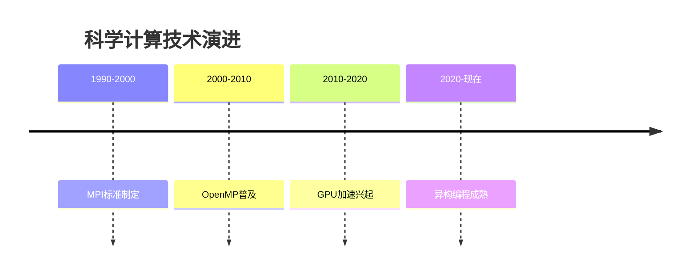

# 高性能计算与并行编程完整笔记集

## 1. CUDA编程模型 
### 核心概念
- **SIMT架构**：32线程组成warp，同一warp内线程执行相同指令
- **内存层次**：
  ```mermaid
  graph TD
    A[寄存器] --> B[共享内存]
    B --> C[L1缓存]
    C --> D[全局内存]
  ```
- **最新发展**：
  - NVSwitch实现GPU间全互联
  - CUDA 12支持C++17标准

## 2. 混合编程 
### 典型模式对比
| 组合方式       | 适用场景           | 通信开销 |
|----------------|--------------------|----------|
| MPI+OpenMP     | CPU多核集群        | 中等      |
| MPI+CUDA       | GPU加速集群        | 高        |
| MPI+PGAS       | 大规模数据共享     | 低        |

### 调试技巧
```bash
# 检查线程绑定
OMP_DISPLAY_ENV=verbose mpirun -np 4 ./program
```

## 3. 共享内存编程 
### 同步原语性能对比
| 机制          | 延迟(ns) | 适用场景         |
|---------------|---------|------------------|
| 原子操作       | 50-100  | 简单计数器        |
| 自旋锁        | 150-300 | 短期临界区        |
| 互斥锁        | 500-1000| 复杂数据结构      |

## 4. PGAS模型 
### 语言特性对比
| 语言   | 内存模型        | 远程访问语法          |
|--------|----------------|-----------------------|
| UPC    | 分块全局数组    | ptr[remote_index]     |
| CAF    | 协同数组       | array[remote_idx]     |
| Chapel | 多域分布式数组  | A[remote_domain]      |

## 5. MPI详解 
### 通信模式基准测试
```python
# MPI vs OpenSHMEM延迟对比
import matplotlib.pyplot as plt
latency = {
    'MPI_Send': [1.2, 2.4, 45.3],
    'OpenSHMEM': [0.7, 1.5, 38.2]
}
plt.plot(message_sizes, latency['MPI_Send'], label='MPI')
```

## 6. 应用分类 
### 技术栈演进


## 7. OpenMP编程 
### 高级特性
```cpp
// 任务依赖示例
#pragma omp task depend(in: x) 
void read_x() {...}

#pragma omp task depend(out: y)
void write_y() {...}
```

## 8. 三大应用领域 
### 典型工作负载特征
| 领域       | 计算密度 | 通信频率 | 内存需求 |
|------------|----------|----------|----------|
| 科学计算   | 极高     | 中等     | 大       |
| 大数据     | 中等     | 高       | 极大     |
| AI计算     | 高       | 低       | 中等     |

## 完整工具链
1. **性能分析**：
   - NVIDIA Nsight Compute
   - Intel VTune
   - ARM MAP
2. **调试工具**：
   - TotalView
   - DDT
3. **通信优化**：
   - UCX框架
   - Libfabric

## 学习路径建议
1. 基础阶段：MPI + OpenMP
2. 中级阶段：CUDA + 性能分析
3. 高级阶段：PGAS + 异构编程


