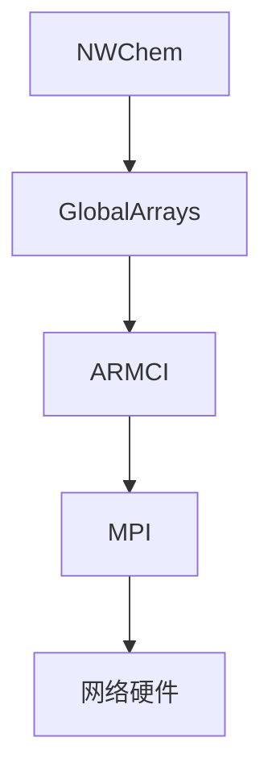
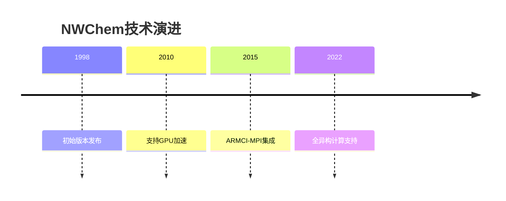

# NWChem高性能计算化学软件技术报告笔记

## 1. 概述 
- **演讲者**：Jeff Hammond（NVIDIA HPC团队）
- **内容框架**：
  - NWChem简介
  - ARM架构适配历程
  - Ampere Altra Q80-30配置实验
  - 与Intel Xeon 6148的对比
  - 结论与未来工作

## 2. NWChem核心特性 
- **功能范围**：
  - 经典分子动力学 → 原子轨道DFT
  - 多尺度计算：QM/MM、嵌入方法
- **架构设计**：
  ```mermaid
  graph LR
    A[MPI并行] --> B[全局数组]
    B --> C[模块化积分计算]
    C --> D[面向对象Fortran]
  ```
- **历史背景**：2000年代为HPC系统设计的Massively parallel架构

## 3. 发展背景 
### 技术里程碑
| 年份 | 关键技术 |
|------|----------|
| 1991 | Fortran 90标准发布 |
| 1993 | MPI 1.0发布 |
| 1997 | OpenMP Fortran 1.0 |
| 1998 | NWChem 3.2.1发布 |

### 硬件厂商变迁
- 1994-1996年行业震荡期：
  - Thinking Machines破产
  - Cray被SGI收购
  - 仅富士通、HP、IBM持续运营至今

## 4. 软件架构 
- **核心组件**：
  - **全局数组(GA)**：分布式数组抽象层
  - **ARMCI**：底层单边通信库
- **计算模块**：
  ```python
  # 典型工作流
  ga_initialize()
  g_m = ga_create('matrix', 100, 100)  # 创建分布式矩阵
  ga_put(g_m, data)                   # 数据写入
  ga_acc(g_m, delta)                  # 原子更新
  ```

## 5. 通信架构 
### GA-ARMCI-MPI栈

- **性能关键**：
  - 非连续子数组通信优化
  - 异步进度机制（Casper方案）

## 6. 性能评测 
### 基准测试数据
| 系统配置 | SCF迭代时间(s) | CCSD(T)算力(PFlops) |
|---------|---------------|---------------------|
| 8节点×24核 | 61.4-128.0 | - |
| 9,450 KNL节点 | - | 9.14 |

**突破性成果**：
- 迄今最大规模CCSD(T)计算（53万核心）
- 石墨烯二聚体结合能精确计算

## 7. 软硬件适配 
### 支持矩阵
| 类别 | 支持选项 |
|------|----------|
| CPU架构 | x86_64/AArch64/PowerPC |
| GPU加速 | CUDA/OpenACC/OpenMP offload |
| 数学库 | MKL/OpenBLAS/BLIS/ARMPL |

**实验配置**：
- Ampere Altra Q80-30（80核@3.0GHz）
- 编译器对比：GCC 8.3.1 vs NVHPC 21.5
- MPI实现：MPICH vs Open-MPI

## 8. 性能分析 
### 关键发现
- **编译器影响**：NVHPC比GCC快2-7%
- **MPI选择**：Open-MPI RMA性能优于MPICH 0-20%
- **通信库**：ARMCI-MPI与MPI-PR差异±10%

```python
# 水分子团簇计算性能
import matplotlib.pyplot as plt
plt.bar(['GCC','NVHPC'], [2100, 1950])  # W21 B3LYP/cc-pVTZ
```

## 9. 总结与资源 
- **学习资源**：
  - [ISC22 SCC入门指南](https://hpcadvisorycouncil.atlassian.net/wiki/spaces/HPCWORKS/pages/2799534081/)
- **联系方式**：
  - Email: jeff_hammond@acm.org
  - LinkedIn: [Jeff Hammond](https://www.linkedin.com/in/jeffhammond/)

## 附录：技术演进路线


