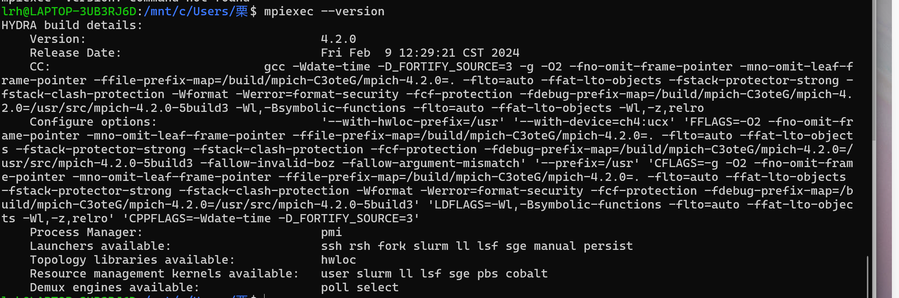
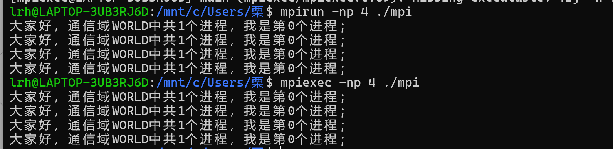
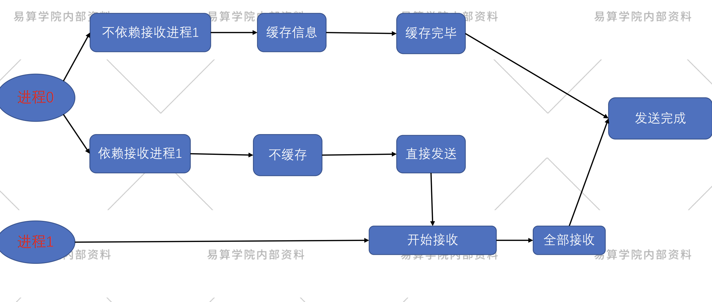
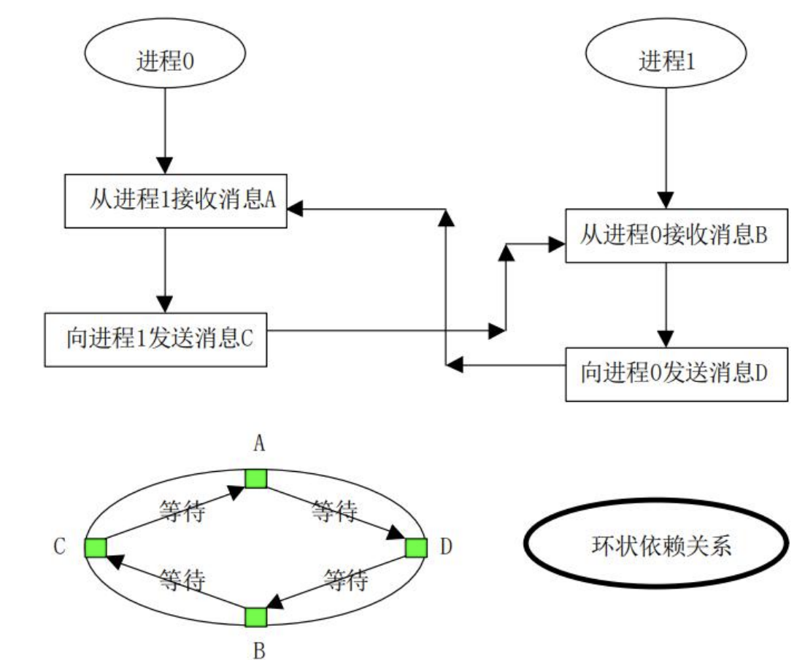
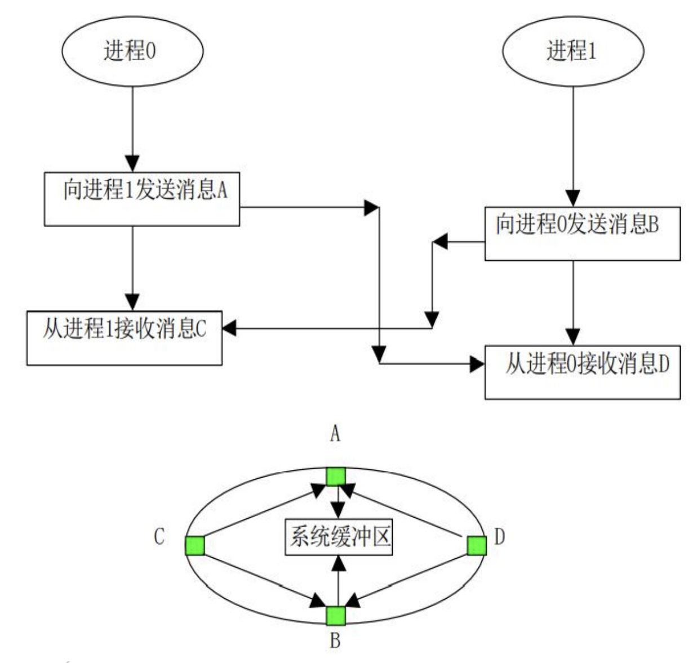
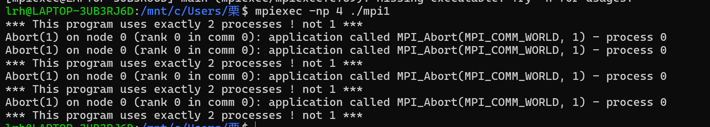
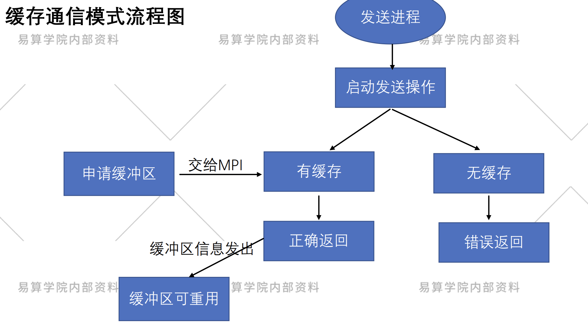
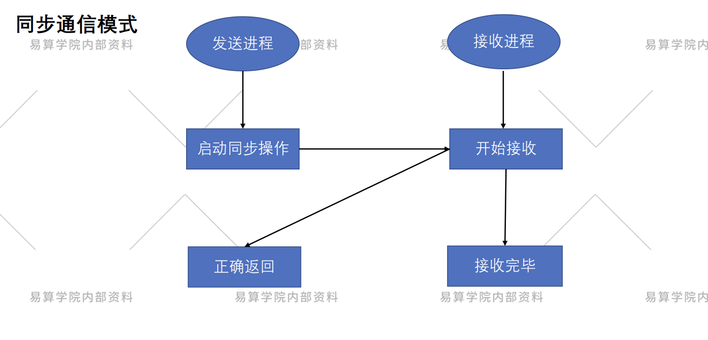

# 基本知识
## 进程
| 概念                | 描述                                                                 |
|---------------------|----------------------------------------------------------------------|
| **进程**            | 具有独立功能的程序关于某个数据集合的一次运行活动。                   |
| **进程与程序关联**  | 程序在操作系统中运行即成为进程；进程拥有独立的执行环境。             |
| **本地进程**        | 在单一执行环境中独立运行的进程，不依赖外部进程的特定语义或内容。     |
| **非本地进程**      | 执行过程中需调用其他进程（如MPI程序）的特定语义或内容的进程。         |
| **同步**            | 调用任务需等待被调用任务完成后才能继续执行。                         |
| **异步**            | 调用任务发出请求后即可继续执行，通过状态通知或回调函数处理被调用任务。|
## 并行计算
- 是相对于串行计算来说的
- 是一种一次可执行多个指令的算法
- 目的是提高计算速度，即通过扩大问题求解规模，解决大型而复杂的计算问题。
## 并行计算机
### 种类
1. 共享内存：机各个处理单元通过对共享内存的访问来交换信息协调各处理器对并行任务的处理.
2. 分布式内存：各个处理单元都拥有自己独立的局部存储器,各个处理器之间通过消息传递来交换信息,协调和控制各个处理器的执行
3. 分布式共享内存：机结合了前两者的特点。可以提高系统的模块性和扩展性有利于快速构造超大型的计算系统
## 并行程序设计
- 需要将问题的并行求解算法转化为特定的适合并行计算模型的并行算法。
- 1. 首先是问题的并行求解算法必须能够将问题内在的并行特征充分体现出来
- > 否则并行求解算法将无法利用这些并行特征，从而使问题的高效并行求解成为不可能
- 2. 并行求解模型要和并行计算模型尽量吻合这样就为问题向并行机上的高效解决提供了前提
## 消息传输
- 是消息数据从一个处理器的内存拷贝到另一个处理器内存的方法。
- 在分布式存储系统中，数据通常是以消息包的形式通过网络从一个处理器发送到另一个处理器。
- 在消息包中，包含了消息头控制信息及消息体数据信息两部分.
## 发送和接受
- 消息通信包括数据传输从一个进程（发送）到另一个进程（接收）。
- 要求两个进程协作完成消息发送和接收过程，发送进程一般要求指定发送数据的源、数据长度、数据类型及目的地，而接收操作也要求指定相应的操作与发送相匹配。
# MPI的介绍
## MPI的含义
1. MPI是一种消息传递编程模型，最终目的是服务于进程间的通信
2. MPI 是一种标准或规范的代表，不特指某一个对它的具体实现。
3. MPI 是一个库，不是一门语言
## MPI的发展
## MPI的一般实现
| **层级**               | **功能描述**                                                                 | **实现方式**                                                                 |
|------------------------|-----------------------------------------------------------------------------|------------------------------------------------------------------------------|
| **MPI标准接口层**      | 通过ADI层提供的服务和平台无关的算法/数据结构，实现MPI的标准接口（如通信原语）。 | 基于ADI层封装的抽象设备实现，对外提供统一编程接口（如`MPI_Send`/`MPI_Recv`）。|
| **ADI层**              | 将底层通信库的API封装为抽象设备，屏蔽硬件差异，支持灵活选择底层通信方式。      | 调用底层通信库（如OpenUCX、Libfabric）的API实现，支持多设备动态绑定。        |
| **底层通道API**        | 提供具体硬件通信能力（如RDMA、TCP/IP、共享内存等）。                         | 由操作系统（如Linux内核）或网络硬件厂商（如InfiniBand Verbs API）直接提供。  |
## MPICH 架构图
| 架构层级          | 名称/组件               | 功能描述                                                                 |
|-------------------|-------------------------|--------------------------------------------------------------------------|
| **应用程序层**    | Application             | 用户编写的并行程序，调用MPI接口函数实现进程间通信                        |
| **MPI接口层**     | MPI Interface           | 提供标准MPI API的实现，将MPI调用转换为下层抽象接口                       |
| **抽象设备接口层**| ADI (Abstract Device Interface) | 定义与底层通信设备无关的统一接口，保证上层MPI实现的可移植性          |
| **设备无关层**    | CH3 (Channel 3)         | MPICH核心抽象层，实现基本通信语义和协议，提供进程管理、点对点通信等功能 |
| **通道层**        | PAMI/Nemesis/sock       | 具体通信实现：<br>- PAMI：并行主动消息接口<br>- Nemesis：高性能网络模块<br>- sock：基于socket的实现 |
| **网络硬件层**    | Network                 | 物理网络设备（InfiniBand/以太网/Myrinet等）                             |
## MPI环境搭建-Linux
1. 下载源码。http://www.mpich.org/downloads/
2. 在安装目录下，解压缩。
3. 进入文件夹，生成编译文件。./configure +选项，指定编译器，和安装路径
4. 安装。make & make install
5. 将生成的相关文件，在咱们环境变量中进行指定。vi ~/.bashrc

## MPI作业运行
- MPI程序运行命令
- - mpirun（mpiexec）-np 进程数可执行文件
- 集群上MPI程序提交运行
- - 集群作业调度系统特定参数+ 可执行文件
# 第一个MPI程序
## MPI程序的基本构造
1. MPI头文件
2. 初始化MPI环境
3. 消息交换处理及计算等
4. 退出MPI环境
## MPI操作分类
- MPI操作是由MPI库为建立和启用数据传输和/或同步而执行的一系列步骤。
- 四个阶段：初始化、开始、完成和释放
## 内部参数名称的概念
- 序号：即进程的标识，是用来在一个进程组或一个通信器中标识一个进程。是唯一的。
- 通信域：它描述了一组可以互相通信的进程以及它们之间的联接关系等信息。MPI所有通信必须在某个通信器中进行。
- 消息：MPI 程序中在进程间传递的数据。它由通信器、源地址、目的地址、消息标签和数据构成。
- 通信：通信是指在进程之间进行消息的收发、同步等操作
- 缓冲区： 在用户应用程序中定义的用于保存发送和接收数据的地址空间
## MPI 程序的一般形式
**C**
1. 头文件包含
/#include<mpi.h>
/#include<stdio.h>
2. 程序主函数
- • MPI_Init(int *argc, char ***argv)
- - 完成MPI程序初始化工作,通过获取main函数的参数,让每一个MPI 进程都能获取到main函数
- MPI_Comm_rank(MPI_Comm comm, int *rank)
- - 用于获取调用进程在给定的通信域中的进程标识号
- MPI_Comm_size(MPI_Comm comm, int *size)
- - 调用返回给定的通信域中所包含的进程总数
- MPI_Finalize(void)
- - MPI程序的最后一个调用，清除全部MPI环境
## MPI小例子
#include <stdio.h>
#include <string.h>
#include "mpi.h"
int main(int argc, char* argv[])
{
int numprocs, myid, source;
MPI_Init(&argc, &argv);
MPI_Comm_rank(MPI_COMM_WORLD, &myid);
MPI_Comm_size(MPI_COMM_WORLD, &numprocs);
printf("大家好，通信域WORLD中共%d个进程，我是第%d个进程;\n",
numprocs,myid);
MPI_Finalize();
}

## 写MPI程序的步骤
1. 先用vim进行编写
2. 编译代码
- mpicc 目录名.c -o 目录名
3. 运行程序
- mpiexec -np <进程数> ./<可执行文件名>
- mpirun -np <进程数> ./<可执行文件名>

# 点对点通信
## MPI四种通信模式
**发送操作**
1. 标准通信
2. 缓存通信
3. 同步通信
4. 就绪通信
**接收操作**
标准接收
## 01 标准通信模式
**标准模式**
- 标准发送
- - MPI_Send(void* buf, int count, MPI_Datatype datatype, int dest, int tag, MPI_Comm comm)
- 标准接收
- - MPI_Recv(void* buf, int count, MPI_Datatype datatype, int source, int tag, MPI_Comm comm,status)
>　buf 数据地址
count 数据个数
MPI_Datatype 数据类型
source 源进程号
dest 目的进程号
tag 进程标识
MPI_Comm 通信域
status 状态

**任意源和任意标识**
- MPI_ANY_SOURCE：
- - 接收者可以给source指定 一个任意值MPI_ANY_SOURCE 标识任何进程发送的消息都可以接收。
- MPI_ANY_TAG
- - 如果给tag一个任意 值MPI_ANY_TAG，则任何tag都是可接收

**MPI环境的异常退出**
- IN comm 退出进程所在通信域
- IN errorcode 返回到所嵌环境的错误码

**标准通信模式流程图**

**MPI程序死锁**

**安全的发送接收序列**


```
#include<stdio.h>
#include "mpi.h"
int main(int argc,char*argv[])
{
 int rank,size;
 int flag,rval,i; 
 int buffer_1,recv_1;
 int buffer_2,recv_2;
 MPI_Status status,statusl,status2,status3,status4;
 int src=0;
 int dest=1;
 MPI_Init(&argc,&argv);
 MPI_Comm_rank(MPI_COMM_WORLD,&rank);/*0 or 1*/
 MPI_Comm_size(MPI_COMM_WORLD,&size );/*2*/
 if (size!=2)
 {
 printf("*** This program uses exactly 2 processes ! not %d ***\n",size);
 MPI_Abort(MPI_COMM_WORLD,1);
 }
 if (rank==src)/*当前进程为发送进程*/
 {
 buffer_1=200;
 buffer_2=20000;
 printf("standard MPI_send \n");
 MPI_Send(&buffer_1,1,MPI_INT,dest,1,MPI_COMM_WORLD);
 MPI_Send(&buffer_2,1,MPI_INT,dest,2,MPI_COMM_WORLD);
 printf("MPI_Send %d data,tag=1\n",buffer_1);
 printf("MPI_Send %d data,tag=2\n",buffer_2);
 }
 else if (rank==dest)/*当前进程为接收进程*/
 {
/*标准消息接收消息长度 tag 为1*/
 MPI_Recv(&recv_1,1,MPI_INT,src,1,MPI_COMM_WORLD ,&status3);
 MPI_Recv(&recv_2,1,MPI_INT,src,2,MPI_COMM_WORLD,&status4);
 printf("MPI_Recv=%d,tag =1\n",recv_1);
/*标准消息接收 tag 为2*/
 printf("MPI_Recv=%d,tag=2\n",recv_2);
}
MPI_Finalize();
}
```

## 02 缓存模式(MPI_BSEND)
**并行程序员的需求**
1. 对标准通信模式不满意
2. 希望对通信缓冲区进行直接控制
> 注意事项：
1、并行程序员需要对通信缓冲区进行申请、使用和释放，
2、通信缓冲区的合理与正确使用需要设计人员自己保证。

**缓存通信模式流程图**

**申请缓冲区，提交给MPI作为发送缓存，不使用时，缓冲区释放**
- 申请的空间提交给MPI做缓冲区
MPI_BUFFER_ATTACH(buffer,size)
IN buffer 初始缓存地址
IN size 按字节计数的缓存跨度
int MPI_Buffer_attach(void*buffer,int size)
MPI_BUFFER_ATTACH(BUFFER,SIZE,IERROR)
<#type>BUFFERR(*)
INTEGER SIZE，IERROR
- 释放缓冲区MPI调用接口
MPI BUFFER DETACH ( buffer , size ) 
OUT buffer 缓冲区初始地址（可选数据类型） 
OUT size 以字节为单位的缓冲区大小（整型） 
int MPI _ Buffer detach ( void ** buffer , int * size ) MPI _ BUFFER _ DETACH ( BUFFER , SIZE , IERROR）
 < type > BUFFER (*) INTEGER SIZE , IERROR 
 ```
 #include<stdio.h>
#include<stdlib.h>
#include"mpi.h"
int main(int argc, char **argv)
{
 int rank;/* My Rank (0 or 1)*/
 double recv;
 double *tmpbuffer ;
 int size=1;
 int bsize;
 double data=100.00;
 MPI_Status status ;
 MPI_Init(&argc,&argv)；
 MPI_Comm_rank(MPI_COMM_WORLD,&rank);
 if (rank==0)
 {
 printf("\nrank0=%d\n",rank);
 MPI_Pack_size(size,MPI_DOUBLE,MPI_COMM_WORLD,&bsize);
 /*计算为发送SIZE个MPI_DOUBLE类型的数据所需要的空间*/
 /*若当前进程为发送进程*/
 tmpbuffer=(double*)malloc(bsize+MPI_BSEND_OVERHEAD);
 /*申请缓存发送所需要的空间*/
 MPI_Buffer_attach(tmpbuffer,bsize+MPI_BSEND_OVERHEAD);
 /*将申请到的空间递交给MPI从而MPI可以利用该空间进行消息缓存*/
 printf("\nBsend data \n");
 MPI_Bsend(&data,1,MPI_DOUBLE,1,2000,MPI_COMM_WORLD);
 MPI_Buffer_detach(&tmpbuffer,&bsize);
 }
 else if (rank==1)
 {
/*若当前进程为接收进程*/
 MPI_Recv(&recv,1,MPI_DOUBLE,0,2000,MPI_COMM_WORLD,&status);/*执行标准的接收文件*/
 printf("\nbuffer recv data %f \n",recv);
 }
 else
 { 
 printf ("*** This program uses exactly 2 processes !***\n");
/*本程序只能使用两个进程*/
 MPI_Abort(MPI_COMM_WORLD,1);
 }
 MPI_Finalize();
}
```
## 03 同步通信模式（MPI_SSEND)

```
#include<stdio.h>
#include"mpi.h"
 int main (int argc,char*argv[]){
 int rank,size;
 int act_size=0;
 int flag,rval,i;
 int buffer,recv;
 int sbuffer,srecv;
 int ssbuffer,ssrecv;
 int buffer1,recv1;
 MPI_Status status,status1,status2,status3,status4;
 int countl,count2;
 int src=0;
 int dest=1;
 MPI_Init(&argc,&argv);
 MPI_Comm_rank(MPI_COMM_WORLD,&rank);/*0 or 1*/
 MPI_Comm_size(MPI_COMM_WORLD,&size);/*2*/
 if(size !=2)
 {
 printf("*** This program uses exactly 2 processes ! not %d ***\n", size);
 MPI_Abort(MPI_COMM_WORLD,1);
 }
 if (rank==src)/*当前进程为发送进程*/
 {
 buffer=100;
buffer1=10000;
 sbuffer=200;
 ssbuffer=20000;
 printf("standard MPI_send \n");
 MPI_Send(&ssbuffer,1,MPI_INT,dest,3,MPI_COMM_WORLD);
 MPI_Send (&sbuffer,1,MPI_INT,dest,4,MPI_COMM_WORLD);
 MPI_Ssend(&buffer,1,MPI_INT,dest,1,MPI_COMM_WORLD);
 printf("MPI_Ssend %d data,tag=1\n",buffer);
 MPI_Ssend(&bufferl,1,MPI_INT,dest,2,MPI_COMM_WORLD);
 printf("MPI_Ssend %d data,tag=2\n",bufferl);
 }
 else if(rank==dest)/*当前进程为接收进程*/
 {
/*标准消息接收消息长度 tag 为1*/
 MPI_Recv(&srecv,1,MPI_INT,src,3,MPI_COMM_WORLD,&status3);
 MPI_Recv(&ssrecv,1,MPI_INT,src,4,MPI_COMM_WORLD,&status4);
 printf("from standard MPI_send done ! srecv=%d,ssrecv=%d \n",srecv,ssrecv);
 MPI_Recv(&recv,1,MPI_INT,src,1,MPI_COMM_WORLD,&status1);
 printf("MPI_Recv =%d,tag=1\n",recv);
/*标准消息接收 tag 为2*/
 MPI_Recv(&recv1,1,MPI_INT,src,2,MPI_COMM_WORLD,&status2);
 printf("MPI_Recv=%d,tag=2\n",recv1);
 }
 MPI_Finalize();
 }
 ```
## 04 就绪通信模式（MPI_RSEND）
- 就绪通信模式的特殊之处就在于它要求接收操作先于发送操作而被启动。因此，在一个正确的程序中，一个就绪发送能被一个标准发送替代，它对程序的语义没有影响，而对程序的性能有影响
```
#include"mpi.h"
#include<stdio.h>
#include<stdlib.h>
 int main ( int argc,char*argv []){
 int rank,size;
 int next,prev;
 int tag,count;
 double buffer,recv;
 MPI_Status status;
 MPI_Request request;
 MPI_Init(&argc,&argv);
 MPI_Comm_rank(MPI_COMM_WORLD,&rank);
 MPI_Comm_size(MPI_COMM_WORLD,&size);
 tag=1;
 next=rank +1;
 if (next>=size)
 next=0;
 if (size!=2)
 {
 printf("*** This program uses exactly 2 processes ! not %d ***\n",size);
 MPI_Abort(MPI_COMM_WORLD,1);
 }
 if (0==rank)
 {
 printf("Rsend Test \n");
 buffer =6666.0f;
 }
 if (0==rank)
 {
 MPI_Recv(MPI_BOTTOM,0,MPI_INT,next,tag,MPI_COMM_WORLD,&status);//收到其接收进程通知，表示其接受操作已经启动
 printf (" Process %d post Ready send \n", rank );
 MPI_Rsend(&buffer,1,MPI_DOUBLE,next,tag,MPI_COMM_WORLD);//执行就绪模式发送
 }
 else 
 {
 printf("process %d post a receive call \n",rank);
 MPI_Irecv(&recv,1,MPI_DOUBLE,MPI_ANY_SOURCE,MPI_ANY_TAG,MPI_COMM_WORLD,&request);//启动就绪模式已经接受
 MPI_Send(MPI_BOTTOM,0,MPI_INT,next,tag,MPI_COMM_WORLD);//通知发送进程接收进程的接收操作已经启动
 MPI_Wait(&request,&status);
 printf("ready MPI_recv=%f \n",recv);
 printf("Process %d Receive Rsend message from %d \n",rank,status.MPI_SOURCE);
 }
 MPI_Finalize ();
 }
 ```