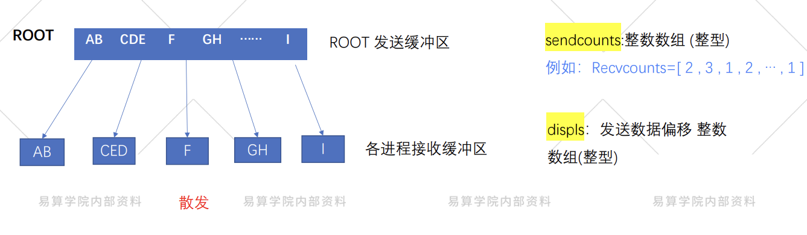

# MPI组通信概念
## 01组通信概述
**组通信一般实现三个功能**
- 通信：通信功能主要完成组内数据的传输
> 通信的方式：广播，收集，散发，组收集，全互换。
- 同步：同步功能实现组内所有进程在特定的地点在执行进度上取得一致
- 计算：计算功能稍微复杂一点，要对给定的数据完成一定的操作
### 消息通信功能
**三种组通信（按方向不同）**
- 一对多通信

- 多对一通信

- 多对多通信：其中每一个进程都向其它所有的进程发送消息，或者每个进程都从其它所有的进程接收消息，或者每个进程都同时向所有其它的进程发送和从其它所有的进程接收消息

### 同步功能
- 同步是许多应用中必须提供的功能，组通信还提供专门的调用以完成各个进程之间的同步，从而协调各个进程的进度和步伐
- 
### 计算功能

## 02广播
MPI广播函数接口：：MPI_Bcast (buffer , count , datatype , root , comm)

代码
```
#include <stdio.h>
#include <mpi.h>

int main(int argc, char** argv) {
    int rank, value;
    // 初始化MPI环境
    MPI_Init(&argc, &argv);
    // 获取当前进程的编号
    MPI_Comm_rank(MPI_COMM_WORLD, &rank);

    do {
        if (rank == 0) {
            // 进程0从标准输入读取数据
            printf("Please enter an integer (enter a negative number to exit): ");
            scanf("%d", &value);
        }
        // 广播数据，根进程为0
        MPI_Bcast(&value, 1, MPI_INT, 0, MPI_COMM_WORLD);
        // 每个进程打印接收到的数据
        printf("Process %d got %d\n", rank, value);
    } while (value >= 0);

    // 释放MPI资源
    MPI_Finalize();
    return 0;
}
```


# MPI组通信
## 01-组通信-单进程收集
- 收集接口：MPI_Gather (sendbuf , sendcount , sendtype , recvbuf , recvcount , recvtype, root, comm)

**MPI_Gather示例**
```
#include <stdio.h>
#include <mpi.h>
#include <stdlib.h>

int main(int argc, char** argv) {
    MPI_Comm comm;
    int gsize, rank;
    int sendarray[100];
    int root = 0;
    int *recbuf;

    // 初始化MPI环境
    MPI_Init(&argc, &argv);
    // 获取通信子
    comm = MPI_COMM_WORLD;
    // 获取当前进程的编号
    MPI_Comm_rank(comm, &rank);
    // 获取通信组中的进程总数
    MPI_Comm_size(comm, &gsize);

    // 为每个进程填充发送数组（这里简单填充为进程编号）
    for (int i = 0; i < 100; i++) {
        sendarray[i] = rank;
    }

    // 根进程分配接收缓冲区
    if (rank == root) {
        recbuf = (int *)malloc(gsize * 100 * sizeof(int));
    } else {
        recbuf = NULL;
    }

    // 执行MPI_Gather操作
    MPI_Gather(sendarray, 100, MPI_INT, recbuf, 100, MPI_INT, root, comm);

    // 根进程打印收集到的数据
    if (rank == root) {
        for (int i = 0; i < gsize * 100; i++) {
            printf("Process %d received data at index %d: %d\n", root, i, recbuf[i]);
        }
        free(recbuf);
    }

    // 释放MPI资源
    MPI_Finalize();
    return 0;
}
```

- 收集接口：MPI_GatherV (sendbuf , sendcount , sendtype , recvbuf , recvcounts , displs, recvtype,root , comm)

**MPI_GatherV代码片段示例**
```
#include <stdio.h>
#include <mpi.h>
#include <stdlib.h>
int main(int argc, char** argv) {
    MPI_Comm comm;
    int gsize, rank;
    int sendarray[100];
    int root = 0;
    int *rbuf, stride = 100;
    int *displs, i, *rcounts;

    // 初始化MPI环境
    MPI_Init(&argc, &argv);
    // 获取通信子
    comm = MPI_COMM_WORLD;
    // 获取当前进程编号
    MPI_Comm_rank(comm, &rank);
    // 获取通信组中进程总数
    MPI_Comm_size(comm, &gsize);

    // 为每个进程填充发送数组（这里简单填充为进程编号）
    for (i = 0; i < 100; i++) {
        sendarray[i] = rank;
    }

    // 分配接收缓冲区、位移数组和计数数组
    rbuf = (int *)malloc(gsize * stride * sizeof(int));
    displs = (int *)malloc(gsize * sizeof(int));
    rcounts = (int *)malloc(gsize * sizeof(int));

    // 初始化位移数组和计数数组
    for (i = 0; i < gsize; i++) {
        displs[i] = i * stride;
        rcounts[i] = 100;
    }

    // 执行MPI_GatherV操作
    MPI_Gatherv(sendarray, 100, MPI_INT, rbuf, rcounts, displs, MPI_INT, root, comm);

    // 根进程打印收集到的数据
    if (rank == root) {
        for (i = 0; i < gsize * stride; i++) {
            printf("Received data at index %d: %d\n", i, rbuf[i]);
        }
        free(rbuf);
        free(displs);
        free(rcounts);
    }

    // 释放MPI资源
    MPI_Finalize();
    return 0;
}
```

## 02-组通信-散发
- MPI_Scatter（sendbuf , sendcount , sendtype , recvbuf , recvcount , recvtype , root , comm）

**MPI_Scatter应用示例**
```
#include <stdio.h>
#include <mpi.h>
#include <stdlib.h>

int main(int argc, char** argv) {
    MPI_Comm comm;
    int gsize, rank;
    int *sendbuf;
    int root = 0;
    int rbuf[100];

    // 初始化MPI环境
    MPI_Init(&argc, &argv);
    // 获取通信子
    comm = MPI_COMM_WORLD;
    // 获取当前进程编号
    MPI_Comm_rank(comm, &rank);
    // 获取通信组中进程总数
    MPI_Comm_size(comm, &gsize);

    // 根进程分配并填充发送缓冲区
    if (rank == root) {
        sendbuf = (int *)malloc(gsize * 100 * sizeof(int));
        for (int i = 0; i < gsize * 100; i++) {
            sendbuf[i] = i;  // 简单填充数据，实际可按需设置
        }
    } else {
        sendbuf = NULL;
    }

    // 执行MPI_Scatter操作
    MPI_Scatter(sendbuf, 100, MPI_INT, rbuf, 100, MPI_INT, root, comm);

    // 每个进程打印接收到的数据
    printf("Process %d received data: ", rank);
    for (int i = 0; i < 100; i++) {
        printf("%d ", rbuf[i]);
    }
    printf("\n");

    // 根进程释放发送缓冲区内存
    if (rank == root) {
        free(sendbuf);
    }

    // 释放MPI资源
    MPI_Finalize();
    return 0;
}
```

- MPI_SCATTERV (sendbuf , sendounts , displs , sendtype , recvbuf , recvcounts , recvtype, root, comm)


**MPI_SCATTERV应用示例**
```
#include <stdio.h>
#include <mpi.h>
#include <stdlib.h>

#define STRIDE 200  // 定义步长，可按需调整

int main(int argc, char** argv) {
    MPI_Comm comm;
    int gsize, rank;
    int *sendbuf;
    int root = 0;
    int rbuf[100];
    int *displs, *scounts;
    int i;

    // 初始化MPI环境
    MPI_Init(&argc, &argv);
    // 获取通信子
    comm = MPI_COMM_WORLD;
    // 获取当前进程编号
    MPI_Comm_rank(comm, &rank);
    // 获取通信组中进程总数
    MPI_Comm_size(comm, &gsize);

    // 根进程分配发送缓冲区并填充数据
    if (rank == root) {
        sendbuf = (int *)malloc(gsize * STRIDE * sizeof(int));
        for (i = 0; i < gsize * STRIDE; i++) {
            sendbuf[i] = i;  // 简单填充数据，实际可按需设置
        }
    } else {
        sendbuf = NULL;
    }

    // 分配位移数组和计数数组
    displs = (int *)malloc(gsize * sizeof(int));
    scounts = (int *)malloc(gsize * sizeof(int));

    // 初始化位移数组和计数数组
    for (i = 0; i < gsize; i++) {
        displs[i] = i * STRIDE;
        scounts[i] = 100;
    }

    // 执行MPI_Scatterv操作
    MPI_Scatterv(sendbuf, scounts, displs, MPI_INT, rbuf, 100, MPI_INT, root, comm);

    // 每个进程打印接收到的数据
    printf("Process %d received data: ", rank);
    for (i = 0; i < 100; i++) {
        printf("%d ", rbuf[i]);
    }
    printf("\n");

    // 根进程释放发送缓冲区内存，所有进程释放位移和计数数组内存
    if (rank == root) {
        free(sendbuf);
    }
    free(displs);
    free(scounts);

    // 释放MPI资源
    MPI_Finalize();
    return 0;
}
```

## 03-组通信--组收集
- MPI_ALLGATHER( sendbuf , sendcount , sendtype , recvbuf , recvcount , recvtype , comm)

**示例**
```
#include <stdio.h>
#include <mpi.h>
#include <stdlib.h>

int main(int argc, char** argv) {
    MPI_Comm comm;
    int gsize, rank;
    int sendarray[100];
    int *rbuf;

    // 初始化MPI环境
    MPI_Init(&argc, &argv);
    // 获取通信子
    comm = MPI_COMM_WORLD;
    // 获取当前进程编号
    MPI_Comm_rank(comm, &rank);
    // 获取通信组中进程总数
    MPI_Comm_size(comm, &gsize);

    // 为每个进程填充发送数组（这里简单填充为进程编号）
    for (int i = 0; i < 100; i++) {
        sendarray[i] = rank;
    }

    // 分配接收缓冲区
    rbuf = (int *)malloc(gsize * 100 * sizeof(int));

    // 执行MPI_Allgather操作
    MPI_Allgather(sendarray, 100, MPI_INT, rbuf, 100, MPI_INT, comm);

    // 每个进程打印接收到的数据
    printf("Process %d received data: ", rank);
    for (int i = 0; i < gsize * 100; i++) {
        printf("%d ", rbuf[i]);
    }
    printf("\n");

    // 释放接收缓冲区内存
    free(rbuf);

    // 释放MPI资源
    MPI_Finalize();
    return 0;
}
```
