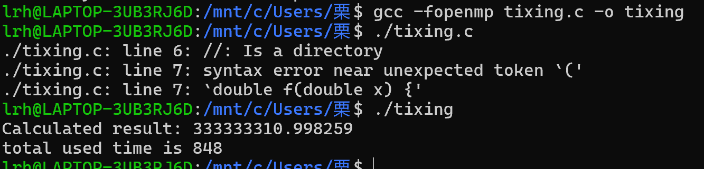
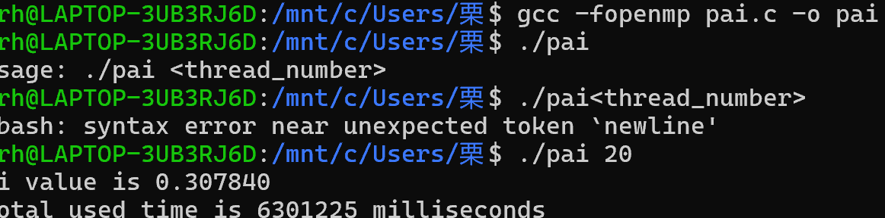

# openmp在并行构造中的运用
## 01.常用指令详解及代码展示
- 指令for表示接下来的循环将被并行执行
- /#pragma omp for
- >前提是此类区域已经被指令parallel初始化，否则以串行的方式执行。

- 利用parallel指令将N次循环置于并行区域内。
- 利用for指令将N次循环进行任务分配。
- 每个线程各自负责其中一部分循环任务，需要保证循环之间数据的独立性。
flowchart TD
主线程-->派生
派生-->for循环体
for循环体-->缩并
缩并-->主线程
> 不知道为什么不是以流程图形式展现

**注意**
- for指令后一般紧跟for循环体
- while/do while这些循环结构不能使用for循环结构并行
- 在for循环中，循环的i必须是整数每次循环i增加的值是不能够被改变的
- 循环必须采用单入口和单出口
- break/goto不能跳出循环还是在循环内部的
- 如果不特殊声明，循环内变量都是公有的，循环的计数器也是公有的，但是循环指标i默认是私有的
- 并不是所有的for都可以用for指令进行并行优化，优化前我们需要确定循环不存在数据相关性

**嵌套循环**
- 又称多重循环，是指在一个循环体内包含有另外的循环体
for{
    for{

    }
}
将编译指导语句parallel for置于循环之前，
就可以对最近的循环语句进行并行化
**数据竞争**
数据竞争是在parallel区域由两个及以上的线程对相同的共享变量同时进行写操作而引起的
**collapse**
- 嵌套循环中，collapse可以使代码在不嵌套并行的情况下对多重循环进行并行。
- 具体功能为将一个多重循环合并后，展开成为一个更大的循环，从而增加在线程组上划分调度的循环总数。
**分段并行**
主要用于非循环的代码并行。若不同子任务之间不存在相互依赖的关系，可以将他们分配给不同顶线程去执行
- 语法格式
```
#pragma omp sections [private firstprivate lastprivate reduction nowait]
{
    #pragma omp section
    结构块
    #pragma omp sectoion
    结构块 
}
```
**Single**
- 需要注意的是，在single后面会有一个隐含的栅障，因此在single
部分执行期间，其他线程处于空闲状态。
- single只能由一个线程来执行，但是并不要求主线程
- ·不执行的其余线程会在single结束后同步，如果指令存在nowait，则不执行single的其余线程可以直接越过single结构向下执行。
```
#pragma omp single [private firstprivate copyprivate nowait]
{
结构块
}
copyprivate也是常用的一个子句，将线程里的私有变量在结构结束时广播给同一线程组的其余线程。
```
## 02-私有变量的声明
**private**
子句 private
- 子句 private 可以将变量列表里的变量声明为线程组中子线程的私有变量，然后指定每个线程都有这些变量的私有副本。
- 并行区域内每个线程只能访问自己的私有副本，无法访问其他线程的私有副本。

**firstprivate**
- 在定义并行区域内的私有变量的时候，private子句会创建一个并行区域外原始变量的私有副本，并且和原始变量没有任何关联。
- 如果想让私有变量继承原始变量的值，可以通过firstprivate子句来实现。
- 值得注意的是，firstprivate 并非使用初始变量，而是生成一个跟原始变量数值一样的副本
- 在并行区域内，当完成对子线程私有变量的计算后，lastprivate可以将它的值传递给并行区域外的原始变量
## 03-规约操作
写代码时，经常会遇到需要累加求和、求差、求积等运算操作，这类操作被称为规约操作。reduction为进行规约操作的子句。reduction支持的运算如下
| 运算类别   | 运算符 | 初始值               |
|------------|--------|----------------------|
| 加         | +      | 0                    |
| 减         | -      | 0                    |
| 乘         | *      | 1                    |
| 逻辑AND    | &&     | 1                    |
| 逻辑OR     | \|\|   | 0                    |
| 最大值     | max    | 尽量小的负数         |
| 最小值     | min    | 尽量大的正数         |
| 按位AND    | &      | 所有位均为1          |
| 按位OR     | \|     | 0                    |
| 按位XOR    | ^      | 0                    |

**reduction**
reduction的运行过程
1. 并行区域开始时，将reduction子句变量列表中的变量定义为私有变量，并创建副本以及初始化。
2. 在并行过程中，各子线程通过指定的运算符进行规约计算，不断更新各子线程的私有变量副本。
3. 在并行区域结束的时候，将各子线程的私有变量通过指定的运算符进行规约计算，更新原始变量。
4. 由主线程将reduction子句变量带出并行区域
# 实例演示
## 梯形积分法的并行化
- 方法介绍：梯形法则是采用梯形来估计曲线下方面积，这等同将被积函数近似为直线函数，被积的部分近似为梯形，要求得较准确的数值，可以将要求积的区间分成多个小区间
- 计算步骤
- 1. 求出单个梯形的面积
- 2. 将所有梯形面积求和
- 可调整的参数
- 1. 分成多少个梯形
- 2. 使用多少线程
#include <stdio.h>
#include <stdlib.h>
#include <sys/time.h>
#include <omp.h>

// 定义要积分的函数
double f(double x) {
    return x * x;
}

int main() {
    //number of threads
    int thread_number = 20;
    //interval lower boundary of the function
    float min = 0;
    //interval upper boundary of the function
    float max = 1000;
    double result = 0;
    double interval = 0;
    int step = 1e5;
    int i;
    //calculate the interval of steps
    interval = (max - min) / step;
    //timer
    struct timeval start, end;
    long totaltime = 0;
    gettimeofday(&start, NULL);

    //openmp
    #pragma omp parallel for reduction(+:result) num_threads(thread_number)
    for (i = 0; i < step; i++) {
        //calculate area
        result += (f(min + i * interval) + f(min + (i + 1) * interval)) * interval / 2;
    }
    gettimeofday(&end, NULL);
    long sec_diff = end.tv_sec - start.tv_sec;
    long usec_diff = end.tv_usec - start.tv_usec;
    if (usec_diff < 0) {
        sec_diff--;
        usec_diff += 1000000;
    }
    totaltime = 1000000 * sec_diff + usec_diff;
    printf("Calculated result: %lf\n", result);
    printf("total used time is %ld\n", totaltime);
    return 0;
}
- 
## 蒙特卡洛方法进行Π值估计
- 一个正方形内部相切一个圆，圆和正方形的面积之比是π/4。在这个正方形内部，随机产生n个点（这些点服从均匀分布），计算它们与中心点的距离是否大于圆的半径，以此判断是否落在圆的内部。统计圆内的点数，与n的比值乘以4，就是π的值。理论上，n越大，计算的π值越准。
#include <stdio.h>
#include <stdlib.h>
#include <sys/time.h>
#include <omp.h>
#include <time.h>

int main(int argc, char *argv[]) {
    // 检查命令行参数个数
    if (argc < 2) {
        fprintf(stderr, "Usage: %s <thread_number>\n", argv[0]);
        return 1;
    }

    // thread number
    int tn = atoi(argv[1]);
    int i = 0;
    int count = 0;
    // pi value
    double pi = 0;
    // x - coordinates
    double x = 0;
    // y - coordinates
    double y = 0;
    int n = 1e9;
    // timer
    struct timeval start, end;
    long totaltime = 0;

    gettimeofday(&start, NULL);
    // start openmp
    #pragma omp parallel num_threads(tn)
    {
        // 为每个线程分配独立的随机数种子
        unsigned int local_seed = time(NULL) + omp_get_thread_num();
        #pragma omp for private(x, y)
        for (i = 0; i < n; i++) {
            // 更合理的浮点数运算避免精度损失
            x = (double)rand_r(&local_seed) / RAND_MAX;
            y = (double)rand_r(&local_seed) / RAND_MAX;
            if ((x * x + y * y) < 1) {
                // Points falls in the circle, counter +1
                count++;
            }
        }
    }
    gettimeofday(&end, NULL);
    // Monte Carlo Method
    pi = 4 * (count / (double)(n));
    totaltime = 1000000 * (end.tv_sec - start.tv_sec) + (end.tv_usec - start.tv_usec);
    // printf("count is %d",count);
    printf("pi value is %f\n", pi);
    printf("total used time is %ld milliseconds\n", totaltime);

    return 0;
}
- 