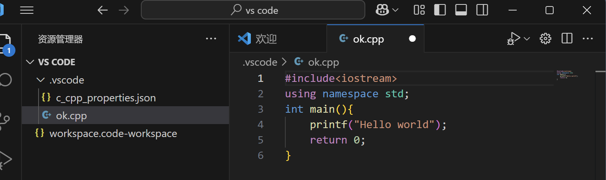

# 搜索和知识获取
## 知识的获取
### 一.搜索引擎的选取
优先使用Google搜索，其次是Bing搜索的国际版（广告会更少，搜索结果也更为准确）和国内版（仍有少量广告）
CS自学指南：https://csdiy.wiki/在其中学到更为优雅的使用Google搜索以及真正的Bing搜索
<font color="red">搜索技巧</font>
1.使用英文
2.提炼关键词：将长句拆分关键词，使用词组或者断句来进行搜索
3.替换关键词
4.高级搜索：不同搜索引擎可能语法不同，一般通用的表示
<font color="red">精准匹配</font>： 精准匹配能保证搜索关键词完全被匹配上，一般是用双引号括起来
不包含关键字： 用 - 减号连接关键字，用于排除某些干扰词
包含关键字： 用 + 加号连接关键字
搜索特定文件类型： filetype:pdf 直接搜索 pdf 文件
搜索特定网址： site:stackoverflow.com 只搜索特定网站内的页面
###  二.如何搜索
试一试：Rust 编程语言 - Rust 程序设计语言 中文版
### 三.信息平台
官方文档：如果你想要获取关于一个软件或者一门编程语言的信息，最好的地方往往是它的官方文档
试一试：LaTeX - 文档准备系统
试一试：
1.Stake Overflow
Stack Overflow(意为 “堆栈溢出”) 是一个面向计算机程序员的问答网站
2.GitHub
一般而言，进入一个项目主页后，你可以通过查看 Readme 文件来快速上手如何构建或使用一个项目，同时也许可以在该文件中找到项目对应的官方文档地址和下载地址；你也可以在右侧的 Releases 选项中找到不同版本的安装包。当然，你也可以通过访问这些项目的 Issues 页面来查看其他人提出的有关该项目的问题和解答，这对你解决使用过程中遇到的问题非常有帮助。
3.知乎，博客园，简书，Bilibili
4.Wikipedia ：Wikipedia 是一个更为全面、更为权威的网络百科全书，早已成为全球网络上最大且最受大众欢迎的参考工具书。你几乎可以在 Wikipedia 上找到关于任何事物的信息，包括历史、科学、技术、文化等等。
5.W3Schools
W3Schools 提供了许多关于开发和编程语言的教程。这些教程涵盖了 HTML、CSS、JavaScript、SQL、Python、Java、PHP、C、C++、C#、Bootstrap、React、jQuery、XML 和 EXCEL 等多个方面
### 四.提问的智慧
#### 在哪里提问
1.抱大腿
2.在前文提到的论坛或问答网站上发表帖子或提问
3.在 Github 上发 Issue
4.尝试在社群中提问
#### 如何提问？
- 展现出必要的礼貌与尊重
- 尽可能具体地描述你的问题
- 阐释你为解决该问题已经做出的尝试
- 向大模型提问
<font color="red">好用的大模型</font>
- [Github Copilot](https://copilot.github.com/)
- [OpenAI](https://www.openai.com/)
- [Azure](https://azure.microsoft.com/)
- [Deepseek](https://deepseek.com/)
#### 如何更好地与LLM交流？
- 具体性
- 明确性
- 简单化
# 计算机基本知识概览 |
## 软件与硬件
### 计算机
计算机，顾名思义，做计算的机器。
### 冯诺依曼架构
具体提出的是这样一种实现形式，由运算器、控制器、存储器、输入输出设备组成。
！[架构图](ttps://missing.lcpu.dev/assets/Von_Neumann_Architecture.CTt4f2LY.svg "markdown")
### CPU
1.CPU 是整个计算机的核心，承担着运算和控制的功能。
2.CPU 从存储设备中读取代码和数据，尽管现代处理器对代码和数据会有不同的处理，但是其本质上并没有严格的区分。代码由一条一条的指令组成，CPU 按照顺序一条一条执行从存储设备中读取的指令，指令可以是修改 CPU 的状态，进行运算，或者是从其他硬件读取信息或者输出信息。
3.市面上的处理器拥有很多种不同的 ISA,ISA 定义了程序员如何使用 CPU，如处理器有哪些指令、指令编码方式和功能、寄存器的大小数量和功能、怎么寻找和读取数据、能暂存多少数据、每个暂存的数据有多大、数据存放的顺序如何等等各种约定，并不是指令的简单集合。一般来说，为其他 ISA 编译好的程序是不能够直接在当前 ISA 上运行的，需要转译，或者重新按照当前 ISA 进行编译
<font color="red">常见的ISA</font>
- x86: 最经典最常见的 ISA，历史兼容性好
- ARM: 移动端（包括手机）常见的 ISA，不管是苹果还是遥遥领先，处理器都使用该 ISA。苹果 M 系列处理器也使用该 ISA
- RiscV: 新兴的开源 ISA，嵌入式设备中有使用，由于其设计比较简单，易于阅读和学习，学校也喜欢用于教学
#### 现代的 ISA 一般都设计保护功能。
保护功能提供不同的模式
1.在特权模式下，代码有对处理器和硬件的（几乎）完全的控制权
2.在非特权模式（用户模式）下，代码只能控制有限的资源，进行“安全”的操作，而其他操作需要通过切换到特权模式完成。
3.同时，ISA 提供了<font color="red">虚拟内存</font>的功能，也就是将物理内存地址（也就是下文将提到的“存储空间的编号”）映射到虚拟地址，并设置访问权限。此时用户模式的程序员看到的是一片连续的地址空间，这样可以简化程序设计，同时提供安全隔离。
### 内存
这里说的内存是 RAM(Random Access Memory)，断电丢失数据的随机存储器。
<font color="red">注意</font>:在不同语境下，内存也可以指下文中的“硬盘”，请注意区分。
内存是处理器 CPU 能够直接访问到的数据存储器。
面向使用的程序员，内存被简化抽象为一个个存储单元，每个存储单元大小一个字节，或者说 8 比特，也就是 8 个数字 0 或者 1,每个存储单元，每个存储单元都有唯一编号.
CPU通过编号，从内存拿出对应存储单元中的数据或者向存储单元写入数据。而随机存储器中“随机”的意思是不论拿什么编号来找数据，所需时间总是差不太多的。与之相对的是顺序存储器。
内存访问速度比其他外部存储要快，但是随着处理器的发展，内存速度的提升却跟不上处理器速度提升的步伐。今日从内存中找一个数据所需的典型时间内处理器大约能执行上百条指令，因此在离得更近的处理器内部引入了高速缓存。
### 硬盘
这里的硬盘指的是断电数据不丢失的可以反复改写的存储设备（有时候被称作为“内存”或者“外存”。
硬盘分为两种
<font color="red">1.机械硬盘HDD</font>
机械硬盘内部结构图


HDD中有一组极为平滑如镜子一样的硬质盘片，表面有磁性物质，旁边有若干磁头，背面则有电路和芯片进行控制。机械硬盘工作时，盘片高速运转，电路控制磁头由于旋转带动的气流从而悬浮在盘片表面(仅有几十纳米甚至更小!)通过磁场读写其中的内容。
<font color="red">2.固态硬盘 SSD</font>
SSD中是闪存芯片和控制电路，在闪存芯片内部有大量的单元通过捕获电荷来存储信息。
固态硬盘内部结构图

<font color="yellow">缺点</font>
1.固态硬盘具有明确的寿命特点，写入次数有限。
2.由于电荷会流失，长时间不通电时不能保证数据稳定
3.为了最大化固态硬盘寿命，其一般有较为复杂的控制电路，保证写入均匀地发生在固态硬盘的不同部位，也因此在异常断电等情况下也更容易发生损坏。
> 注意
> 由于固态硬盘为了平衡擦写的特点，其引入了 FTL 映射表，用于将用户存储的位置(逻辑地址)和实际物理上闪存内部位置(物理地址)之间建立映射，于此同时数据被交叉分布在各个颗粒之间，在读取的时候可以并行从而极大地提高了传输速度，通道数量越多，传输速度越快，于此同时管理更复杂，可靠性更低。换言之，固态硬盘内数据都是以碎片形式存在的。
### 其他存储设备
- U 盘: 较为简化的一种固态硬盘，通过 USB 接口与主机连接，性能较弱，主控结构比较简单，所以可靠性不佳，用于临时的数据搬运
- 存储卡: 也是一种固态硬盘，接口为移动插拔做了优化
- 光盘: 在闪存时代前常见的存储设备用于交换数据(如 Windows 安装光碟)，一般只能写入一次，存储容量在几百 M 到几十 G 不等。内部有一层薄介质，通过激光在上面进行刻蚀或由母盘压制而得，并通过反射读取信息
- 软盘：一个薄磁性塑料软片，故名软盘，存储容量在几百 KB 至几 MB 左右
- 磁带：一圈一圈卷起来的塑料磁性软带，因此读取写入只能顺序进行，意味着找数据的时候需要倒带到指定位置，时间和倒带的距离成正比。曾经用于存储音频，后被用于长时间归档巨量数据，需要特定的仪器和环境，维护成本高。
### 常见存储设备对比
|种类| 单盘最大容量 | 密度 | 容量/价格 | 单盘宽带 | 延迟 | 可靠性 | 维护成本 |
|---|:---:|---|---|---|---|---|---|
|HDD|24TB|中|8GB/RMB|300MB/s|10ms|高|低|
|SSD|60TB|极高|2GB/RMB|6000MB/s|50us|中|低|
|Blu-ray|100GB|低|5.5GB/RMB|35MB/s|100ms|很高|中|
|Tape|18TB|极高|45GB/RMB|750MB/s|loooong|很高|极高|
### 存储层次结构
存储器有很多种类，速度、容量单价、稳定性都各有不同。
- CPU寄存器
- 高速缓存
- 主存储器
- 辅助存储器
### GPU
GPU也叫做显卡，有独立显卡和集成显卡两种
**GPU的功能**
- 图形处理加速
- 视频输出
- 大规模并行计算
**GPU和CPU的特色**
- CPU 擅长控制和逻辑，单核处理能力强得多，适合各种通用的场合;
- GPU 仅适用于并行且逻辑简单的计算，以其独特的架构取胜
> 显卡与 GPU
> 严格来说，GPU 是显卡上面主要的计算芯片，也可集成在 CPU 中，但是人们经常混用两个概念，我们在此也不严加区分。
### 主板
将各种硬件连接在一起，形成一个电路系统，为主芯片的工作提供各类条件支持提供固件进行硬件自我检查和系统初始化，保存各个硬件的配置等。
### 电源
为各类电子元件提供电力。
- CPU和GPU核心的工作电压通常很低，只有 1V 左右
- 其他辅助芯片的电压通常也只需要 5 V 以内的直流供电
### 外设
外设种类众多，提供计算机对外的数据接口
- 人机交互的接口：鼠标、键盘、显示器和声卡
- 各类外部设备与计算机进行交互： USB 接口
**PCIe**
- 作用：用于 CPU 系统与其他设备比如 GPU、网卡、固态硬盘的连接，也可以延伸到芯片组间的连接
- 特点：标准化
- 组成： 由电源，一些辅助信号和若干条 Lane 组成
### 软件
根据其功能不同也可以分为很多种
- 直接跟硬件打交道的
包含操作系统和硬件驱动程序
- 直接跟用户打交道
各类应用程序
### 保护和抽象
#### 一·保护
##### 1. 保护功能的核心目标
- **资源访问限制**：通过硬件机制限制程序对内存、设备等资源的访问权限
- **执行控制**：控制代码是否可修改、是否可作为指令执行（冯诺依曼架构下代码与数据无严格区分）
- **特权指令保护**：限制对特权指令（如I/O操作、权限修改、模式切换等）的使用

##### 2. 操作模式分类
| 模式类型 | 别名 | 权限级别 | 典型用途 |
|----------|------|----------|----------|
| **内核模式** | 超级用户/特权模式/系统态/核心态/管态 | 高 | 操作系统内核运行 |
| **用户模式** | 目态 | 低 | 应用程序运行 |

##### 不同ISA的实现差异：
- **x86**：提供4个特权级（r0-r3），但主流OS通常只使用r0（内核）和r3（用户）
- **RISC-V**：提供3个模式（机器模式 > 系统模式 > 用户模式）

##### 3. 保护机制的价值
- **安全性**：
  - 防止有缺陷程序破坏系统
  - 防御恶意程序攻击
- **抽象化**：
  - **虚拟内存**：为应用提供连续地址空间，隐藏物理内存细节
  - **统一接口**：文件系统抽象不同存储设备（硬盘/磁带等）的差异

##### 4. 特权操作实现方式
用户模式程序必须通过：
1. 预定义的系统调用接口
2. 内核模式程序授权
才能执行需要特权的操作
#### 二.抽象
- 操作系统借助硬件提供的虚拟内存技术，让应用程序拥有完整的虚拟地址空间，应用程序不再需要关心自己被加载到内存的哪个部分，只需要让操作系统完成地址映射和转换即可；
- 又比如操作提供统一的文件访问接口，让应用程序不论是读写硬盘，读写软盘还是读写磁带都只需要使用统一的文件读写接口即可完成。
#### 三.进程
一个进程(Process)包含了一个程序运行的全部状态和属性。
#### 四.线程
线程(Thread)是轻量级的进程，一个进程可建立多个线程子程序任务同时执行。
#### 五.例外
可以发生在硬件层面，也可以发生在软件层面。
硬件层面的异常通常包含有：
1.来自硬件的中断(Interrupt)
2.陷阱(Trap)，包括调试陷阱，以及来自软件主动请求的系统调用(以前也称软件中断)。
3.故障
4.终止
### 操作系统概述 
#### **1. 操作系统的核心功能**  
- **资源管理**：统一管理处理器、内存、网络、外设（如打印机）等硬件资源  
- **抽象接口**：提供标准化的系统调用（如文件操作、进程管理），屏蔽底层硬件差异  
- **安全隔离**：防止有缺陷或恶意程序破坏其他程序或系统  
- **高效运行**：优化资源分配，确保应用程序正确、安全、高效执行  

#### **2. 操作系统的运行模式**  
| **运行模式** | **运行内容** | **权限** | **作用** |  
|-------------|-------------|---------|---------|  
| **内核模式** | 操作系统核心（如进程调度、内存管理）、关键硬件驱动 | 最高（特权级） | 直接控制硬件，提供基础服务 |  
| **用户模式** | 系统库（如C标准库）、管理程序（如Shell）、部分驱动程序 | 受限 | 提供高级抽象，与内核交互 |  

> **注**：现代操作系统并非完全运行在内核态，许多功能（如GUI、网络协议栈）可能部分或全部运行在用户态以提高安全性和稳定性。  

#### **3. 操作系统的分层架构**  
```
上层应用程序  
↓（依赖系统调用、库函数）  
用户态程序（如Shell、系统库）  
↓（通过系统调用进入内核）  
内核态（进程管理、内存管理、设备驱动等）  
↓（直接操作硬件）  
物理硬件（CPU、内存、磁盘、网络等）  
```  

#### **4. 操作系统的主要角色**  
- **资源管理者**：分配CPU时间、内存、I/O设备等  
- **服务提供者**：提供文件系统、网络通信、进程间通信等  
- **安全仲裁者**：通过权限控制（如用户/内核模式）保护系统完整性  
### Windows
Windows 是微软公司开发的图形化操作系统，具有成熟的图形界面。
### Linux
目前说 Linux 操作系统，一般指的是基于 Linux 内核衍生的各大发行版
### 其他操作系统
- macOS
- FreeBSD
- MSDOS
### 移动操作系统
- Android
- iOS
### 应用程序
#### 桌面程序与命令行程序
- 桌面程序：有漂亮的图形界面进行人机交互
- 命令行程序：只处理字符流的输入输出
#### 库
很多代码是被大量重复使用的，这些代码被做成了库
- 可以是以源代码形式或者封装好的机器码的形式存在
- 库可以是在程序编译时一同编译并连接，也可以是提前编译好，并在程序编译后以静态或者动态的方式与程序链接在一起。
### 程序的执行
#### 机器码与汇编
1. 机器码
特点：处理器直接执行的二进制指令
缺点：难以编写和维护，已无直接使用的意义
2. 汇编语言
作用：比机器码更高一级的抽象，与机器码基本一一对应
组成：
助记符（如 mov、add）代替二进制操作码
操作数（如 mov dest, src）指定指令参数
转换工具：
汇编器（Assembler）：将汇编代码 → 机器码
反汇编器（Disassembler）：将机器码 → 汇编代码
#### 编译
##### **1. 高级语言的作用**  
- 比汇编语言更易读写，减少开发复杂度  
- 极少需要手写汇编（仅用于特殊优化或硬件操作）  
- **仍需能阅读汇编**：用于调试、性能分析  

##### **2. 高级语言的执行方式**  
| **方式**       | **流程**                                                                 | **特点**                     |  
|----------------|-------------------------------------------------------------------------|----------------------------| 
| **编译执行**   | 高级语言 →（编译器）→ 汇编语言 →（汇编器）→ 机器码 → 直接执行               | 运行快，但需提前编译（如C、Rust） |  
| **解释执行**   | 解释器逐行读取高级语言代码，动态维护状态并执行操作（如Python、JavaScript） | 灵活但速度较慢，依赖解释器环境   |  
**核心区别**：  
- **编译**：提前转换，直接运行机器码  
- **解释**：边解析边执行，依赖解释器
#### 链接
1.链接的核心作用
解析外部引用：处理对库函数(如printf)的调用
地址重定位：确定程序各段在内存中的最终位置
符号解析：将符号引用替换为实际地址
2. 为什么需要链接
程序几乎总是依赖外部库(如C标准库)
编译时无法确定最终内存布局
需要合并多个目标文件
#### 可执行文件
- 可执行文件具有其特定的储存编码方式，记录了程序启动的方式和环境需求。
- 当执行可执行文件时，操作环境会请求 OS 读取该文件并加载准备所需的环境。
 #### 动态链接
##### 1. 基本概念
- **目的**：节省存储空间和内存
- **实现形式**：
  - Windows：`.dll` (Dynamic Link Library)
  - Linux：`.so` (Shared Object) 
  - macOS：`.dylib` (Dynamic Library)

##### 2. 链接方式
| 链接类型 | 触发时机 | 实现机制 | 特点 |
|---------|----------|----------|------|
| **加载时动态链接** | 程序启动时 | 由操作系统加载器完成 | 自动加载所有依赖库 |
| **运行时动态链接** | 程序运行期间 | 通过`dlopen()`等API动态加载 | 按需加载，灵活性强 |

##### 3. 核心优势
- 🚀 **资源高效利用**
  - 多个程序共享同一库副本
  - 减少内存和磁盘占用
- 🔧 **系统灵活性**
  - 支持热更新（替换库文件无需重编译）
  - 实现插件架构（如浏览器扩展）
- 🛠 **维护便利性**
  - 库更新只需替换单个文件
  - 兼容性管理更方便

##### 4. 典型应用场景
1. 系统基础库（如C标准库）
2. 软件插件系统
3. 多语言扩展支持
4. 驱动程序加载
#### 程序的加载与结束
- 加载：加载程序到内存，可能还需要进行动态链接
- 结束：程序因为非法操作被系统夺回控制权并强行结束，或者程序通过系统提供的接口主动退出为止。
### 开机
电源接通 → 待机电路激活
按下电源键 → 主电源启动 → PWRGD 信号
CPU 复位解除 → 执行 BIOS 第一条指令
BIOS POST（内存、显卡、存储检测）
Bootloader 加载（Legacy/UEFI）
操作系统内核启动 → 完整系统加载
### 软件的许可
#### 软件的授权
- 保留所有权利，限制源代码的取得和分发
- 附条件开放源代码的取得和分发
- - 一般都需要保留原作者的署名和版权声明
- - 对于以 GPL 等 Copyleft 性质的许可证授权的软件，你的代码也需要以同样或者符合原来许可证规定的许可证开源。这种特性也被称为传染性
## 计算机网络
### OS/I 七层模型
--------------
|   应用层    |     7
--------------
|   表示层    |     6
--------------
|   会话层    |     5
--------------
|   传输层    |     4
--------------
|   网络层    |     3
--------------
|  数据链路层  |     2
--------------
|   物理层    |     1
--------------
### TCP/IP协议
#### IP
- 第三层
- 功能：为世界上每一个能连入全球互联网的设备分配一个地址，同时提供不可靠的包交换服务。
- - >数据包指的是一段长度有限（但不总是固定）的数据，不可靠的包交换意思是把数据包从出发地传送到目的地，但是不保证包按照顺序到达，不保证有且仅有一个包到达，不保证包内容正确。
- 版本：IPv4，IPv6
#### TCP
- 第四层
- 功能：利用 IP 协议提供的不可靠数据传输，为上层提供流式的端到端可靠数据传输。
- 状态：必须先双方三次交互建立连接，每个数据报文对方都要确认，报文都带有编号和校验码，确保报文正确按顺序到达。
- 缺点：不能保证服务质量
### DNS协议
#### 基本概念
- **作用**：将人类可读的域名（如 `pku.edu.cn`）转换为机器可识别的 IP 地址。
- **必要性**：IP 地址（如 `162.105.129.12`）抽象难记，域名提供友好访问方式。

#### 解析流程（递归查询示例）
1. **根域查询**  
   - 客户端向预设的 **DNS 服务器** 查询 `pku.edu.cn`。
   - DNS 服务器从右向左解析，先查询顶级域 **`.cn`** 的权威服务器地址。

2. **顶级域查询**  
   - 向 `.cn` 服务器查询 **`.edu.cn`** 的权威服务器地址。

3. **二级域查询**  
   - 向 `.edu.cn` 服务器查询 **`pku.edu.cn`** 的权威服务器或直接返回其 IP 地址。

4. **结果返回**  
   - 最终获得 `pku.edu.cn` 的 IP 地址，返回给客户端。

#### 查询方式差异
- **迭代查询**：  
  DNS 服务器仅返回下一级域名服务器地址（如 `.cn` → `.edu.cn`），由客户端继续查询。
- **递归查询**：  
  DNS 服务器代替客户端完成全部查询，直接返回最终 IP 地址。

#### 实际应用
- **缓存机制**：DNS 服务器会缓存常见域名结果，加速后续查询。
- **负载均衡**：同一域名可能返回多个 IP（如 CDN 节点），实现流量分发。
# 计算机基本知识概览 ||
##　衡量计算机的指标
### 能耗与功耗
| **概念**       | **定义**                                                                 | **应用场景**                                                                                     | **设计约束**                                                                                     | **优化目标**                                                                                     |
|----------------|--------------------------------------------------------------------------|------------------------------------------------------------------------------------------------|------------------------------------------------------------------------------------------------|------------------------------------------------------------------------------------------------|
| **功耗（Power）** | 单位时间内消耗的电能（单位：瓦特 W）<br>公式：`P = V × I`（电压 × 电流）               | - **移动设备**：手机/笔记本需控制发热和续航<br>- **数据中心**：散热和供电能力限制               | - 温度墙（Thermal Throttling）<br>- 电源/主板供电上限（如服务器单CPU TDP ≤ 350W）              | 在散热和供电限制内，尽可能提高性能                                                             |
| **能耗（Energy Efficiency）** | 单位电能完成的工作量（单位：性能/焦耳）<br>例如：`每瓦特算力（FLOPS/W）` | - **移动设备**：延长电池续航<br>- **数据中心**：降低运营成本（电费占TCO 40%+）                  | - 电池容量（如手机 4000mAh）<br>- PUE（数据中心能效比）                                        | 相同电能下完成更多任务，或相同任务消耗更少电能                                                 |
| **边际效益**     | 性能提升与功耗增长呈非线性关系（如超频时功耗激增，性能提升有限）                       | - **超频**：额外 10% 性能可能需要 30% 功耗<br>- **节能模式**：降低 20% 性能可节省 50% 能耗      | - 芯片制程物理极限（如 5nm 以下漏电问题）<br>- 散热技术上限（风冷/液冷/相变）                  | 寻找性能与功耗的最佳平衡点（如笔记本的“平衡模式”）                                             |
| **类比**        | **“印钞机”模型**                                                         | - **功耗** = 印钞速度（张/小时）<br>- **能耗** = 每度电印钞量（张/kWh）                        | - 印钞机过热会损坏（温度墙）<br>- 电网供电有限（电源功率限制）                                   | 在机器不损坏、供电稳定的前提下，最大化总印钞量（性能）或单位成本印钞量（能效）                 |

#### 关键区别说明
- **功耗是瞬时指标**：类似汽车油门，踩得越猛（功耗越高），速度越快（性能越高），但油箱（电池）耗尽更快。  
- **能耗是长期价值**：类似“每升油行驶里程”，高效引擎（高能效芯片）能用更少的电做更多事。  
###　性能
#### 1. 性能基础理论
##### 性能计算公式
总执行时间 = 程序指令数 × 单指令耗时
单指令耗时 = 1 / (频率 × IPC)

- **频率**：处理器时钟速度（GHz）
- **IPC**：每时钟周期指令数（Instructions Per Cycle）
##### 关键变量说明
| 变量 | 影响因素 | 典型差异 |
|------|----------|----------|
| 指令数 | 处理器架构 | x86 vs ARM指令集差异 |
| 频率 | 制程工艺/设计 | 游戏CPU(5GHz+) vs 服务器CPU(3GHz) |
| IPC | 微架构设计 | 苹果M1(高IPC) vs 传统x86 |

#### 2. 性能评估方法
##### 基准测试(Benchmark)体系
- **常用测试套件**
  - SPEC CPU（通用计算）
  - 3DMark（图形性能）
  - Geekbench（跨平台）

- **测试有效性分析**
  ```mermaid
  graph LR
    A[基准测试] --> B(优点：量化比较)
    A --> C(局限：可能被针对性优化)
    A --> D(不代表所有应用场景)
#### 3. 专用处理器对比
| 指标         | GPU优势领域               | CPU优势领域         |
|--------------|--------------------------|--------------------|
| 算力         | 深度学习(100TOPS+)       | 单线程任务         |
| 成本         | 并行计算性价比高         | 通用计算           |
| 适用性       | 图形/矩阵运算            | 复杂逻辑处理       |
### 成本
####  成本的核心维度
| 成本类型       | 定义                                                                 | 典型案例                                                                 |
|----------------|----------------------------------------------------------------------|--------------------------------------------------------------------------|
| **制造成本**   | 设备生产与配套的初始投资（硬件生产、软件/生态研发）                   | - 消费级PC售价与BOM成本差（约15-30%）<br>- 企业级设备服务溢价（50%+）    |
| **运作成本**   | 设备全生命周期使用开销（能源/维护/空间等）                            | 数据中心成本构成：<br>- 电费40%<br>- 冷却25%<br>- 网络15%<br>- 硬件20%  |
- 成本是一个整体性的概念，是面向最终需求的解决方案不多不少，而不应当仅仅关注其内某个单一组件
### 生态
#### 1. 优化必要性
- **硬件发展放缓**：处理器主频提升受限，转向并行计算发展
- **程序员责任加重**：需主动优化弥补硬件进步减速

#### 2. 主要优化手段
| 优化方式       | 加速原理                     | 典型加速比 | 开发成本 |
|----------------|----------------------------|------------|----------|
| **编译器优化** | 自动代码重构                | 2-5倍      | 低       |
| **SIMD指令**   | 单指令处理多数据（向量化）   | 4-8倍      | 中       |
| **多核并行**   | 任务/线程级并行             | 核数线性倍 | 中       |
| **GPU加速**    | 大规模数据并行              | 10-100倍   | 高       |

#### 3. 技术生态影响
- **架构选择因素**：
  - 易用性（API设计）
  - 设备普及度
  - 厂商支持力度
  - 社区/商业库丰富度

- **生态垄断现象**：
  - CUDA因生态优势形成事实垄断
  - 其他架构（如ROCm）面临推广阻力
## 计算机的过去，现在和未来
- 摩尔定律与后摩尔时代
- Dennard Scaling Law
- Amdahl's Law
## 计算机层次化
- 简单性
- 模块化
- 标准化
- - 在芯片制造领域，通常具有两大模式，一种称为 IDM，另一种为Fabless
- - 而在芯片设计领域，有一些公司提供设计芯片所需要的工业软件(称为 EDA)，而有另一些公司则以兜售被称为 IP 的模块谋生
- - 在软件领域，将众多子程序集合(也称为库)单独分离出来成为一个个单独的文件，一些在程序编译链接时被其他开发者集合在一起，称为静态链接库；而另一些则是在运行时动态的被其他程序使用，则称为动态链接库。
# 用好你的电脑 I：环境配置，常用软件选择、安装与卸载
## 1.基本环境配置
### 1.0程序编写的过程


### 1.1C++环境配置——与课程评测系统保持一致
#### 1.1.1一些前置问题
| 名称           | 类型                | 特点                                                                 | 适用场景                          |
|----------------|---------------------|----------------------------------------------------------------------|-----------------------------------|
| **GCC**        | 编译器集合          | - Linux 默认编译器<br>- 开源项目首选<br>- 支持多语言(C/C++/Fortran等) | Linux 开发/开源项目               |
| **MinGW**      | Windows GCC 移植版  | - 提供 Windows 下的 GCC 环境<br>- 轻量级                             | Windows 平台 C/C++ 开发           |
| **Clang/LLVM** | 编译器框架          | - 模块化设计<br>- 更快编译速度<br>- macOS 默认编译器                 | 跨平台开发/macOS 开发             |
| **MSVC**       | 微软编译器          | - Windows 深度集成<br>- Visual Studio 专属                           | Windows 平台商业开发              |
| **Visual Studio** | IDE             | - 功能全面<br>- 调试强大<br>- 体积较大                              | 企业级 Windows 开发               |
| **Xcode**      | IDE                 | - macOS 专属<br>- 苹果生态集成                                       | macOS/iOS 开发                    |
| **Dev-C++**    | IDE                 | - 老旧但轻量<br>- 内置 MinGW                                        | 教学/简单项目                     |
| **VS Code**    | 代码编辑器          | - 轻量可扩展<br>- 丰富插件生态<br>- 需自行配置环境                   | 全平台通用开发/学习               |
#### 1.1.2Windows 环境配置——以 Windows10、11 为例
##### 环境变量·path
- 环境变量
- - 环境变量是包含关于系统及当前登录用户的环境信息的字符串
- path
- - path 是操作系统中的一个环境变量，用于指定可执行程序的搜索路径。
##### 如何下载安装VS Code
##### 如何获取合适版本的 MinGW，并添加到环境变量？
1. 前往谷雨同学的预编译 MinGW 下载（提取码 cgzy），下载gytx_x86_64-14.1.0-win32-seh-ucrt.7z文件。
2. 点击任务栏的 Windows 徽标，搜索“环境变量”，找到“编辑系统环境变量”，点击进入，找到界面右下角的“环境变量(N)..."按钮，进入后，在系统变量栏找到 Path，双击后，点击"新建(N)"，键入引号里面的内容： "C:\mingw64_14.1.0\bin" , 然后依次对三个窗口点击确定。

##### 如何在 VS Code 中安装合适的插件？
推荐如下插件：C/C++，C/C++ Extension Pack，C/C++ Themes，Python，Python Debugger，Pylance。

##### VS Code 的工作逻辑
- vscode 分为全局和工作区两部分组成
- 如果工作区只有一个文件夹，配置会被放在该文件夹下 .vscode 文件夹中。如果有多文件夹，工作区配置会用一个 code-workspace 结尾的文件保存。


##### VSCode如何打开文件夹、将工作设置保存到工作区便于取用？
1. 点击左侧边栏第一个按钮，点击打开文件夹，浏览到所需位置并打开

2. 点击界面上方的 “文件” 按钮，找到 “另存为工作区”，选择一个位置来保存工作区设置。

3. 点击界面上方的 “文件” 按钮，点击 “从文件打开工作区”，浏览到刚才保存的文件，打开它。

4.如果想在这个工作区添加不同文件夹，如 "C++" "Python" 来便于管理作业，请点击界面上方的 “文件” 按钮，点击 “将文件夹添加到工作区”。

5.以后每次打开 VS Code 后，请从刚才保存的文件打开工作区。这个文件会保存各类设置，包括下文提到的内容。
##### VS Code 中的 C/C++ Configuration UI 配置指南：设定编译器路径、默认语法检查 C++ 标准
设定好前文所述的环境后，我们还需要调整 C/C++插件的编译器路径和语法检查标准，与我们使用的 gcc 相匹配。这样，不会出现引用头文件却报错的情况。
1.请在 VS Code 界面最上方搜索栏键入 ">C/C++"，找到 "C/C++编辑配置(UI)"。
2.找到想要用来写C++程序的文件夹，点击它。
3.找到编译器路径，点击下拉按钮，应该会自动检测到如下路径："C:/mingw64_14.1.0/bin/g++.exe"，选择它。否则，请你复制此路径，粘贴到框内

> 之前配过环境 路径不一样
> 
4.下拉，找到 C 标准和 C++ 标准，选择你的课程使用的在线测评网站使用的标准。例如，两者分别选择 c17 和 c++17。

5.在刚才所选的文件夹内创建".cpp"后缀的文件，编写你的 C++程序。你会发现语法检查、include 路径检查都使用了相应环境。

##### 编译运行你的 C++程序——使用终端 PowerShell
在 VS Code 编写完程序后，我们可以按如下步骤运行程序。
1.使用组合键 Ctrl+` 打开终端（有些时候是 Ctrl+Shift+`）。这里使用 PowerShell。
2.cd 到程序所在子目录（请自行查找 cd 命令用法）

3.使用 g++ 命令编译程序。如：g++ .\test.cpp（寻找文件时可以用 Tab 快捷键）。
4.上述命令默认生成 "a.exe"。请输入命令 .\a.exe 执行生成的 exe 文件

### 1.2Python环境配置
#### 1.2.1Conda是什么
- conda可以快速安装、运行和更新软件包及其依赖项。
- 使用 Conda 配置 Python 环境，有一个巨大的好处：它可以同时存储各个不同版本的 Python，每个版本具有独立的包和库；使用时，可以用命令很方便地切换要使用的版本
- 我们对于所有系统，都推荐 Miniforge，这是一个精简版的 Conda，不含 Anaconda 的一些不必要的包，体积更小，更适合个人使用，而且其中的 mamba 命令速度极快。
**具体安装方式如下：**
- 先访问 miniforge 网页，下载所需的安装包。这里以 Windows 为例，下载Miniforge3-Windows-x86_64.exe。

#### Conda 的基本使用
使用前先换源，保证网络连接性。在 ~/.condarc 文件中添加如下内容即可。这里的 ~ 表示用户目录，Windows 上是 C:\Users\用户名。注意，Windows 先执行 conda config --set show_channel_urls yes 生成 .condarc 文件，然后再修改会比较方便。
**常用命令**
- mamba env list：查看已安装环境。刚安装好 Conda 时，会显示base这个环境。
- mamba list：查看当前环境下安装的所有包的名称。
- mamba -V：查看 Conda 的版本号。
- mamba create：创建环境。参数 -n 指定环境名称，参数 python= 指定 python 版本。此处推荐安装好环境后再安装它的包，不要在这里指定。例如：mamba create -n AIHomework python=3.10.11，创建了一个名为 AIHomework 的环境，它的 python 版本是 3.10.11。
- mamba activate：激活环境。


### 虚拟环境内包的安装
**常用命令**
- pip show：查看包的具体信息。
- pip list：查看已经安装的包。
- pip install：安装指定的包。后面要接包名。
- pip freeze > requirements.txt：把包列表输出到文本文件。
- pip install -r requirements.txt：根据文本文件批量安装包。
- pip uninstall：卸载包。
- pip install --upgrade 包名称==版本号：更新包。
- python -m pip install --upgrade pip：更新 pip。
### 1.3终端环境配置
终端，就是一种提供各类 Shell 访问的应用程序
#### 1.3.1 Windows 终端配置
##### 更改脚本执行策略
一.更改脚本执行策略
在 VS Code 中打开终端，或者按 Win+R 输入 powershell 回车。打开终端后，输入如下命令：
Set-ExecutionPolicy PolicyYouWant


##### 更改终端配置文件和美化终端
我们可以在 powershell 中输入 start $PROFILE 来打开配置文件进行编辑。
#### 1.3.3常用快捷键和一些指令
- Ctrl+Shift+C/V：终端中的复制和粘贴。注意，它与常用的复制粘贴快捷键不同。在 Windows 中，你也可以直接选中文本，然后右键复制。
- Ctrl+C：请求终止程序并释放内存。程序也可以选择做一些清理之后退出或者不响应此操作。
- Ctrl+Z：请求暂停程序，不释放内存，后续可以恢复执行。程序同样可以做清理或者不响应此操作
- Ctrl+A：全选代码，方便快速复制提交
- 按住滚轮，上下滑动：扩展光标所在行数，可以批量在很多行代码前面加 Tab 或者删空格，便于控制缩进。
- ./a.out < in > out：在 Linux 和 macOS 中，此指令可以从 in 读取输入，传递给程序 a.out 作为输入，然后把输出传到文件 out 中。
- get-content in | .\a.exe > out 这个命令功能与上述命令相同，但它在 Windows PowerShell 中使用。因为 PowerShell 中 '<' 字符是保留字，所以必须使用这种写法
- cd：更改终端所在目录。使用时，输入 cd 后按 Tab 键，可以快捷遍历当前目录下的子目录。或者，也可以直接输入全路径。
## 2.文件和文本
### 2.1文件的本质
- 文件为一堆二进制数据的集合——它是计算机存储系统中的基本单位，用于存储数据和信息。
- 无论文件的类型或内容是什么，计算机存储和处理的所有数据最终都表示为二进制形式
### 2.2文件的后缀
- 文件的后缀是文件命名的一部分
- 在各个操作系统中一般用.来区分
- 文件名从左到右的第一个.右边就是文件后缀。
- 文件后缀与文件的具体内容无关，改变它并不会改变文件的内容
- 后缀可以告诉计算机用哪一类应用程序来读取文件


| 文本和文档                     | 源代码                                   | 视频文件                     | 图片                          | 压缩文件                                                                 | 可执行文件                     | 脚本文件               |
|--------------------------------|------------------------------------------|------------------------------|-------------------------------|--------------------------------------------------------------------------|--------------------------------|------------------------|
| .txt, .doc, .docx, .xls, .xlsx, .ppt, .pptx | C++: .cpp, .cc, .cxx, .hpp, .hxx<br>C: .h, .c<br>Python: .py | .mp4, .avi, .mkv, .ts, .m3u8 | .jpg/.jpeg, .png, .gif, .bmp, .webp, .svg | .zip, .rar, .7z<br>Linux: .tar.gz, .tar.xz<br>macOS: .dmg<br>光盘: .iso | Windows: .exe<br>Linux/Unix: 无<br>macOS: .app<br>Java: .jar | Windows: .bat, .cmd, .ps1<br>Linux/Unix: .sh |
### 2.3文件系统
**文件系统的概念**
- 目录（文件夹）：是包含文件和子目录的特殊文件，用于组织和管理文件。
- 文件路径：
- - 绝对路径：从根目录开始的完整路径
- - 相对路径：相对于当前工作目录的路径
- 元数据：文件系统存储文件和目录的元数据，包括文件名、大小、创建时间、修改时间、权限等。
**文件系统的部分功能**
- 管理文件权限：
- - 文件系统管理文件和目录的访问权限，通常包括读取、写入和执行权限。
- - 在类 Unix 系统中，文件权限由所有者、所属组和其他用户的权限组成。
- 文件操作：
- - 文件系统提供基本的文件操作，如创建、删除、读取、写入、重命名、复制等。
- 挂载和卸载
- - 文件系统可以挂载到操作系统的目录树中，使其内容可访问。卸载文件系统会断开这种连接
**常见的文件系统**
FAT32 NTFS ext4 APFS
### 2.4文本
- 纯文本
- - 用.txt后缀来区分
- - 打开它时会调用系统自带的纯文本编辑器
#### 文本的编码
编码，就是将字符转换为二进制数据的规则
常见编码之间的关系


#### 文本的字体 
- 常见字体：微软雅黑，宋体，黑体，Consolas
- 更改字体的方法：依次选中文件->首选项->设置，搜索字体，在 Font Size 和 Font Family 中更改字体大小和字体系列。逗号分隔字体，系统会依次搜索可以使用于当前文本的字体。
#### 各类文本和文档
- Word文本，Excle表格，PowerPoint幻灯片，PDF，Markdown，LaTeX
### 2.5 创建文件
创建一份文件，可以在右键菜单中选择创建文本文档，然后根据需要修改名称和后缀。
## 3.软件的安装和卸载
### 3.1软件的安装
- **定位官网**
一般来说，搜索引擎以蓝色小块标注官网的，就是官网。
- **下载软件**
进入官网后，一般来说软件下载按钮会出现在主页
- GitHub 上软件的下载
- 1. 首先，我们需要进入一个项目的 Releases 界面
- 2. 然后找到它的 Assets 部分
- **安装软件**
打开安装包后，就可以开始安装了
### 3.2卸载软件
**卸载软件**
#### Windows

点击后，搜索你要卸载的软件，然后点击卸载

### 3.3 规避流氓、病毒软件
注意：
- 不要去任何软件园下载软件
- 不要去下载未经确认安全的盗版资源。
- 安装的时候，安装程序的每一个界面都要留意
- 可以多去 GitHub 下载开源软件。
### 3.4获取正版软件
- Adobe：现在，请前往 Adobe Creative Cloud Download 直接下载 Creative Cloud，下载时输入学号邮箱（xxx@stu.pku.edu.cn），会自动跳转到门户登录，登录后就会获得授权。
- VMWare：现在已经免费。请直接去官网下载。
- Office：可按照网站要求，申请学生订阅。或者直接下载软件包，用校园网环境激活。
- MATLAB：可直接下载离线包，用学校邮箱登录来安装
## 4.常用软件推荐
### 4.1压缩软件推荐
- 7-zip 或者其变种 7-zip-zstd
- 老版 Bandizip
- WinRAR
### 4.2播放器推荐
- vlc
- Potplayer
- mpv
### 4.3下载器推荐
- Internet Download Manager
### 4.4杀毒软件推荐
- 火绒
- Windows Defender
### 4.5文本编辑软件
- Kate
- Visual Code
- Typora
- Vim
- HxD
### 4.6文献管理
- Zotero
- EndNote
# 用好你的电脑 ||
## 版本控制概览
- 版本控制系统
- - 用来管理和追踪一个软件的源文件版本的系统，同时也可以提供协作、备份等功能
- - 可以分为中心化和去中心化两种工作方式
### 中心化版本控制
- 中心化的工作方式必须有一个服务器，储存所有的版本记录，客户端只负责拉取某个版本，进行修改，并推送回去。
### 去中心化的版本控制
- 去中心化的工作方式中，每个人都有完整的版本记录，可以存在中心服务器用于交换各个客户端的提交，但是即使服务器下线或者不存在，两个人之间也可以通过互相交换信息来完成版本同步。
## Git的基本理念
**Git的三个目录**
- 工作区：就是你的项目目录，你可以随意改动，直到你决定记录你的修改。
- 版本库：Git 存储有向无环图的地方。
- 暂存区：是一个缓冲区，你可以把你的修改放到暂存区，然后一次性提交到版本库


## Git的使用
### 初始化仓库
我们使用 init 子命令来初始化一个仓库。打开你的 shell，执行：

这说明一个空的 git 仓库已经创建好了。
### 配置Git
配置 Git 只需要用到 config 子命令。如果需要修改全局设置，可以加上 --global 参数，如果需要打开配置文件进行编辑，可以加上 --edit 参数。现在我们修改一下全局参数，执行：

由于众所周知的原因，你可能需要使用代理。请在文件末尾另起一行，填写以下内容，其中链接需要填写你自己的链接
[http]
    proxy = http://127.0.0.1:7890（请更改为你自己的链接）
[https]
    proxy = http://127.0.0.1:7890（同上）
### 暂存你的更改
使用 add 子命令可以暂存某一个文件的更改，以便后续提交。先试着在目录中创建一个文件，内容是 Hello, world!，然后暂存：
查看当前分支的状态，如果你前面操作全部正确，你应该看到如下内容：

### 提交你的更改
使用 commit 子命令来提交你的更改。执行：
git commit
会弹出文本编辑器，请在第一行写你的提交信息，比如 My first commit，然后退出编辑器。或者你也可以执行：
git commit -m "My first commit
达到同样的效果。此时你应该能看到如下信息：

这个时候我们再执行一遍：
git status

- 总结一下，git 整体的工作流程就是修改-暂存-提交-下一轮修改-……这样一直进行。
### 查看并回退到指定历史版本
在开始讲解之前，我们再建立一个提交，方便后续讲解。执行：
echo Hello, Git! > example1.txt
git commit -am "My second commit"

然后我们使用 log 子命令，执行：
git log

其中 commit 后面跟着的编号（实际上是散列值）、日期会不同，作者和邮箱信息应该是你刚刚设置的。

此时我们想检查第一个提交，这个时候我们可以使用多种方式来完成，我们先使用 checkout 子命令：
git checkout 7a6ab774caa62ba9d0a091a2c1dc3e96af04ffa7
此时该提交被检出，当前工作区应该回到上一个提交的状态，显示

可以使用
cat example1.txt
检查文件内容

事实上，使用散列值指定提交时，若无歧义，写前 5 个字符即可。
如果你想回到最新的提交，执行：
git checkout master

如果你想回退到当前提交，可以使用
git reset --hard 7a6ab

此命令将签出并将头指针指向指定提交。后续提交除非你知道提交的散列值，否则你无法找回提交。可以使用垃圾回收（gc 子命令）清除未被引用的提交。
### 排除掉特定的文件
 有时候一些文件不应该被版本管理系统追踪，如编译生成的目标文件，可执行文件，一些敏感配置等等。我们可以使用 .gitignore 文件来排除指定文件和文件夹。执行以下内容：
 mkdir confidential
echo Password is not a good password > confidential/password.txt
echo This is pretend to be a object file > main.o
git status

再去执行
echo confidential\n\*.o > .gitignore
git status
 
 可以发现 credential 目录和所有的 .o 文件都被忽略了。
最后我们执行
git add .
git commit -m "add .gitignore"

### 分支管理
#### 创建分支、变基分支、合并分支以及冲突解决。
首先我们执行：
git log

#### 创建分支
我们想以第二个提交为根节点，向上延伸分支，我们可以执行：
git checkout -b update-example 37f7d

然后我们将文件 example1.txt 改为 Hello, Git2!，执行：
git commit -am "Branch!"
#### 变基分支
接着我们将刚刚创建的提交变到主线上，如下图所示：
A-----B-----C (master)
       \                  A-----B-----C-----D  (update_example)
        \            ===>         (master)
         D    (update-example)
git rebase master
git checkout master

- 分支 update-example 将重新以 master 的最新提交为根基。
- rebase 会使得移动的全部提交的散列值被重新计算
#### 合并分支与冲突解决
- 合并分支会产生一种叫做合并提交的提交。
- 合并提交本身的特别性在于，其具有多于一个的父提交，因此可以将两个分支合并到一起
**将 master 的 HEAD 设置到刚刚 rebase 后的分支的顶部，然后我们新建一个分支：**

然后我们检出 master，然后执行：

我们打开 example1.txt 查看内容

然后我们运行
git add .
git merge --continue
### Git 服务器与多人合作
#### 克隆仓库
- 克隆就是把别人的代码仓库复制一份过来。
- git clone url://path/to/be/cloned
#### 拉取代码
git pull
- 事实上，pull 子命令同时执行了 fetch 然后将当前分支的 HEAD 指针指向远端对应分支的 HEAD 指针
- > 如果本地有远端不存在的提交，则拉取代码不能以默认的 “fast-forward” 方式进行，因此需要指定 --no-ff 参数进行合并拉取或者指定 --rebase 进行变基拉取。在特别有必要时，也可以直接 hard reset 到远端 HEAD 处，丢弃本地未上传的提交。
#### 推送代码
- 在工作完成，提交完成之后，可以用这个子命令将修改推送至远端
- 有远端有本地没有的提交，需要先进行拉取，才能推送，或者 --force 强制推送，此时不一致的提交会被本地提交代替
#### 分叉与合并请求/拉取请求
| 主题               | 说明                                                                 |
|--------------------|----------------------------------------------------------------------|
| **分叉(Fork)**     | - 无写权限时复制原仓库到自己的账户<br>- 原仓库删除不影响分叉仓库<br>- 开发时避免使用默认分支(master/main) |
| **合并请求(MR/PR)** | - 开发完成后向原仓库发起MR/PR<br>- 原作者可合并/提意见/拒绝<br>- 直接关闭不礼貌，通常先提意见 |
| **分支权限**        | - 有写权限时可直接在仓库内创建分支<br>- 通过MR/PR将修改合并到目标分支（如默认分支） |
| **合并方式**        | **操作**       | **效果**                                                                 |
|                    | **Merge**      | 创建合并提交，保留分支历史                                               |
|                    | **Rebase**     | 将提交逐个应用到目标分支（可能改变提交哈希，签名失效）                   |
|                    | **Squash**     | 将所有修改压缩为单个提交应用到目标分支                                   |
| **历史建议**        | 需要线性历史时，避免使用`Merge`，优先选择`Rebase`或`Squash`             |
#### 图形化工具的使用
- VSCode
- - VSCode 自带 Git 管理功能，可以使用该功能进行可视化编辑和提交
- gitg
- - Gnome 桌面的 git 管理软件
- kommit
- - KDE 桌面的 git 管理软件
# 用好你的电脑 III：故障自查与知识串讲
## 硬件资源监控
- **磁盘信息**
- - 查看磁盘占用情况，Windows 和 Linux 下的文件管理器
- - 查看磁盘健康情况，可以使用 smartctl 命令(Linux)或者 CrystalDiskInfo
- **处理器与内存信息**
- - Windows 下任务管理器即可，Linux 下推荐btop程序。
- **电池信息**
- Windows 下可以使用自带的 powercfg 命令生成 html 格式的电池信息报告，Linux 下可以使用 upower 命令查看
- **视频信息**
- **音频信息**
## 常见故障自查
**蓝屏**
| **分类**               | **操作步骤**                                                                                     | **备注**                                                                 |
|------------------------|------------------------------------------------------------------------------------------------|--------------------------------------------------------------------------|
| **蓝屏常见原因**       | - 驱动问题<br>- 病毒/关键进程退出<br>- 硬件故障（如新安装硬件）                                  | 优先排查最近安装的驱动或硬件                                             |
| **进入安全模式**       | 1. **能进系统**：`Win+R` → 输入 `msconfig` → 勾选“安全启动” → 重启<br>2. **不能进系统**：多次启动失败 → 恢复菜单 → “疑难解答”→“高级选项”→“启动设置” → 重启 | 安全模式仅加载基础驱动和启动项                                           |
| **安全模式下的操作**   | - 卸载问题驱动<br>- 查杀病毒（建议选带网络的安全模式）                                           | 完成后需在`msconfig`取消“安全启动”并重启                                 |
| **调试工具（WinDbg）** | 1. 应用商店安装WinDbg<br>2. 打开转储文件 → 输入`!analyze -v`生成报告                           | 用于分析蓝屏原因或向驱动作者反馈                                         |

**内核恐慌**：  

| **分类**               | **操作步骤**                                                                                     | **备注**                                                                 |
|------------------------|------------------------------------------------------------------------------------------------|--------------------------------------------------------------------------|
| **可能原因**           | - 软件本身的 bug<br>- 用户环境或使用方式问题                                                    | 优先检查软件版本和正确使用方法                                           |
| **反馈前的准备**       | 1. 确保软件是最新版本<br>2. 确认操作步骤正确                                                   | 新版本可能已修复该问题                                                   |
| **反馈信息要求**       | - 软件版本、操作系统版本、库版本（如适用）<br>- 硬件型号<br>- 详细复现步骤<br>- 日志或截图（建议用附件或在线剪贴板，如 Gist） | 避免在正文中粘贴大段日志                                                 |
| **Linux 调试（如适用）** | 1. 使用 `coredumpctl -r debug`<br>2. 输入 `bt` 获取栈回溯信息                                   | 需开启核心转储功能                                                       |
| **自行调试建议**       | - 优先寻找调试符号包或源码<br>- 若无符号包但有源码，可重新编译（`-g` 参数生成调试符号）<br>- 避免高优化等级（如 `-O3`） | 无源码和符号包的调试可能涉及反汇编，通常不推荐                            |

**系统启动慢**
- Windows 下打开任务管理器检查有无不必要启动项，加以禁止即可；

- Linux 下可以使用 journalctl 检查日志，留意启动慢的服务，有针对性地加以解决，或者直接禁用服务

**应用程序慢**
1. 检查内存和处理器占用情况，结束其他无关程序
2. 对于有网络 IO 的程序，检查网络连接
3. 对于有磁盘 IO 的程序，检查磁盘健康状态。
**网络连接故障**
1. 建议检查网线是否插好，网关是否登陆，是否欠费，DNS 设置是否正确，上一次关机时代理是否正确关闭
2. 对于 Linux 系统，可以检查 rfkill 是否允许相应网卡工作，ip 是否启动相应适配器
## 小知识串讲
### 快捷键
**系统快捷键**
- Windows
- - Ctrl+Alt+Del: 打开一个可以唤起任务管理器的屏幕
- - Ctrl+Shift+Esc: 直接打开任务管理器。
- - Alt+F4: 关闭处于焦点的窗口
- - Alt+Tab: 切换窗口
- - Win+Tab: 切换桌面。
- - PrintScreen(PrtSc): 截图
- Linux
- - Ctrl+Alt+{F1-F12}: 切换 tty。
- - Alt+SysRq：（SysRq 键就是 PrintScreen 键）
- - 1.  C 会让内核强制崩溃
- - 2.  E 会向所有进程发送 SIGTERM 使得它们可以做一些清理后退出
- - 3.  I 会向所有进程发送 SIGKILL 使得它们强行退出
- - 4. 按下 S 会同步磁盘写入
- - 5. 按下 U 会使得所有文件系统被重新挂载为只读
- - 6. 按下 B 会让计算机立刻重启。

**shell快捷键**
> 主要针对 Linux Shell
- Ctrl+C: 发送 SIGINT 到前台进程组，默认行为是程序退出。在 Shell 中复制文本避免按下此键！
- Ctrl+D: 关闭标准输入，或者说发送 EOF（文件末尾）。在 Windows Shell 中，一般为Ctrl+Z, Enter。
- Ctrl+Z: 发送 SIGTSTP 到前台进程组，默认行为是程序退出，可用fg使程序恢复运行，或使用bg使程序在后台恢复运行，或者直接向程序发送 SIGCONT 恢复运行。
- Ctrl+\: 发送 SIGQUIT 到前台进程组，和 SIGINT 不同的是，该信号默认不仅让程序退出，还会产生核心转储文件(coredump)。
- Ctrl+Shift+C: 复制内容。
- Ctrl+Shift+V: 粘贴内容。
- Ctrl+A: 编辑命令时回到行首。
- Ctrl+L: 清除屏幕，并重新打印当前行。
# 用好你的电脑
## 网络安全
### 小心搜索引擎中的陷阱
1. 首先下载最好认准官方途径，除非对自己有着足够的自信否则不建议尝试 xx 软件园 之类的网站。
2. 一般来说，google 在准确度与效率上更胜一筹，不过需要科学上网。
### 如何更好地搜索
1. 使用关键词而非问句
2. 使用英文搜索
3. 输入修饰符，达到精确搜索的目的
- 双引号(" ")，
- 减号(-)，- 后面表示不会出现在搜索结果中的词
- 或(OR |)，OR, | 表示满足两个关键词中的一个即会出现在搜索结果中
> OR必须大写
- 限定网站搜索(site: )，使用 site: 后接网站域名的格式，限定只对特定网站进行搜索。
- 限定标题搜索(intitle: ,allintitle: )，intitle: 关键词后接关键字，表示要搜索的关键字只会在标题中出现

- 限定正文搜索(intext: )，通常与 intitle: 结合使用，表示关键词应该在正文中出现
- 文件类型搜索(filetype: )，filetype: 后面接文件类型，可以直接搜索文件而非网页
### 什么是url
**URL** ：一般包含协议、域名、路径、查询字符串等信息。
1. https:// 表示访问资源使用的是 https:// 协议
2. search.bilibili.com 是域名
3. /all 是路径，也即访问的资源在域名的 /all 目录下
4. ? 后面的所有信息都是查询字符串，表示我们向服务器发送的请求
### 隐私保护
### 简单的安全措施
**密码**
1. 不要用弱密码
2. 尽量在不同的平台用不同的密码
3. 密码尽可能不要带有含义，或者说最好能保证只对自己有含义
4. 一般建议密码长度至少 8 个字符，包含大写字母、小写字母、数字和特殊符号中的至少 3 种
### 什么是代理 

| **概念**       | **功能描述**                                                                 | **典型用途**                                                                 | **注意事项**                          |
|----------------|-----------------------------------------------------------------------------|-----------------------------------------------------------------------------|--------------------------------------|
| **代理服务器** | 介于客户端和 Web 服务器之间，代替客户端请求数据并返回响应。                   | - 隐藏客户端 IP<br>- 缓存加速<br>- 负载均衡<br>- 访问过滤/绕过限制           | 流量经过第三方，存在数据泄露风险      |
| **客户端代理** | 代表客户端向服务器发送请求，可匿名化访问或绕过访问控制。                      | - 隐私保护（隐藏真实 IP）<br>- 突破地域/网络限制                            | 可能违反某些网络使用政策              |
| **服务端代理** | 代表服务器处理客户端请求，可优化性能或增强安全。                              | - 缓存静态内容<br>- 负载均衡（分发请求）<br>- 防御 DDoS/恶意流量             | 配置不当可能影响服务稳定性            |
| **VPN**        | 通过加密隧道在公共网络上建立虚拟专用网络，使远程用户安全访问内网资源。          | - 远程办公（访问企业内网）<br>- 加密通信（防止窃听）<br>- 突破网络审查       | 依赖 VPN 服务商的信任，可能存在日志记录 |
| **安全风险**   | 代理/VPN 服务提供者可能记录或泄露用户数据。                                   | - 敏感信息（如账号、密码）可能被截获<br>- 恶意代理/VPN 可能植入恶意软件      | 选择可信服务商，避免处理敏感数据      |
# 用好你的电脑V
## 操作系统与编程语言
### 什么是操作系统

| **概念** | **说明** | **示例/好处** |
|---------|---------|--------------|
| **操作系统核心功能** | 管理计算机软硬件资源，为软件提供运行环境 | 开发者无需直接操作硬件 |
| **抽象层次** | 上层只需知道功能，无需知道实现细节 | 换CPU只需换驱动，不用改所有程序 |
| **封装的好处** | 将功能模块化隔离 | 各模块可独立修改和优化 |
| **多任务处理** | 通过快速切换实现"同时"运行多个程序 | 可以边听歌边写代码 |
| **错误处理** | 防止单个程序错误影响整个系统 | 内存不足时由OS终止程序而非死机 |
| **资源保护** | 限制程序对硬件的直接访问 | 防止程序错误导致硬件损坏 |
### 用户界面————CLI，TUI与GUI
- UI (User Interface)，用户界面，则是直接涉及到用户应该如何与操作系统（或者是其他的软件）进行交互的核心模块。
以下是简化后的对比表格：

| **界面类型** | **交互方式** | **特点** | **优势** | **典型应用场景** |
|-------------|-------------|---------|---------|----------------|
| **GUI**<br>(图形用户界面) | 鼠标/触摸屏<br>点击图标/菜单 | - 可视化操作<br>- 直观易上手<br>- 学习成本低 | - 用户体验友好<br>- 适合普通用户<br>- 交互效率较高 | 个人电脑<br>移动设备<br>日常软件 |
| **CLI**<br>(命令行界面) | 键盘输入<br>文本指令 | - 纯文本交互<br>- 无可视化元素<br>- 需记忆命令 | - 节省系统资源<br>- 可脚本化自动化<br>- 精确控制 | 服务器管理<br>开发调试<br>远程操作 |
| **TUI**<br>(文本用户界面) | 键盘输入<br>文本+简易图形 | - 基于字符的界面<br>- 支持光标/窗口<br>- 比CLI更丰富 | - 兼顾效率与功能<br>- 节省带宽<br>- 无图形渲染开销 | 终端编辑器(Vim等)<br>远程管理工具<br>嵌入式系统 |
### 集成开发环境与文本编辑器

| **类型**       | **代表工具**               | **主要特点**                                                                 | **优势**                          | **劣势**                          | **适用场景**               |
|----------------|--------------------------|----------------------------------------------------------------------------|----------------------------------|----------------------------------|--------------------------|
| **IDE**        | Visual Studio, PyCharm   | - 功能集成（编辑/调试/构建/版本控制）<br>- 内置编译器/调试器<br>- 一键运行          | - 开箱即用<br>- 适合新手<br>- 功能全面 | - 体积庞大<br>- 启动慢<br>- 资源占用高 | 大型项目开发<br>初学者学习       |
| **代码编辑器** | VSCode, Vim, Emacs      | - 轻量级<br>- 基础功能（代码高亮/补全）<br>- 需手动配置环境<br>- 依赖插件扩展功能     | - 快速启动<br>- 高度可定制<br>- 跨平台支持 | - 需额外配置<br>- 学习曲线较陡峭      | 快速编辑<br>远程开发<br>高级用户使用 |
| **混合型**     | VSCode（安装插件后）      | - 通过插件模拟IDE功能（如Code Runner）<br>- 保留编辑器轻量特性                     | 平衡功能与性能                      | 插件质量参差不齐                    | 中小型项目<br>多语言开发环境       |
### 什么是命令式语言
- **命令式语言**
- 1.计算理论来自于图灵机，通过对状态的改变描述计算的过程。
- 2.它们的语句主要为对状态（也就是变量内部存储的值）的改变以及对控制流的改变（也就是条件或循环的跳转语句）。
- **函数式语言**
- 1.计算理论来自于 λ演算，通过创建匿名函数和应用函数描述计算。
- 2.有和图灵机一样的描述能力。函数式语言相对来说更难理解，这里不再深入。
### 编译型语言与解释型语言

| **特性**         | **C++**                          | **Python**                      |
|------------------|----------------------------------|---------------------------------|
| **运行方式**     | 编译型（先编译成可执行文件，再运行） | 解释型（逐行解释执行）           |
| **执行速度**     | 快（直接运行机器码）              | 慢（解释执行，效率较低）          |
| **类型系统**     | 静态类型（编译时检查类型）         | 动态类型（运行时确定类型）         |
| **错误检查**     | 编译时检查语法和部分语义错误       | 运行时才报错（可能隐藏 bug）      |
| **开发效率**     | 较低（需管理内存、编译等）         | 高（无需编译，语法简洁）          |
| **适用场景**     | 高性能计算、系统编程、游戏引擎等   | 脚本、数据分析、机器学习、快速原型开发 |
| **依赖管理**     | 较复杂（需手动管理头文件和库）     | 简单（`pip`/`conda` 管理第三方库） |
| **调试难度**     | 编译时捕获错误，运行时问题较少      | 运行时错误较多，需更多测试         |
| **典型工具链**   | GCC/Clang + Make/CMake           | CPython + pip/conda             |
| **适合项目规模** | 大型项目（性能关键型）            | 中小型项目（快速开发优先）         |
### 如何阅读报错与调试代码
**错误**
- 语法错误
- 语义错误
- >语法错误和大部分语义错误会被编译器直接发现。
- 逻辑错误:就是编写出的代码与预期不符的情况
**对于debug问题的建议
1. 缩小错误出现的范围：可以跟踪代码的行为，直到发现代码的行为与预期不符，调试器可以提供“跟踪代码行为“的功能。
2. 重新审视自己的预期（以及 OJ 题的题面），寻找是否遗漏了什么约束条件或关键信息。
# Linux 与服务器介绍与基本使用 I
## 先跑个小火车
sudo apt update
sudo apt install -y sl
sl

- 命令大概是这样一个形式：
程序 子命令 选项 对象
- apt -h：这是最简单的程序帮助，会列出一些常用的知识
- man apt：这是最详细的程序帮助，会列出所有的知识，但是可能会很长
- tldr apt：这个命令会给出一些使用示例，可以照着抄 （tldr 需要自行安装，相信你可以根据上面安装 sl 的方法举一反三）
#Linux 101
**停下来想一想**
tar 是 Linux 下常用的压缩解压缩工具，试试看怎么创建一个 tar 压缩包，然后解压缩它。

## 文件如何组织
- Linux 中，硬盘本身也是文件，所以根目录 /，在所有文件之前存在，所有文件都由其派生。
- 其中，文件夹是一种特殊类型的文件，其中可以包含一系列文件和文件夹的索引。
1. cd 命令，你可以在切换当前所在的文件夹
2. 通过 ls 命令，你可以查看文件夹下面的内容
3. 路径有一些缩写，你可以认为它们会被自动扩展为从 / 出发的路径。. 是当前目录，.. 是当前目录的父目录，~ 是当前用户的家目录，通常为 /home/用户名，或者 /root/。
**路径**
- 绝对路径：绝对路径指的是以 / 为开头或者将被扩展为 / 开头的，从根目录开始查找到本文件的路径
- 相对路径：相对路径指的是相对于当前所在文件夹，文件的存放位置。
***试一试***
- 在自己机器上的 / 路径下面逛逛。
- 
- 查找资料并回答：/proc 和 /dev 是什么？哪个文件可以获取 CPU 的核心频率？
- **/proc**
“内核窗口”：实时反映系统和进程状态，适合调试和性能监控。
动态生成：文件内容随系统运行变化
参数调整：通过 /proc/sys/ 修改内核参数
- **/dev**
设备入口：通过文件操作硬件
静态+动态：部分设备节点固定，部分由 udev 动态生成.
权限控制：设备文件权限决定用户能否访问硬件。
## 文件是谁的，有哪些属性？
- Linux 抽象出了"用户“这个实体其实就是在 /etc/passwd 里面定义的一行 UID 和用户名的对应而已）。为了方便用户的文件共享，同时抽象出了组（Group）的概念，代表一组互相信任的用户。
- 权限：每个文件的读、写、执行，对应当前用户、组内用户以及其他用户组成的 3*3 矩阵
> 用权限位 4、2、1 （二进制下第 3 2 1 个 bit ）代表读、写、执行的权限
- **所以可执行文件并不是因为这个文件本身有什么特别，而是这个文件被你赋予了可执行的性质。**
***试一试***
- 如果你会写 Python 的话，写一个从输入读取 4 个数字，输出他们和的程序，输出结果到控制台。

- 在本地跑起来这个程序之后，把 #!/usr/bin/env python3 放在脚本的第一行（这个特殊的一行叫 Shebang）。给这个脚本加上可执行的属性，然后直接运行这个文本！还记得应该如何运行一个不在 PATH 中的命令吗？
## 文件间的联系
- **硬链接**
- - 指在文件系统中，一个文件可以有多个文件名，存在于多个位置，但是文件系统中只有一份文件副本，所有链接均指向这一副本。
- - 硬链接是文件系统的一个特性
- - 硬链接只能在同一个文件系统下
- - 硬链接不能链接目录
- **软连接**
- - 软链接是指一个文件名指向另一个文件名，删除原文件名会影响软链接的有效性。
- - 软链接是文件系统的一个单独的文件
- - 软链接可以在不同文件系统下
- - 软链接可以链接目录
# Linux 与服务器介绍与基本使用 II
## Linux 安装和使用
### Linux 安装
> 之前安装的
### Linux的使用
#### 环境的配置
**root权限的配置**
在终端内使用su命令即可以超级用户开启终端
**软件源的配置**

#### 基本命令
> Linux 中的文件系统是一个树状结构，根目录为 /，所有文件都是从根目录开始的

**常用命令**

---

### **文件与目录操作**
| 命令 | 功能 | 常用参数/示例 |
|------|------|--------------|
| `cd [dir]` | 切换目录 | `cd /path`（绝对路径）<br>`cd ../folder`（相对路径）<br>`cd ~`（用户家目录） |
| `ls` / `dir` | 列出目录内容 | `-l`（详情）<br>`-a`（含隐藏文件）<br>`-lh`（易读大小）<br>`-R`（递归显示） |
| `pwd` | 显示当前目录路径 | `pwd` |
| `mkdir` | 创建目录 | `-p`（递归创建，如 `mkdir -p dir1/dir2`） |
| `touch` | 创建空文件 | `touch file.txt` |
| `cp` | 复制文件/目录 | `-r`（递归复制目录）<br>`-i`（覆盖确认）<br>`cp file.txt /backup/` |
| `mv` | 移动/重命名文件 | `-i`（交互确认）<br>`mv old.txt new.txt` |
| `rm` | 删除文件 | `-r`（递归删除目录）<br>`-f`（强制删除） |

---

### **进程管理**
| 命令 | 功能 | 常用参数/示例 |
|------|------|--------------|
| `ps` | 查看进程 | `-aux`（所有进程）<br>`ps -ef \| grep nginx`（过滤进程） |
| `kill` | 终止进程 | `kill -9 PID`（强制终止） |

---

### **压缩与解压**
| 格式 | 解压命令 | 压缩命令 |
|------|----------|----------|
| `.tar` | `tar -xvf file.tar` | `tar -cvf file.tar dir` |
| `.gz` | `gzip -d file.gz` | `gzip file` |
| `.tar.gz` | `tar -zxvf file.tar.gz` | `tar -zcvf file.tar.gz dir` |
| `.zip` | `unzip file.zip` | `zip file.zip dir` |
| `.rar` | `rar -x file.rar` | `rar -a file.rar dir` |

---

### **系统与权限**
| 命令 | 功能 | 示例 |
|------|------|------|
| `sudo` | 超级用户权限 | `sudo apt update` |
| `chmod` | 修改权限 | `chmod +x script.sh`（添加执行权限） |
| `apt` | 包管理（Debian系） | `sudo apt install package`<br>`sudo apt remove package` |

---

### **文本编辑（Vim）**
| 模式 | 快捷键 | 功能 |
|------|--------|------|
| **命令模式** | `i` | 进入输入模式 |
|  | `dd` | 删除当前行 |
|  | `:wq` | 保存并退出 |
| **输入模式** | `Esc` | 返回命令模式 |
| **底线模式** | `:q!` | 强制退出不保存 |

---

### **I/O 重定向**
| 命令 | 功能 | 示例 |
|------|------|------|
| `<` | 输入重定向 | `./a.out < input.txt` |
| `>` | 输出重定向 | `ls > files.txt` |
| `\|` | 管道 | `ps -aux \| grep python` |

---

### **其他实用命令**
| 命令 | 功能 | 示例 |
|------|------|------|
| `time` | 测量命令耗时 | `time ./script.sh` |
| `grep` | 文本搜索 | `grep "error" log.txt` |
| `cat` | 查看文件内容 | `cat file.txt` |

---
## 远程连接与远程文件传输
### SSH
**SSH的介绍**
- SSH是一种网络协议，用于加密两台计算机之间的通信，并且支持各种身份验证机制
- 主要用于保证远程登录和远程通信的安全，任何网络服务都可以用这个协议来加密
**SSH的安装**
- 若你所使用的 Linux 发行版使用 apt 包管理器，可通过以下命令安装：
sudo apt install openssh-client openssh-server

- 查看 SSH 服务是否正在运行：systemctl status sshd
**如何查看IP**
- 在 Windows 中只需要在命令提示符中输入 ipconfig 即可查看自己的 IP

- 在 Linux 系统中有多种方式查看 IP
- - ifconfig: 使用方式为在终端输入 ifconfig 或 sudo ifconfig
- - ip: 使用方式为在终端输入 ip addr

**SSH的用法**
查看 openSSH 安装版本：ssh -V
使用 ssh 登录服务器的命令
- ssh hostname


- hostname: 主机名，可以是域名、IP 地址或局域网内部的主机名。不指定用户名的情况下，将使用客户端的当前用户名，作为远程服务器的登录用户名，也可以用以下两种方式指定用户名
ssh username@hostname
ssh -l username hostname
- ssh 除了使用 -l 参数指定用户名外还可以使用 -p 指定端口（默认连接 22 端口）
ssh username@hostname -p 22

**scp/sftp**
**文件传输工具对比**
| **特性**       | **`scp`** (Secure Copy)               | **`sftp`** (SSH File Transfer Protocol) |
|----------------|---------------------------------------|-----------------------------------------|
| **协议基础**   | 基于 SSH 加密传输                     | 基于 SSH 的交互式文件传输协议            |
| **主要用途**   | 快速加密复制文件/目录                 | 交互式文件管理（上传/下载/浏览）         |
| **命令格式**   | `scp [参数] 源文件 目标文件`          | 先连接：`sftp user@host`，再交互操作     |
| **远程路径**   | `user@host:path`（冒号分隔）          | 连接后直接操作远程路径（如 `cd /tmp`）   |
| **目录操作**   | `-r` 递归复制目录                     | 原生支持目录操作（`mkdir`/`rmdir`）      |
| **端口指定**   | `-P 端口号`（大写 P）                 | `-P 端口号`（连接时指定）                |
| **常用操作**   | ```scp file.txt user@host:/path```    | ```sftp> put local.txt remote.txt```     |
| **交互性**     | 单次执行，无交互                      | 交互式命令行（类似 FTP）                 |
| **适用场景**   | 简单文件传输/备份                     | 需要频繁上传下载或远程文件管理           |
**SSH 的密钥登录**
- 密钥（key）是一个非常大的数字，通过加密算法得到。对称加密只需要一个密钥，而 SSH 密钥采用的非对称加密需要两个密钥成对使用，分为公钥和私钥。每个用户通过自己私密保存的私钥登录。而公钥则是公开对外发送的。公钥和私钥是一一对应的，每一个私钥都有且仅有一个对应的公钥，反之亦然。
- 如果数据使用公钥加密，那么只有使用对应的私钥才能解密，其他密钥都不行；反过来，如果使用私钥加密（这个过程一般称为"签名"），也只有使用对应的公钥解密。

**密钥登陆流程**
1. 手动将客户端的公钥放入远程服务器的指定位置。
2. 客户端向服务器发起 SSH 登录的请求。
3. 服务器收到用户 SSH 登录的请求，发送一些随机数据给用户，要求用户证明自己的身份。
4. 客户端收到服务器发来的数据，使用私钥对数据进行签名，然后再发还给服务器
5. 服务器收到客户端发来的加密签名后，使用对应的公钥解密，然后跟原始数据比较。如果一致，就允许用户登录
**生成密钥**

**上传公钥**
用户公钥保存在服务器 ~/.ssh/authorized_keys 文件，将公钥手动添加进去即可完成上传服务器的过程
可以使用如下格式上传
cat ~/.ssh/id_rsa.pub | ssh user@host "mkdir -p ~/.ssh && cat >> ~/.ssh/authorized_keys"
或者输入
ssh-copy-**id**
### VSCode的相关插件
**使用 WSL 扩展连接到 WSL 子系统**

**使用 Remote-SSH 扩展进行 SSH 连接**
1. 
2. 
3. 
4. 
5. 
> 其中 <ssh key path> 即为存放私钥的路径
# 文本编辑: Markdown，LATEX和 Typst
## Markdown
### 什么是Markdown
Markdown 是一种轻量级的标记语言，可用于在纯文本文档中添加格式化元素。
### 怎样使用Markdown
> 一般的，VS Code 已经集成了 MD 的编译，因此你完全可以于 VS Code 中创建一个名为 *.md 的文件，然后进行相关的操作。
- 分段、换行、分割线


| 功能               | 语法                          | 注意事项                                                                 |
|--------------------|-------------------------------|--------------------------------------------------------------------------|
| **分段**           | 段落之间插入空行              | 不要用空格或 Tab 缩进（会被识别为代码块）                                 |
| **换行（不分段）** | 行尾加 2 个空格后换行<br>或 `<br>` | 兼容性最佳方案是使用 `<br>`                                               |
| **分割线**         | 单独一行写 `***`/`---`/`___`  | 前后需加空行，且行内不能有其他内容                                        |
| **方言提示**       | \ 或直接换行可能无效           | 不同编译器解析不同，建议避免使用非标准符号                                |
- 转移符号\
符号 \ 是转义符。该符号接下来的下一个符号不会被编译为 Markdown 的控制符号(代码块外，代码块内的转义参见代码符号)。
- 标题符号 #
符号 # 是标题符号。在一行的开头打 # 号，再接一个空格，后面的内容就会被编译成标题。
- 强调符号 * 和删除线
**粗体**、*斜体*、***粗斜体***、~~删除线~~.
可以通过 <u>下划线</u> 标签实现下划线
- 代码符号
- 1. 小块代码高亮使用方法非常简单: 使用 ` 把你需要的代码内容包装起来即可，
- 2. 代码块则稍稍复杂一些，你可以使用 把你需要的代码块内容包装起来。在第一个 之后，你可以手动指定代码使用的语言。直接进行缩进也可以定义代码块。
- 列表符号 1. 和 -
- - 要创建有序列表和无序列表，可以分别使用上述的两个符号。
- 引用符号
-  > 后面最好是有一个空格，且前面什么都不要有
-  表格
-  - 使用三个或多个连字符（---）创建每列的标题，并使用管道（|）分隔每列
-  - 左对齐使用 :---，居中使用 :---:，右对齐使用 ---: 。
-  外部路径: 图片与链接
-  - 图像：感叹号 !，然后在方括号增加替代文本，图片链接放在圆括号里，括号里的链接后可以增加一个可选的图片标题文本。
-  - 链接：链接文本放在中括号内，链接地址放在后面的括号中
- 公式符号 $
- 使用 $ $ 框住对应的LATEX公式
- > 公式的前后应该有空格，否则不会编译。这是 Markdown 的自动转义特性导致的。
## LATEX
###　什么是LATEX
它是一种极为专业的排版工具，而不是文本编辑器。
###　怎么安装

# Windows入门指南
**优势**
- 占有了目前计算机系统市场的最大份额
- 其配套的 Microsoft Office 系列更是目前比 LaTeX 使用更广泛的办公软件、
- 目前使用最广泛的游戏编程语言是微软的 C#，而 C# 跨平台做得很一般，导致开发几乎不得不用 Windows
## Windows的缺点
- Windows 的注册表记录着系统最私密的配置信息。随意修改可能让系统直接崩溃。
- 强制更新
- 权限
- - 用户账户控制（UAC）和 Defender 防病毒构成了双重枷锁。开发者编译程序要穿越证书签名、SmartScreen 过滤、Defender 误报三重关卡
## 调配WIndows
### 1.获取真正的 Administrator 权限
**普通管理员局限性**
- 普通管理员执行敏感操作时会触发 UAC（用户账户控制）弹窗
- 试图修改 C:\Windows\System32 这类核心目录时，普通管理员会被Defender挡住；
- 创建系统级自动化任务时，只能
创建简单的
**如何获得Administrator 权限**
>命令行
net user administrator /active:yes
### 2.让Windows认识路
**增加系统变量**
- 视窗操作
- - 
- 命令行操作
- - $env:Path += ";C:\Program Files\mingw64\bin"
### 3.給Windows换个工作服
PowerShell

> 终端美化工具：Oh My Posh
### 4.Windows的自动化管理
**包管理器winget**
- 一键安装：winget install VSCode 直接召唤 Visual Studio Code，免去浏览器搜索之苦；
- 批量管理：winget upgrade --all 可同时更新所有软件，避免“逐个点击更新按钮”的繁琐；
- 仓库生态：对接微软官方及第三方软件源，如同从贵族集市采购正版货物。
# Linux 文件系统的基本概念与操作
## 块设备、磁盘与分区的概念
graph TB
    A[物理硬件] --> B[块设备]
    B --> C[磁盘]
    C --> D[分区]
    D --> E[文件系统]
| 类别          | 关键点                                                                 | 详细说明                                                                 |
|---------------|----------------------------------------------------------------------|--------------------------------------------------------------------------|
| **块设备**    | 以块为单位读写（如 512B、4KB）                                        | 支持随机访问，Linux 中以 `/dev/` 下的设备文件表示（如 `/dev/sda`）         |
|               | 常见设备：硬盘、SSD、虚拟磁盘                                         | IDE/SATA: `/dev/sdX`<br>NVMe: `/dev/nvmeXnY`<br>虚拟磁盘: `/dev/vdX`      |
| **分区**      | 将物理磁盘划分为逻辑区域                                              | **MBR**：最多 4 主分区（或 3+1扩展分区），≤2TB<br>**GPT**：128主分区，支持>2TB |
|               | 用途：数据管理、多系统共存、性能优化                                  | 扩展分区可包含多个逻辑分区                                                |
| **文件系统**  | 组织分区数据的结构                                                    | **ext4**：通用稳定<br>**xfs**：大文件/高并发<br>**btrfs**：快照/压缩<br>**fat32/ntfs**：Windows兼容 |
| **选型建议**  | - 默认 Linux：ext4<br>- 大文件/高性能：xfs<br>- 高级功能：btrfs<br>- Windows交互：fat32/ntfs | fat32 适合小容量 U 盘，ntfs 适合大容量存储                                |
### 磁盘
磁盘是最常见的块设备，在 Linux 系统中有不同的命名规则：
IDE/SATA 硬盘：/dev/sda, /dev/sdb, /dev/sdc...
NVMe 固态硬盘：/dev/nvme0n1, /dev/nvme0n2...
虚拟磁盘：/dev/vda, /dev/vdb...
## Linux 的挂载机制
**挂载的概念**
挂载（mount）是将一个文件系统关联到目录树的过程
- - 挂载的意义
- 1. 保持文件系统的统一性
- 2. 灵活管理不同的存储设备
- 3. 实现文件系统的动态扩展

**挂载点与目录树的关系**
- 挂载点是目录树中的一个目录
- 挂载后，访问该目录就等于访问被挂载的文件系统
- 常用的挂载点位置：
- 1. /mnt：临时挂载点
- 2. /media：可移动设备自动挂载点
- 3. /：根文件系统挂载点

**自动挂载与手动挂载**
*自动挂载*
- - 系统启动时通过 /etc/fstab 自动挂载
- - 对于 Linux 部分桌面发行版，插入可移动设备时通常由 udisks2 自动挂载，无需手动干预

*手动挂载*
- - 使用 mount 命令临时挂载
- - 系统重启后需要重新挂载
## Linux 磁盘与文件系统常用命令
### 查看磁盘信息
1. 使用 fdisk -l 查看分区信息

2. 使用 lsblk 查看块设备信息

3. 使用 df -h 查看磁盘使用情况

### 磁盘分区操作
| 工具         | 命令                | 功能描述                                | 使用示例                                                                 |
|--------------|---------------------|----------------------------------------|--------------------------------------------------------------------------|
| **`fdisk`**  | `n`                 | 创建新分区                              | `sudo fdisk /dev/sdb` → 输入 `n` → 设置分区类型和大小                     |
|              | `p`                 | 打印当前分区表                          | 交互模式中直接输入 `p`                                                   |
|              | `d`                 | 删除分区                                | 输入 `d` → 选择分区编号                                                  |
|              | `w`                 | 保存更改并退出                          | 完成操作后输入 `w`                                                       |
|              | `q`                 | 不保存退出                              | 放弃修改时输入 `q`                                                       |
| **`parted`** | `mklabel gpt`       | 创建 GPT 分区表（会清除所有现有数据）    | `sudo parted /dev/sdb` → 输入 `mklabel gpt`                              |
|              | `mkpart`            | 创建新分区                              | `mkpart primary ext4 1MiB 10GiB`（分区类型/文件系统/起始位置/结束位置）  |
|              | `print`             | 显示分区信息                            | 直接输入 `print`                                                         |
|              | `rm`                | 删除分区                                | `rm 2`（删除编号为 2 的分区）                                            |
|              | `quit`              | 退出 parted                             | 输入 `quit`                                                              |
### 创建文件系统
1. 在分区上创建 ext4 文件系统
sudo mkfs.ext4 /dev/sdb1
2. 创建 xfs 文件系统
sudo mkfs.xfs /dev/sdb1
3. 创建 fat32 文件系统（用于跨平台兼容）
### 挂载文件系统
1. 手动挂载
**创建挂载点**
sudo mkdir /mnt/mydisk
**挂载分区**
sudo mount /dev/sdb1 /mnt/mydisk
**指定文件系统类型挂载**
sudo mount -t ext4 /dev/sdb1 /mnt/mydisk
2. 卸载文件系统
sudo umount /mnt/mydisk
**或**
sudo umount /dev/sdb1
### 配置开机自动挂载
- 编辑 /etc/fstab 文件来配置开机自动挂载
sudo nano /etc/fstab

- fstab 文件格式
<file system> <mount point> <type> <options> <dump> <pass>
UUID=xxxxx       /mnt/mydisk   ext4    defaults    0       2
> 字段说明
file system：设备名或 UUID
mount point：挂载点
type：文件系统类型
options：挂载选项
dump：是否备份（0 表示不备份）
pass：开机时 fsck 检查的顺序（0 表示不检查）

### 实践练习
#### 练习 1：创建并挂载新分区
1. 查看可用磁盘
sudo fdisk -l

2. 在目标磁盘创建新分区

3. 创建文件系统

4. 创建挂载点并挂载

5.配置开机自动挂载

#### 练习 2：U 盘操作实战
1. 插入 U 盘后查看设备名

2. 挂载U盘
sudo mkdir /mnt/usb
sudo mount /dev/sdc1 /mnt/usb

3. 安全卸载

### 常见问题与故障排除
| 问题类型           | 问题现象/命令                                                                 | 解决方案/命令                                                                 |
|--------------------|-------------------------------------------------------------------------------|-------------------------------------------------------------------------------|
| **挂载失败 - 设备忙** | `mount: /dev/sdb1 is already mounted or /mnt/mydisk busy`                    | ```bash<br># 查看进程<br>lsof \| grep /mnt/mydisk<br># 结束进程<br>sudo kill <PID>``` |
| **挂载失败 - 文件系统损坏** | `mount: wrong fs type, bad option, bad superblock`                          | ```bash<br>sudo fsck /dev/sdb1```                                             |
| **fstab配置错误修复** | 系统无法启动                                                                 | ```bash<br>mount -o remount,rw /<br>nano /etc/fstab<br># 注释问题行```        |
| **查找大文件**       | -                                                                             | ```bash<br>sudo find / -type f -size +1G<br>sudo du -h / \| sort -rh \| head -10<br>sudo ncdu /``` |
| **清理空间**         | -                                                                             | ```bash<br># 软件包缓存<br>sudo apt clean<br># 旧内核<br>sudo apt autoremove<br># 日志<br>sudo journalctl --vacuum-time=3d<br># 临时文件<br>sudo rm -rf /tmp/* ~/.cache/*``` |
| **LVM扩容**          | -                                                                             | ```bash<br>sudo vgdisplay<br>sudo lvextend -L +10G /dev/mapper/vg0-root<br>sudo resize2fs /dev/mapper/vg0-root``` |
| **Docker空间占用**   | 镜像/容器占用过大                                                             | ```bash<br>docker system prune -a```                                          |
| **日志文件清理**     | `/var/log` 占用过大                                                           | ```bash<br>sudo find /var/log -type f -size +100M<br>sudo truncate -s 0 /var/log/large_log.log``` |
| **备份文件清理**     | 过期备份堆积                                                                  | ```bash<br>find /backup -name "*.bak" -mtime +30 -delete```                  |
## 附注
### ext4 的基本操作命令
1. 创建 ext4 文件系统

2. 检查和修复 ext4 文件系统

3. 调整 ext4 文件系统大小

### xfs 的基本操作命令
1. 创建 xfs 文件系统

2. 检查和修复 xfs 文件系统

3. 增加 xfs 文件系统大小

### btrfs 简介
> btrfs 是一种现代的 Linux 文件系统，支持快照、压缩和子卷等高级特性，适合需要高级数据管理功能的场景。
#### btrfs 子卷
- btrfs 基本概念与操作命令
- 1. 创建 btrfs 文件系统

- 2. 创建子卷
sudo btrfs subvolume create /mnt/mydisk/subvol
- 3. 创建快照
sudo btrfs subvolume snapshot /mnt/mydisk/subvol /mnt/mydisk/snapshot
- 4. 检查和修复btrfs文件系统
sudo btrfs check /dev/sdb1
- 5. 调整 btrfs 文件系统大小
sudo btrfs filesystem resize +10G /mnt/mydisk
### LVM 的基本概念
1. 物理卷（PV）：物理硬盘或分区，通过 pvcreate 命令创建。
2. 卷组（VG）：由一个或多个物理卷组成，通过 vgcreate 命令创建
3. 逻辑卷（LV）：从卷组中分配的逻辑存储单元，通过 lvcreate 命令创建。
#### LVM 的基本操作命令
1. 创建物理卷

2. 创建卷组

3. 创建逻辑卷

4. 创建文件系统
sudo mkfs.ext4 /dev/myvg/mylv
5. 挂载逻辑卷
sudo mkdir /mnt/mylv
sudo mount /dev/myvg/mylv /mnt/mylv
6. 扩展逻辑卷
sudo lvextend -L +5G /dev/myvg/mylv
sudo resize2fs /dev/myvg/mylv